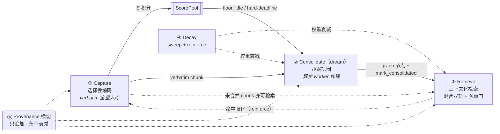
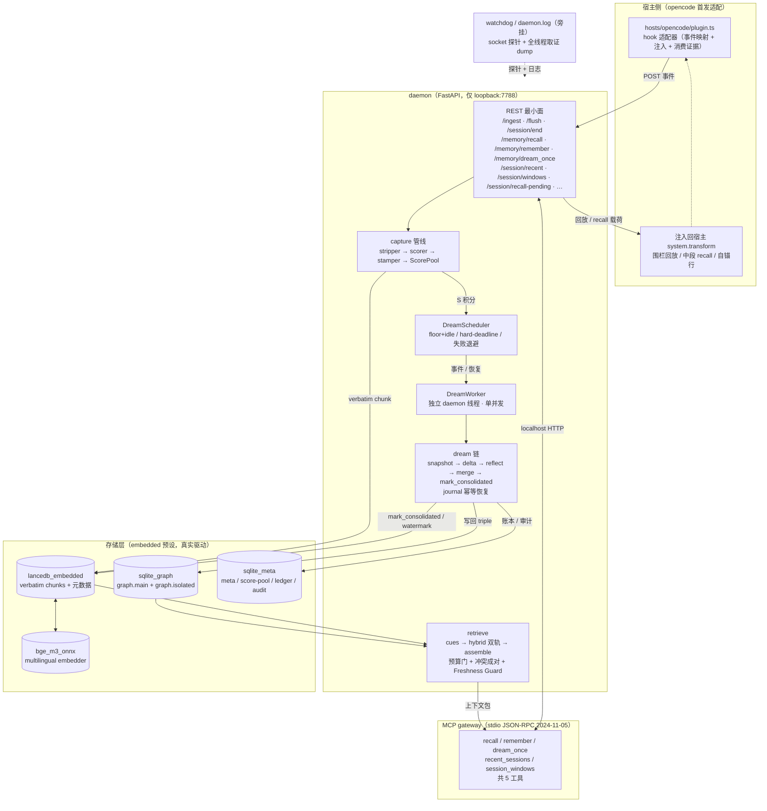

# 00 · 概览与设计哲学

> 元信息块：本地单机版记忆层 MnemoSeed-Local 的定位、与主仓的关系、"长上下文不是记忆"的立场、四阶段管线语义骨架、设计原则、裁剪清单与架构总图。状态基线：commit `02ca93d`（F2 根治收口）之后，1349 passed / 3 skipped，门禁全净。主要依据：`docs/zh/design/mvp-design.md`（v1.3 + v1.4 修正注记）、`docs/zh/MVP.md`、`docs/zh/prd/PRD-B2-roadmap.md`、`docs/zh/prd/PRD-B2.1-auto-recall.md`、`docs/zh/prd/PRD-B2.4-time-awareness.md`；理论条目状态沿主仓 `G:\Development\MnemoSeed\mnemoseed\docs\REFERENCES.md` 登记体系核对。行号引用一律钉在基线 commit（`02ca93d` 代码内容）之上；B6/B4a 等在途批次合入 src 后，行号引注须随基线推进重钉。

---

## 0. 功能定位与边界

### 0.1 一句话定位

**MnemoSeed-Local 是主仓 MnemoSeed 的本地单机移植：一个只在本机回环地址上运行的记忆层守护进程**——loopback 隐式信任、无账号体系、profile 固定为 `default`、CLI 与 MCP 优先、dream 巩固走本地模型（ollama 默认）、记忆明文不出本机。

### 0.2 与主仓的关系

- **同源移植、独立并行演化、不回流主仓**（mvp-design.md §1）：主仓与本仓按同一设计哲学并行演化，不允许"本仓为主、主仓跟随"，本仓代码不回写主仓。
- 地基层原样移植：config / secrets / schema / storage 四接口；生产驱动裁剪为 `lancedb_embedded` + `sqlite_graph` + `sqlite_meta` + `bge_m3_onnx`（见 §3）。
- 管线原则继承：capture → consolidate(dream) → decay → retrieve + provenance 审计横切；mark-consolidated 语义（合并后的 raw chunk 标记退出搜索面但不删除）与全部产品红线按 mvp-design.md §3 保留。

### 0.3 为什么"长上下文不是记忆"（沿用主仓 00 §2 的三维论证）

本仓对此立场的论证与主仓完全一致，照搬沿用、不再重推：

| 维度 | 失效形态 | 对应生物学事实 |
|---|---|---|
| **成本** | 六个月历史塞进窗口，首条消息的 token 开销比新用户一周还贵 | 人脑做决定前不会回放一生 |
| **可分性** | "我喜欢喝咖啡"与"客户合规红线"同权重，因为写时不分级 | 海马依赖显著性标记决定什么值得编码 |
| **更新** | 事实变更后，全量回放里新旧两版并存且无信号指明当前版本 | 大脑通过 reconsolidation 改写旧记忆，而不是叠加 |

结论沿用：**记忆不是更大的窗口；它是一套独立的架构——刻意决定什么被带向未来、什么被放手。** 本仓的实现差异仅是：因本地单机 + 本地模型，没有主仓的云端 token 预算硬上限（见 §0.6 裁剪清单）；"长上下文 vs 记忆"的论证本身不受影响。

### 0.4 四阶段管线语义骨架（本仓裁剪版）

主仓是"五阶段 + provenance 横切"；本仓是**四阶段 + provenance 横切**：

**诚实裁剪（必须注明）**：主仓的 ④ Reconcile（reconsolidation 改写）在本仓**不存在为独立阶段**。本仓只在 capture 侧做近重复冲突的写时标注（`needs_reconcile`，`capture/stamper.py`），冲突成对返回只在 retrieval 内部实现（`src/mnemoseed_local/retrieve/assemble.py:11-21`：graph 候选按 `conflict_group` 原子成组、成对返回，绝不平白拆散；写侧近重复决策是 `NearDuplicateChecker` 的规则集，只做 CONSISTENT / CONFLICT 二分类）。没有"命中即开可写窗"的 retrieval 侧 reconsolidation 改写协议。四阶段 + 冲突内嵌于 capture/retrieval，是本仓与主仓最实质的架构差异。

### 0.5 设计原则清单

每条原则都在代码或 mvp-design.md 有出处，不列入无出处原则：

1. **verbatim 全量入库契约（"Capture 即拒绝"的演化形态）**：v1.4 起漏斗第一闸的"拒绝优先"演化为"F2 durability 判定只作元数据注解、绝不过滤落库"——每个 turn 原文逐字进 chunk，scorer 的 S 仅供积分池积累（mvp-design.md v1.4 注记、§4.4；`capture/scorer.py` 模块 docstring；`capture/pipeline.py` ScoringStats 文档）。
2. **本地优先**：仅 loopback 绑定，非回环地址拒绝启动（`daemon/app.py`）；dream 推理默认 ollama（`config.py` DEFAULT_LLM_ROUTES）。
3. **完整读、分流写**：dream 的 snapshot 是全量只读场景（100% 完整场景，无上下文断裂），写回按认知分流 core / isolated / salvage 三分流（mvp-design.md §3 dream 行、§5）。
4. **诚实空 / 自报告覆盖**：检索无合格候选时返回显式"无相关记忆"语义，绝不垫低质替代品；`dropped_count` 与 CoverageReport 自报搜索覆盖（`retrieve/assemble.py` FR-3.13；honest empty 语义见 03）。
5. **捕获中立**：评分只读内容本身，不读 anima/偏好状态（本仓无 anima 模块，红线形态照常保留，理论出处见 01 §2 与主仓 design/01 §1）。
6. **provenance 只追加、永不覆盖**（mvp-design.md §4.6；`schema/stamp.py` Provenance.history）。
7. **dream 在独立线程执行，不阻塞 daemon 响应**（mvp-design.md §2.2；`daemon/app.py` DreamWorker）。

### 0.6 裁剪清单与边界（依据 mvp-design.md §1、§3 表）

裁掉的（MVP 不做）：console（静态 + 后端）、账号体系（localhost 隐式信任）、多 profile（profile 硬编码 `default`）、PG 驱动组（storage 仅 sqlite/lancedb 两族）、云端含 BYOK（推迟至 Phase B 之后）、一切用户管理、provider registry、产品营销平面、**任何形式的平台 budget 上限**（token 账本只记录不封顶）；storage 层去掉 openai-compatible **embedder** 驱动（嵌入器仅 `bge_m3_onnx` + 测试用 synthetic）；llm 驱动去掉 anthropic/oauth（`openai_compatible` LLM 驱动保留为 BYOK 预留回退路由）。

### 0.7 「未实施/在途」清单（一句话，细节在对应 PRD）

- ensemble 的 vote 模式：机制级改动（单快照双 reflect 相位 + 确定性 combiner + triple 级归因），B5 立项，未实施（PRD-B2-roadmap B5）；
- BYOK：显式 opt-in 的云端回退 + 用户自设用量上限，Phase B 后立项，未实施（mvp-design.md §4.8）；
- advanced 27B 档：本机 8GB VRAM 跑不动，硬件到位前挂起（PRD-B2-roadmap 挂起项）；
- `dream.capture_only` 硬模式：待 Phase B 评测数据定夺，未实施（mvp-design.md §4.8）；
- 多 session 互认知：研究专题，排在 B2.6 之后（PRD-B2-roadmap 挂起项）；
- 多 DB 可插拔后端（qdrant 等）：长期方向，暂不入排期（PRD-B2-roadmap 挂起项）；
- 宿主 plugin 统一安装面（B2.6）：前置 T0 式探针，未开工（PRD-B2-roadmap 挂起项）。

---

## 1. 流程

### 总体架构图（构件均为真实件，见 §3 路径对照）

**文字走查**：opencode 宿主由 plugin.ts 将聊天/工具/生命周期事件映射为 `/ingest`（用户轮、助手轮、工具轮）、`/flush`（空闲/出错/压缩）、`/session/end`（仅 `session.deleted`）POST 进 daemon（fire-and-forget、2s 超时）。daemon 的 capture 管线在消费侧依次做 F1 剥噪、F2 持久性注解、F3 重要性打分，把 verbatim chunk 逐字写入 lancedb_embedded，并把每 turn 的 S 积分累入 ScorePool；达到门槛或硬期限后，事件经 DreamScheduler → DreamWorker（独立线程，不阻塞事件循环）→ snapshot/delta/reflect/merge 链，把反射出的 triple 按 core/isolated/salvage 写回 sqlite_graph，并对源 chunk 打 `consolidated` 标记（watermark 前进，仅按 provenance 可追溯取回）。检索侧从 graph 节点 + 未合并 chunks 双轨取候选，经预算门（top-k=5 / 800 tokens）、冲突成对、Freshness Guard 组装成上下文包，经 MCP 网关 5 工具或 REST 暴露给宿主；宿主把回放/回忆注入回 `chat.system.transform`。watchdog 与 `daemon.log` 旁挂在进程内：socket 探针失效即取证并 `os._exit(1)`，日志持久落盘。

---

## 2. 理论锚

本节承载本系列**锚点纪律本体**，不放完整锚点——完整锚点落在 01（capture）/ 02（dream）/ 03（检索与衰减）/ 06（会话连续性）各自篇目；总表即承载，见 §2.3。

### 2.1 什么是理论锚（入选标准）

- 只列**有实验与长期复现证据验证的规律**（不是比喻、不是营销话术、不是单次未复现实验）。
- 每条锚点 = 来源（作者/年份/标题/期刊或出处/DOI 若知）+ 已验证规律（规律原文级表述）+ 由此推导的**设计规则**。
- 理论回答"**为什么这样设计**"；延迟/缓存/预取/预算/超时/阈值等**实现机制层**内容一律明确标注为机制，绝不包装成理论。
- 每条锚点在对应篇目 §5 登记完整引用，并与主仓 REFERENCES 条目核对状态。

### 2.2 公理句（沿用主仓 00 §3）

> **人脑三亿年已验证的机制（选择性编码、睡眠巩固、主动遗忘、reconsolidation、来源监控）我们按其形状工程化；全回放、无差别追加、永不遗忘，我们直接拒绝。**

本仓沿用该公理句为架构级判据；本仓因无 anima 模块、无独立 Reconcile 阶段，对"reconsolidation / 来源监控"两词的落实形态有裁剪（见 §0.4、§0.6）。

### 2.3 理论映射总表

细节一律指针到对应篇目；编号为本仓 REFERENCES 本地编号，括号内注明同主仓编号与校验状态（✅ 已校验 / 📕 经典专著 / ⚠️ 待抽查）。

| 锚点 | 一句话规律 | 一句话设计规则 | 承载文档+§ |
|---|---|---|---|
| Fuzzy-Trace verbatim/gist 双轨（Brainerd & Reyna 1990，本地 R12 ✅（同主仓 R13）） | 人类并行存 verbatim 与 gist 两线，提取 gist 不抹除原文 | verbatim 通道永不有损；gist 可蒸馏/衰减/重写，永远可经 provenance 指回原文 | 00、01 |
| ACT-R base-level learning（Anderson & Schooler 1991，本地 R23 ✅） | 记忆可用性 = 基础激活（使用频度×时近的幂律和）+ 线索扩散激活 + 噪声 | 回忆排序 = 基础激活 + 线索激活；decay/reinforce 是该方程的同构物（自洽，非巧合） | 00、01、03、05、06 |
| 编码特异性（Tulving & Thomson 1973，本地 R4 ✅（同主仓 R4）） | 提取成功率取决于线索与编码时上下文的重合度；遗忘主因是线索失败 | 回忆本职是线索工程；编码时元数据（时间/项目/实体）作线索面存储 | 00、01、03、05、06 |
| 近因优势与无线索态默认（Murdock 1962，本地 R24 ✅；Howard & Kahana 2002，本地 R25 ✅） | 无外部线索时近因主导回忆 | 新 session 首轮无条件时近回放，不做触发侧预审 | 00、05、06 |
| 前瞻记忆多加工（McDaniel & Einstein 2000，本地 R26 ✅） | 意图提取靠事件线索的自发提取；自主监控贵且易漏 | 自动回忆 = 自发提取通道常开；non-focal 弱关联不自动注入 | 00、05、06 |
| 来源监控（Johnson et al. 1993，本地 R7 ✅（同主仓 R7）） | 内容来源的判别天然不可靠，来源混淆是常态 | 一切注入上下文带明确围栏；provenance 只追加、永不覆盖 | 00、04、05、06 |
| 提取诱发遗忘（Anderson, Bjork & Bjork 1994，本地 R28 ✅（同主仓 R40）） | 提取 X 会压制竞争者，高频提取自我强化 | 注入≠强化：仅消费证据（助手轮实际引用注入内容）才计 reinforce | 00、03、05、06 |
| 时序语境作为残余线索（Howard & Kahana 2002，本地 R25 ✅） | 语境切换后，时间近因与接续是残余语境的主要携带者 | 会话时间窗是全部读面的一等可对比结构；daemon 只供结构、不判归属 | 00、05、06 |
| 双加工再认（Yonelinas 2002，本地 R27 ✅） | 熟悉度与回忆是两条独立通道；熟悉度低 + 回忆失败 = 判陌生/错源 | 系统支持回忆（暴露会话窗），不制造熟悉感、不加时间相似度检索项 | 00、06 |
| CLS 双存储（McClelland, McNaughton & O'Reilly 1995，本地 R1 ✅（同主仓 R1）） | 海马快录情景，皮层慢沉淀结构知识 | 双存储：lancedb 向量池（热层）+ sqlite_graph（冷层） | 00、02 |
| SWR 重放（Wilson & McNaughton 1994，本地 R2 ✅（同主仓 R2）） | 睡眠中海马向皮层回放日间经验 | dream 引擎在空闲期做异步反思合成 | 00、02 |
| Synaptic Tagging & Capture（Frey & Morris 1997，本地 R3 ✅（同主仓 R3）） | 只有被打上显著性标签的突触转成长期增强 | 选择性编码：S 分三组件（0.3·arousal(饱和) + 0.4·novelty + 0.3·causal_chain 加权和）评分入池 | 00 |
| Reconsolidation（Nader et al. 2000，本地 R5 ✅（同主仓 R5）） | 记忆被提取后进入可写窗，可改写后重新固化 | 冲突不静默单边消灭：写时标 `needs_reconcile`、检索时成对返回（裁剪注记见 §0.4） | 00 |
| SHY 突触稳态（Tononi & Cirelli 2003/2014，本地 R6 ✅（同主仓 R6）） | 睡眠期全局突触缩放，弱连接低于噪声底、强连接存活 | 遗忘是功能：未强化权重单调衰减，访问强化回升，软衰减不硬删 | 00、03 |
| 艾宾浩斯遗忘曲线（Ebbinghaus 1885/1913，本地 R8 📕（同主仓 R8）） | 无复习条件下遗忘随时间近似指数衰减 | decay 曲线取指数形态 `w = conf × exp(−λ×days)`（形状锚，不约束 λ 数值） | 00、03 |
| 干扰论（Wixted 2004，本地 R29 ✅（同主仓 R41）） | 遗忘主引擎是干扰（相似记忆互相遮蔽）而非时间流逝 | λ 随相似邻居数增大；独特记忆天然抗衰减 | 00、03 |
| 间隔效应（Cepeda et al. 2006，本地 R9 ✅（同主仓 R9）） | 分散复习远优于集中复习 | 强化回弹有冷却窗，短窗内重复命中收益递减 | 00、03 |
| 上下文依赖（Godden & Baddeley 1975，本地 R11 ✅（同主仓 R12）） | 记忆天然绑定提取情境；全局唯一"事实"是工程幻觉 | 冲突先按 cue 分域共存，分不开才进入裁决 | 00 |
| 睡眠二过程（Borbély 1982，本地 R31 ⚠️（同主仓 R48）） | 睡眠压力随时间累积，其量决定睡眠长度 | 动态 delta 预算：dream 长度随积压扩展而非固定 | 00、02 |
| REM 反弹（Dement 1960，本地 R33 ✅（同主仓 R50）） | 剥夺后出现超常代偿 | 积压期预算扩张的生理对应物 | 00、02 |
| 睡眠依赖记忆 triage（Stickgold & Walker 2013，本地 R37 ✅（同主仓 R54）） | 巩固是选择性的（triage）而非全量回放 | 只对池达标的窗口做梦（floor+idle / hard-deadline）；完整读、分流写 | 00、02 |
| Little 定律（Little 1961，本地 R32 ✅（同主仓 R49）） | L = λW：稳态下积压 = 到达率 × 等待时间 | 积压超上限不放大单次预算，靠多次连续 dream 排空 + 溢出行永不丢弃 | 00、02 |
| 重建性记忆/误导信息（Bartlett 1932，本地 R34 ✅（同主仓 R51）；Loftus 2005，本地 R35 ✅（同主仓 R52）） | 巩固/重建会扭曲，蒸馏输出须先验证再落库 | 合并前质量门：reflect 输出经检验才写回 graph | 00、02 |
| 元记忆（Nelson & Narens 1990，本地 R36 ✅（同主仓 R53）） | 用户显式 pin/更正 = 最高权威信号 | `/memory/remember` 显式 pin 独立于捕获通道，`asserted_by=user` | 00 |
| 深度加工（Craik & Lockhart 1972，本地 R22 ✅（同主仓 R28）） | 语义深加工胜过浅加工；意图本身加成有限 | `importance_hint` 显式权重走深度加工通道 | 00、01 |
| 赫布定律（Hebb 1949，本地 R10 📕（同主仓 R10）） | 反复激活强化既有联结而非新建痕 | 捕获近重复命中就地强化（stamper）与检索命中回弹同一步进 | 00、01、03 |
| 情绪驱动轴是 arousal（Kensinger & Corkin 2003，本地 R15 ✅（同主仓 R17）） | 情绪词记忆增强由 arousal 独立驱动，与 valence 分离 | 评分主轴用 arousal；valence 降级为线索元数据 | 00、01 |
| 情绪调制巩固强度（McGaugh 2000，本地 R14 ✅（同主仓 R16）） | 情绪 arousal → 杏仁核 → 调制海马巩固强度 | 情绪分进捕获评分与 consolidate 优先级，不决定"记什么" | 00、01 |
| 倒 U 型饱和（Yerkes & Dodson 1908，本地 R17 ✅（同主仓 R20）） | 中等唤醒最优，极端唤醒损害表现 | arousal 进公式带饱和 cap，不做线性放大 | 00、01 |
| 环形情感模型（Russell 1980，本地 R20 ✅（同主仓 R23）） | 情绪 = valence×arousal 二维 | emotion 量化用 V/A 二维 | 00、01 |
| NRC VAD 词典（Mohammad 2018，本地 R21 ✅（同主仓 R27）） | 2 万英文词的人工 VAD 评分 | v1 情绪量化走 lexicon（NRC VAD shape 的种子词表） | 00、01 |
| flashbulb 悖论（Neisser & Harsch 1992，本地 R16 ✅（同主仓 R19）） | 高情绪记忆主观确信极高、客观准确率不高于日常记忆 | 情绪分永不喂 provenance.confidence | 00、01 |
| 注意窄化（Easterbrook 1959，本地 R18 ✅（同主仓 R21）；Christianson 1992，本地 R19 ✅（同主仓 R22）） | 高唤醒下核心细节记得好、外围信息丢失 | 高唤醒 chunk 打 `peripheral_gaps` 标记（本仓只标记不补洞，见 01 §4 未实施） | 00、01 |

### 2.4 不借清单（存在性声明）

本系列每篇 理论锚 均以「不借清单」收尾，防伪理论混入：列明被明确拒绝的流行说法及其被拒绝理由。本仓目前已拒绝：7±2 工作记忆容量（不得作为任何数字常量出处）、左右脑神话/学习风格论（无有效证据）、把实现机制包装成理论、单次未复现实验结论。清单随各篇自有权重扩展（详见 01 §2.5 与 PRD-B2.1 / PRD-B2.4 的不借清单）。

---

## 3. 实施方式

（真实模块 / 类 / 配置键 / 默认值 + 路径。此处给骨架，细节在对应篇目 §3。）

- **包/入口**：`src/mnemoseed_local/`（dist 名 `mnemoseed-local`，模块名 `mnemoseed_local`）；CLI 入口 `mnemoseed-local`（`cli.py`），daemon 入口 `mnemoseed-local up`。
- **config**：`src/mnemoseed_local/config.py`——`~/.mnemoseed-local/config.toml` 为单一真相；preset `embedded` 默认映射 `vector=lancedb_embedded / graph=sqlite_graph / meta=sqlite_meta / embed=bge_m3_onnx`（config.py:29-38）；`baseurl` 默认 `http://localhost:7788`，非回环地址启动即拒绝（app.py:659-664）。
- **capture**：`capture/{stripper,scorer,stamper,segment,pool,pipeline,rulesets_v1,lexicon_v1}.py`（见 01 §3）。
- **dream**：`dream/{snapshot,delta,reflect,prompts,merge,ledger,trigger,pipeline,verify}.py`（见 02）。
- **retrieve**：`retrieve/{cues,hybrid,assemble}.py`（见 03）。
- **decay**：`decay/{model,sweeper,reinforce}.py`（见 03）。
- **daemon**：`daemon/{app,ingest,memory,watchdog,runner,actor}.py`；REST 面见 §1 走查。
- **MCP 网关**：`mcp_gateway/{server,reliable_client}.py`——stdio 换行分隔 JSON-RPC 2.0，5 工具：recall / remember / dream_once / recent_sessions / session_windows（server.py TOOLS 列表）。
- **host 适配**：`hosts/opencode/plugin.ts`——`mnemoseed-local hook install` 部署；wire 事件映射契约见 plugin.ts:10-18。
- **watchdog**：`daemon/watchdog.py`——boot grace 300s / refused grace 10s / 探针 1s（watchdog.py:40-42）；`daemon.log` 由 `daemon/app.py` `_attach_daemon_log_handler` 持久化。

---

## 4. 红线与诚实边界

- **loopback 信任**：非回环 baseurl 启动即拒绝；无账号、无 token（app.py:13-16, 659-664）。
- **记忆明文不出本机**：MVP 纯本地；BYOK 属 Phase B 后显式 opt-in（mvp-design.md §4.6）。
- **provenance 只追加**：历史只追加、永不覆盖（schema/stamp.py Provenance.history）。
- **budget 无上限**：token 账本只记录、不封顶；`dream.token_budget_usd` 键已移除且硬性 deprecation（config.py:470-477）。
- **诚实边界**：本系列只描述代码中已存在的行为；未实施项只在「未实施/在途」列出（§0.7），任何"预留/规划"不写成现状。

---

## 5. 本篇引用

本系列每篇在 §5 登记本篇用到的完整引用；本页（00）只用指针承载，完整锚点明细在对应篇目。

- 主仓设计系列 `mnemoseed/docs/design/00-overview-and-philosophy.md`（2026-08-08，v4.0 Draft）——公理句与"长上下文不是记忆"三维论证的沿用出处；非理论条目，不登记 REFERENCES。
- R1 — McClelland, J. L., McNaughton, B. L., & O'Reilly, R. C. (1995). Why there are complementary learning systems in the hippocampus and neocortex. *Psychological Review*, 102(3), 419–457. DOI: 10.1037/0033-295X.102.3.419 — 理论映射总表 CLS 行，承载 02。同主仓 REFERENCES R1（✅）。
- R2 — Wilson, M. A., & McNaughton, B. L. (1994). Reactivation of hippocampal ensemble memories during sleep. *Science*, 265(5172), 676–679. — 总表 SWR 行，承载 02。同主仓 REFERENCES R2（✅）。
- R3 — Frey, U., & Morris, R. G. M. (1997). Synaptic tagging and long-term potentiation. *Nature*, 385, 533–536. — 总表 STC 行，承载 00。同主仓 REFERENCES R3（✅）。
- R4 — Tulving, E., & Thomson, D. M. (1973). Encoding specificity and retrieval processes in episodic memory. *Psychological Review*, 80(5), 352–373. — 总表编码特异性行，承载 01。同主仓 REFERENCES R4（✅）。
- R5 — Nader, K., Schafe, G. E., & LeDoux, J. E. (2000). Fear memories require protein synthesis in the amygdala for reconsolidation after retrieval. *Nature*, 406, 722–726. — 总表 Reconsolidation 行，承载 00。同主仓 REFERENCES R5（✅）。
- R6 — Tononi, G., & Cirelli, C. (2003). Sleep and synaptic homeostasis: A hypothesis. *Brain Research Bulletin*, 62(2), 143–150.（extended 2014, *Neuron*）— 总表 SHY 行，承载 03。同主仓 REFERENCES R6（✅）。
- R8 — Ebbinghaus, H. (1885/1913). *Memory: A Contribution to Experimental Psychology*. — 总表艾宾浩斯遗忘曲线行，承载 03。同主仓 REFERENCES R8（📕）。
- R7 — Johnson, M. K., Hashtroudi, S., & Lindsay, D. S. (1993). Source monitoring. *Psychological Bulletin*, 114(1), 3–28. — 总表来源监控行，承载 06。同主仓 REFERENCES R7（✅）。
- R9 — Cepeda, N. J., Pashler, H., Vul, E., Wixted, J. T., & Rohrer, D. (2006). Distributed practice in verbal recall tasks: A review and quantitative synthesis. *Psychological Bulletin*, 132(3), 354–380. — 总表间隔效应行，承载 03。同主仓 REFERENCES R9（✅）。
- R11 — Godden, D. R., & Baddeley, A. D. (1975). Context-dependent memory in two natural environments: On land and underwater. *British Journal of Psychology*, 66(3), 325–331. — 总表上下文依赖行，承载 00。同主仓 REFERENCES R12（✅）。
- R12 — Brainerd, C. J., & Reyna, V. F. (1990). Gist is the grist: Fuzzy-trace theory and the new intuitionism. *Developmental Review*, 10(1), 3–47. DOI: 10.1016/0273-2297(90)90003-M — 总表 Fuzzy-Trace 行，承载 01。同主仓 REFERENCES R13（✅）。
- R13 — Miller, G. A. (1956). The magical number seven, plus or minus two. *Psychological Review*, 63(2), 81–97. DOI: 10.1037/h0043145；Cowan, N. (2001). The magical number 4 in short-term memory. *Behavioral and Brain Sciences*, 24(1), 87–114. — 不借清单依据（7±2 不得作为任何数字常量出处），承载 01/PRD-B2.1。同主仓 REFERENCES R15（✅ 两者）。
- R14 — McGaugh, J. L. (2000). Memory—A century of consolidation. *Science*, 287(5451), 248–251. — 总表情绪调制行，承载 01。同主仓 REFERENCES R16（✅）。
- R15 — Kensinger, E. A., & Corkin, S. (2003). Memory enhancement for emotional words: Are emotional words more vividly remembered than neutral words? *Memory & Cognition*, 31, 1169–1180. — 总表 arousal 驱动轴行，承载 01。同主仓 REFERENCES R17（✅）。
- R16 — Neisser, U., & Harsch, N. (1992). Phantom flashbulbs: False recollections of hearing the news about Challenger. In Winograd & Neisser (Eds.), *Affect and Accuracy in Recall*. — 总表 flashbulb 行，承载 01。同主仓 REFERENCES R19（✅）。
- R17 — Yerkes, R. M., & Dodson, J. D. (1908). The relation of strength of stimulus to rapidity of habit-formation. *Journal of Comparative Neurology and Psychology*, 18(5), 459–482. — 总表倒 U 型行，承载 01。同主仓 REFERENCES R20（✅）。
- R18 — Easterbrook, J. A. (1959). The effect of emotion on cue utilization and the organization of behavior. *Psychological Review*, 66(3), 183–201. — 总表注意窄化行，承载 01。同主仓 REFERENCES R21（✅）。
- R19 — Christianson, S.-Å. (1992). Emotional stress and eyewitness memory: A critical review. *Psychological Bulletin*, 112(2), 284–309. — 总表注意窄化行（武器聚焦），承载 01。同主仓 REFERENCES R22（✅）。
- R20 — Russell, J. A. (1980). A circumplex model of affect. *Journal of Personality and Social Psychology*, 39(6), 1161–1178. DOI: 10.1037/h0077714 — 总表环形情感模型行，承载 01。同主仓 REFERENCES R23（✅）。
- R21 — Mohammad, S. M. (2018). Obtaining reliable human ratings of valence, arousal, and dominance for 20,000 English words. *Proceedings of ACL 2018*. — 总表 NRC VAD 行，承载 01。同主仓 REFERENCES R27（✅）。
- R22 — Craik, F. I. M., & Lockhart, R. S. (1972). Levels of processing: A framework for memory research. *Journal of Verbal Learning and Verbal Behavior*, 11(6), 671–684. DOI: 10.1016/S0022-5371(72)80001-X — 总表深度加工行，承载 01。同主仓 REFERENCES R28（✅）。
- R10 — Hebb, D. O. (1949). *The Organization of Behavior*. Wiley. — 总表赫布定律行，承载 01/03。同主仓 REFERENCES R10（📕）。
- R28 — Anderson, M. C., Bjork, R. A., & Bjork, E. L. (1994). Remembering can cause forgetting: Retrieval dynamics in long-term memory. *Journal of Experimental Psychology: Learning, Memory, and Cognition*, 20(5), 1063–1087. DOI: 10.1037/0278-7393.20.5.1063 — 总表提取诱发遗忘行，承载 06。同主仓 REFERENCES R40（✅）。
- R29 — Wixted, J. T. (2004). The psychology and neuroscience of forgetting. *Annual Review of Psychology*, 55, 235–269. — 总表干扰论行，承载 03。同主仓 REFERENCES R41（✅）。
- R31 — Borbély, A. A. (1982). A two process model of sleep regulation. *Human Neurobiology*, 1(3), 195–204. — 总表睡眠二过程行，承载 02。同主仓 REFERENCES R48（⚠️）。
- R33 — Dement, W. (1960). The effect of dream deprivation. *Science*, 131(3415), 1705–1707. — 总表 REM 反弹行，承载 02。同主仓 REFERENCES R50（✅）。
- R37 — Stickgold, R., & Walker, M. P. (2013). Sleep-dependent memory triage. *Nature Neuroscience*, 16(2), 139–145. DOI: 10.1038/nn.3303 — 总表睡眠依赖 triage 行，承载 02。同主仓 REFERENCES R54（✅）。
- R32 — Little, J. D. C. (1961). A proof for the queuing formula: L = λW. *Operations Research*, 9(3), 383–387. DOI: 10.1287/opre.9.3.383 — 总表 Little 定律行，承载 02。同主仓 REFERENCES R49（✅）。
- R34 — Bartlett, F. C. (1932). *Remembering: A Study in Experimental and Social Psychology*. Cambridge. — 总表重建性记忆行，承载 02。同主仓 REFERENCES R51（✅）。
- R35 — Loftus, E. F. (2005). Planting misinformation in the human mind. *Learning & Memory*, 12(4), 361–366. DOI: 10.1101/lm.94705 — 总表误导信息行，承载 02。同主仓 REFERENCES R52（✅）。
- R36 — Nelson, T. O., & Narens, L. (1990). Metamemory: A theoretical framework and new findings. *Psychology of Learning and Motivation*, 26, 125–173. DOI: 10.1016/s0079-7421(08)60053-5 — 总表元记忆行，承载 00。同主仓 REFERENCES R53（✅）。
- R23 — Anderson, J. R., & Schooler, L. J. (1991). Reflections of the environment in memory. *Psychological Science*, 2(6), 396–408. DOI: 10.1111/j.1467-9280.1991.tb00174.x — 总表 ACT-R 行，承载 06/03（本仓 TA-1 全文在 PRD-B2.1）。已核验 · REFERENCES R23 ✅。
- R24 — Murdock, B. B., Jr. (1962). The serial position effect of free recall. *Journal of Experimental Psychology*, 64(5), 482–488. — 总表近因优势行，承载 06（本仓 PRD-B2.1 TA-3）。已核验 · REFERENCES R24 ✅。
- R25 — Howard, M. W., & Kahana, M. J. (2002). A distributed representation of temporal context. *Journal of Mathematical Psychology*, 46(3), 269–299. — 总表时序语境行，承载 06（本仓 PRD-B2.1 TA-3 / PRD-B2.4 TA-7）。已核验 · REFERENCES R25 ✅。
- R26 — McDaniel, M. A., & Einstein, G. O. (2000). Strategic and automatic processes in prospective memory retrieval: A multiprocess framework. *Applied Cognitive Psychology*, 14(7), S127–S144. — 总表前瞻记忆行，承载 00/05/06（本仓 PRD-B2.1 TA-4）。已核验 · REFERENCES R26 ✅。
- R27 — Yonelinas, A. P. (2002). The nature of recollection and familiarity: A review of 30 years of research. *Journal of Memory and Language*, 46(3), 441–517. — 总表双加工再认行，承载 06（本仓 PRD-B2.4 TA-9）。已核验 · REFERENCES R27 ✅。