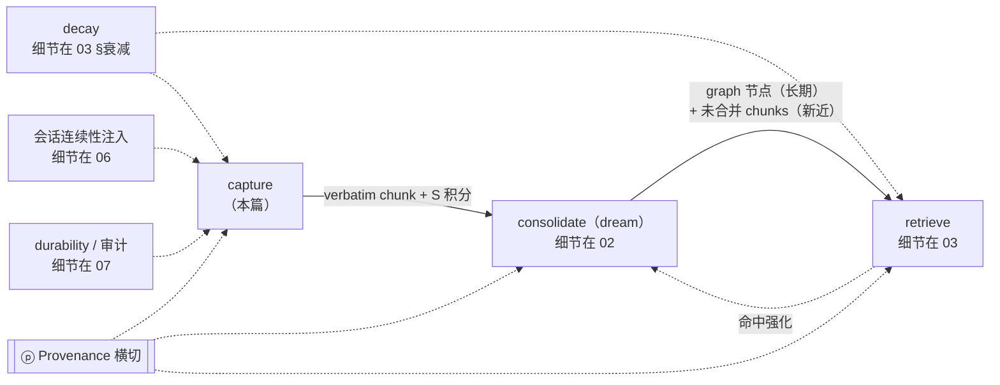
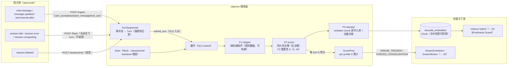

# 01 · 记忆管线：capture 主战场

> 元信息块：capture（捕获）阶段是 MnemoSeed-Local 记忆管线的第一战场——宿主事件如何变成带完整印章的 verbatim chunk、S 分如何进入积分池、以及捕获侧的全部红线。状态基线：commit `02ca93d` 之后，1349 passed / 3 skipped，门禁全净。主要依据：`docs/zh/design/mvp-design.md`（§1 / §3 / §4.4 / §4.5 / §7）、`docs/zh/MVP.md`、`docs/zh/prd/PRD-B2.1-auto-recall.md`、主仓 `mnemoseed/docs/design/01-memory-pipeline.md`（阶段① 与 §1.6 情绪部分，移植裁剪）；理论条目状态沿主仓 REFERENCES 登记体系核对。行号引用一律钉在基线 commit（`02ca93d` 代码内容）之上；B6/B4a 等在途批次合入 src 后，行号引注须随基线推进重钉。

---

## 0. 功能定位与边界

### 0.1 管线四阶段总览（capture 视角）

capture 是管线第一段，也是唯一直接接触宿主原始对话的段。其职责是：**把宿主事件流切成 turn、剥掉机械噪声、判定持久性（仅注解）、打重要性分、逐字落库、并把积分喂给 dream 的触发面**。



- **capture → dream**：每 turn 的 S 重要性累入 profile 的 ScorePool，池达门槛（floor+idle）或最老 pending chunk 达硬期限即触发 dream（触发与调度的完整机制见 02 §调度；本篇只讲积分池的入池与 drain 语义）。
- **capture → retrieve**：verbatim chunk 在合并前**即可被检索**（Freshness Guard 探测 `consolidated=false`）；dream 合并后 chunk 标记退出搜索面，仅可按 provenance 追溯取回——freshness/降权语义一律指针到 03 §Freshness Guard。
- **capture → decay**：chunk 与 graph 节点同受衰减治理（λ 分层见 03 §衰减）；捕获侧近重复命中即回弹（Hebbian 编码时强化，见 §1.4）。
- **capture → 06**：会话起始回放、中段 auto-recall、消费证据守卫的注入面全部消费 capture 落库的 chunk 与 session 结构（06 负责）。
- **capture → 07**：capture 写出的 provenance 与审计记录是 durability 与审计面的事实源（07 负责）。

### 0.2 capture 的边界定位

- 只管"入库"，不管"怎么取回"：检索排序、预算门、冲突返回、时间窗供给分属 03/06。
- 只管"注解"，不管"丢弃"：F2 持久性判定是元数据，不是闸门——这是 verbatim 契约的核心（§1.4）。
- 只管"内容本身"，不读任何偏好/人格状态：捕获中立红线（§4.1）。
- 本仓无独立 Reconcile 阶段：capture 侧只做近重复冲突的写时标注（`needs_reconcile`），不做改写裁决（00 §0.4）。

---

## 1. 流程

### 1.1 capture 流程图



### 1.2 文字走查

宿主事件经 REST 进入 daemon：`/ingest` 只做 O(1) 入队（submit 绝不在 HTTP 热路径上跑 stripper/scorer/embedding），`/flush` 与 `/session/end`（以及 daemon teardown 的 `flush_all`）在消费侧触发 drain。drain 依次：F1 用当前规则集剥掉机械噪声（ANSI 控制码、包管理器摘要、进度条、死循环块等；只碰机械形状，绝不碰散文）；F2 给出持久性注解（DURABLE/DISPOSABLE，**只作元数据**）；F3 计算 S = 情绪×新颖×因果三组件加权和（0..10）；随后 stamper 把每个 turn 的原文逐字组装成 chunk（`user:`/`assistant:` 标注行），连同 cue 印章与 provenance 写入 lancedb_embedded，并把 S 积分累入 profile 的 ScorePool。chunk 在合并前即可被检索（vector 轨对 `consolidated=false` 的 chunk 开放），因此"刚说完就能想起来"。

### 1.3 ScorePool 机制

- **入池**：每个被 drain 的 turn 都把其 S 分（0..10 量表）累入 profile 的 ScorePool（`pool.add_points`）；prediction-error 冲突命中另加 2.0 分（`stamper.WriteConfig.prediction_error_bonus`）。
- **防溢出**：池余额达 `dream.pool_forced_cap`（默认 `50.0`）即触发 `FORCED_CONSOLIDATION`（微合并，与空闲无关），防池无限膨胀（`capture/pool.py`）。
- **drain 语义**：任一事件触发即把该 profile 的池余额归零（drain），**同一批分数永不重复触发**；再触发需池重新积累到阈值。后台 seam 在每次状态变化后把余额镜像进 MetaStore（`pool_credit`/`pool_add`），daemon 重启后 `pool.restore` 回填（`app.py` 构造时 `pool_states()` 恢复）。
- **与 DreamScheduler 的关系**：ScorePool 的事件只投递（经 relay/worker forwarder），不直接跑 dream；调度规则（floor+idle / hard-deadline / 失败退避）与状态机在 DreamTrigger / DreamScheduler——调度细节一律指针到 02 §调度。池构造与调度器同源绑定同一组 config 键（§3.3）。

### 1.4 verbatim 契约（v1.4）

- **每 turn 全量逐字入库**：任何对话 turn 都进 chunk，**F2 durability 判定只作元数据注解、绝不过滤落库**（mvp-design.md v1.4 修正注记；`scorer.py` docstring；`pipeline.py` ScoringStats："durability counters are ANNOTATION telemetry, never drop counters"）。v1.4 之前曾有实现误把 DISPOSABLE turn 丢弃，已修正。
- **stripper 只剥噪声单元**：F1 只处理机械形状与宿主注入脚手架（会话压缩摘要包裹、`<task-notification>` 块、包管理器输出等），**不剥散文**；纯散文 turn 原样通过，`strip_turn` 返回副本、输入 Turn 永不改动（原始 provenance 副本始终可用）。
- **合并前即可检索；合并后退出搜索面**：chunk 被 dream 合并（`mark_consolidated`）前，vector 检索轨与 Freshness 探针都对 `consolidated=false` 的 chunk 开放；合并后 chunk 标记退出搜索面，仅按 provenance 追溯取回（原文保留为证据链，不删除）。此处的新旧两态只是"合并与否"的检索面差异；freshness 探测、pending 降权、证据片段拼接等语义一律指针到 03 §Freshness Guard。
- **近重复的编码时强化**：写库前做近重复探测（`reinforce_threshold=0.9`）：一致命中 → 原地强化（`last_reinforced` 刷新 + `decay_weight` 回弹 0.1，Hebbian 编码时强化，不等 dream）；冲突带命中（`conflict_threshold=0.85` 且规则判定 CONFLICT）→ 标记 `needs_reconcile` + 池加预测误差分；全新内容才 upsert 新 chunk（`stamper.py` FR-1.8）。

### 1.5 turn/session 生命周期

- **消息事件 → turn 累积**：`user_prompt` 开新 turn；assistant/tool 事件进当前 turn（锚感知边界：user 锚定的 turn 吸收整条多段回复；无锚流才按响应边界切分，`capture/segment.py`）。
- **/flush 关闭在飞 turn**：空闲/出错/压缩时关闭当前 turn 并 drain，**会话保持可摄入**（后续事件仍可继续开 turn）。
- **/session/end 终止**：仅真正的会话终止（`session.deleted`）结清 session；结清后迟到消息被正当 409 拒绝。
- **daemon 关停**：teardown 先 `flush_all()` + 全 session drain（重启不丢最后一轮），再 `prune_settled` 释放缓冲（`daemon/app.py` lifespan）。
- **hook 事件映射细节**（哪些宿主事件对应哪些端点、火忘契约、超时、重放/水位）：一律指针到 05（宿主适配篇）。

---

## 2. 理论锚

入选标准同 00 §2.1：只列有实验与长期复现证据验证的规律；理论回答"为什么这样设计"；预算/超时/阈值/缓存属实现机制层，不入本节。每条锚点给出 来源 + 已验证规律 + →设计规则，完整引用在 §5 登记。

### 2.1 Fuzzy-Trace：verbatim/gist 双轨（双程编码）

- 来源：Brainerd & Reyna（1990），Fuzzy-trace theory（主仓 R13 ✅）。
- 已验证规律：人类以 verbatim 与 gist 两条并行编码线存储经验；**提取 gist 不抹除原文**——两条线独立存活。
- → 设计规则：给双存储架构定名——**verbatim 通道 = chunk 向量库原始文本**，任何有损操作（摘要/蒸馏）永不发生在这一层；**gist 通道 = graph 节点（triple）**，可蒸馏、可衰减、可重写，但永远可经 provenance 指回 verbatim 证据场。本仓的 `stamper` 逐字落库与 dream 的 `mark_consolidated`（合并后原文保留、仅退出搜索面）正是这条规则的落实。

### 2.2 ACT-R base-level learning（排序动力学的同源锚，本篇一句话）

- 来源：Anderson & Schooler（1991），ACT-R 陈述性记忆激活方程（主仓 TA-1 同源，本仓 TA 全文在 `PRD-B2.1-auto-recall.md` §理论锚 TA-1）。
- 已验证规律：记忆可用性 = 基础激活（使用频度×时近的幂律和）+ 当前线索的扩散激活 + 噪声；回忆概率 ≈ 环境中需要的概率。
- → 设计规则：回忆排序 = 基础激活 + 线索激活。decay/reinforce 是该方程的同构物；**本篇只引用此锚点存在，不展开**——排序动力学的完整推导与落实主场在 06（会话连续性/排序动力学）与 03（检索与衰减）。

### 2.3 编码特异性：stamper 的 cue 元数据面

- 来源：Tulving & Thomson（1973）encoding specificity（主仓 R4 ✅；主仓 TA-2 同源）。
- 已验证规律：提取成功率取决于线索与编码时上下文的重合度；"available but not accessible" 是遗忘的主形态——遗忘主因是线索失败而非存储失败。
- → 设计规则：**cue 必须在编码时存储**，否则检索侧无物可匹配。stamper 的 `Cues` 字段（project / host / task / tools_used / time_bucket / entities / emotion）即编码上下文元数据面；检索侧的实体重叠与弱环境 cue（host/project/time_bucket 参与低权重 rerank）是它的检索侧对应物（03 §检索）。

### 2.4 情绪调制（arousal 驱动轴 + 饱和 + 环形模型 + 注意窄化）

- **arousal 是驱动轴，valence 只是线索**：Kensinger & Corkin（2003，R17 ✅）——情绪词记忆增强由 arousal 独立驱动，与 valence 分离（两条通路）。→ 设计规则：评分主轴用 arousal；**valence 只进 `cues.emotion`，永不进 S**。
- **情绪调制巩固强度，不决定记什么**：McGaugh（2000，R16 ✅）——情绪 arousal → 杏仁核 → 调制海马巩固强度。→ 设计规则：情绪分进捕获评分与 consolidate 优先级，决定"记得多牢"，不决定"记什么"。
- **倒 U 型饱和**：Yerkes & Dodson（1908，R20 ✅）——中等唤醒最优，极端唤醒损害表现。→ 设计规则：arousal 进公式带**饱和 cap**（`ScoringConfig.arousal_cap=0.75`），不做线性放大（实现机制层数值见 §3.2）。
- **环形情感模型 + NRC VAD**：Russell（1980，R23 ✅）情绪为 valence×arousal 二维；Mohammad（2018，R27 ✅）给出 2 万英文词的人工 VAD 评分。→ 设计规则：emotion 量化用 V/A 二维，v1 走 lexicon 查词（`lexicon_v1.py`：NRC VAD shape 的种子词表，arousal 0..1 / valence -1..1，Russell circumplex 语义）。
- **注意窄化 → 外围标记**：Easterbrook（1959，R21 ✅）与 Christianson（1992，R22 ✅）——高唤醒下核心细节记得好、外围信息丢失。→ 设计规则：高唤醒 chunk 打 `peripheral_gaps` 标记（`scorer.py` 以 `gaps_arousal=0.8` 为阈值）；本仓**只标记、不补洞**（dream 侧按邻接 chunk 补全外围的动作未实施，见 §4.5）。

### 2.5 不借清单（01 自有）

- **Miller 7±2 不得作为任何数字常量的出处**——工作记忆容量已被后续研究修正（Cowan 2001：chunk 依赖的约 4；主仓 R15 ✅）。本仓任何 top-k / 预算 / 阈值数字均不引用 7±2（TA 不借清单原话见 `PRD-B2.1-auto-recall.md`）。
- **情绪分不得作为真相判定**——flashbulb 悖论（Neisser & Harsch 1992，R19 ✅）证明"感觉真切"不等于"客观准确"；情绪影响的是巩固优先级，不是真假。延伸红线：情绪分永不写入 provenance.confidence（§4.2）。
- **stripper 不是"注意力"隐喻**——F1 是机械噪声规则引擎（匹配的是包管理器摘要、ANSI 控制码等形状），不是选择性注意的生物学隐喻；"选择性编码"的隐喻本体是 F3 评分与积分池，不是 F1 剥噪。

---

## 3. 实施方式

### 3.1 模块清单（真实模块，各一行）

- `src/mnemoseed_local/capture/stripper.py` — F1 本地剥噪引擎：有序规则引擎（`Rule`/`RuleSet`，STRIP_LINE / REDACT_SPAN / COLLAPSE_RUNS 三动作），只碰机械形状与宿主注入脚手架，绝不碰散文；`strip_turn` 返回副本、原 Turn 不被改动。
- `src/mnemoseed_local/capture/rulesets_v1.py` — F1 的默认数据规则集 `RULESET_V1`：规则是数据（可热换，`reload_rules` 生效于下一个被剥的 turn），全部锚定机械形状（ANSI/ESC 序列、`\r` 进度碎片、npm/pip/uv/cargo 摘要、重复块折叠等）。
- `src/mnemoseed_local/capture/scorer.py` — F2 持久性注解 + F3 重要性打分：`TurnScorer.score_turn` 一次确定性调用完成分类与打分；F2 判定只作元数据（`DurabilityResult`），绝不过滤落库；F3 输出 `ScoredTurn`（S、分量、emotion cue、features）。
- `src/mnemoseed_local/capture/stamper.py` — 印章装配 + 近重复双分支：`StampWriter.write` 完成"一致命中→原地强化 / 冲突→`needs_reconcile`+预测误差加分 / 全新→upsert"，并装配完整 `ChunkStamp`（cue 面 + provenance，`confidence` 取 F2 持久性置信度）。
- `src/mnemoseed_local/capture/segment.py` — turn 切分：`TurnSegmenter` 按宿主事件流组 turn（锚感知边界：user 锚定吸收整条多段回复）；`flush` 关闭在飞 turn 不结清、`end` 结清、`flush_all` 关停兜底。
- `src/mnemoseed_local/capture/pool.py` — ScorePool 积分池状态机：per-profile 累计 S、触发 `DREAM_TRIGGER` / `FORCED_CONSOLIDATION`、drain 语义、MetaStore 持久化 seam（`pool_credit` / `pool_add` / `pool_states`）。
- `src/mnemoseed_local/capture/pipeline.py` — CapturePipeline seam：`StrippingPipeline`（F1）/ `ScoringPipeline`（F2/F3 + 池）/ `WritingPipeline`（+ StampWriter 写库）三层叠套；submit 一律 O(1)，全部重活在消费侧 drain。
- `src/mnemoseed_local/capture/lexicon_v1.py` — v1 种子情感词典：EN+ZH arousal/valence 词条（NRC VAD shape、Russell circumplex），`Lexicon` 提供查找与最长匹配扫描（CJK 无词界走最长子串），并校验取值域防止替代资源静默投毒。

### 3.2 scorer 公式（按代码写死，`scorer.py`）

```text
S = w_arousal × arousal_saturated + w_novelty × novelty + w_causal × causal_chain    # 0..10 量表
权重默认 (w_arousal, w_novelty, w_causal) = (0.3, 0.4, 0.3)                          # scorer.py:77
arousal_saturated = min(peak_arousal, arousal_cap) / arousal_cap × 10                # scorer.py:311；arousal_cap=0.75（倒 U 饱和，Yerkes-Dodson）
novelty          = max(0, min(10, (1 − max_cosine) × 10))                            # scorer.py:289；渐变刻度：(1−max_sim)×10，max_sim=1.0 才到 0（0.95 时 novelty=0.5）
causal_chain     = min(去重因果/决策/习惯标记数, 5) × 2.0                             # scorer.py:314-316；单 turn 封顶 5 个标记
auto_s           = w1·arousal + w2·novelty + w3·causal_chain                          # scorer.py:354-355
importance       = max(auto_s, importance_hint×10)（importance_hint 钳制到 [0,1]）    # scorer.py:356-361（深度加工锚，本地 R22）
importance       = clamp(importance, 0, 10)
```

配套规则：valence 只进 `cues.emotion`，永不进 S；arousal 以 `peak_arousal` 经饱和 cap 归一后进公式；因果项只计**去重后的不同标记**（`_CAUSAL_TERMS` 表：连接词/决定/习惯规则三类）；`importance_hint` 是 max-merge（取大），可来自显式用户提示（主通道 `ingest` 事件可选字段，显式 pin 的 `/memory/remember` 直接给 `score=1.0`）。

### 3.3 ScorePool 配置键（config.py:86-103 取证）

| 配置键 | 默认值 | 语义 |
|---|---|---|
| `dream.floor_pool_points` | `10.0` | 积分池触发下限（0..10 的 S 分制）；达此值且空闲足够才可 dream |
| `dream.idle_min_sec` | `900.0` | 触发所需空闲时长（池构造的 `idle_window_sec` 与调度器同源绑定此键） |
| `dream.hard_deadline_sec` | `86400.0` | 最老 pending chunk 等待上限（24h），到点强制 dream；无 pending 则完全跳过 |
| `dream.pool_forced_cap` | `50.0` | 池防溢出强制合并上限（须 ≥ floor，校验拦截；daemon 构造时经绑定 Config 实时读，configwrite 热生效） |

ScorePool 构造函数自带默认 `dream_threshold=10.0 / forced_cap=50.0 / idle_window_sec=5.0`（pool.py:97-99），但 daemon 装配时一律改为绑定上述 config 键并从 `pool_states()` 恢复余额（app.py:599-606），**生产有效空闲窗口是 900s 而非 5s**；调度器每 tick 重读同一组键，configwrite 变更热生效。

### 3.4 生命周期实施

- 装配链（app.py `_build_capture`）：`FileSnapshotter + DreamTrigger + ScoringPipeline + WritingPipeline + DreamWorker + _DreamRelay`；ScorePool 绑定 `stores.meta` 作后台 seam，启动时从 `pool_states()` 恢复余额（`pool.restore` 永不立即可触发，restored 余额须等下一个新 turn 推进时钟）。
- 池事件投递不跑热路径：`_DreamRelay` 在 drain 期间缓冲池事件，drain 写完 chunk 后才按序交给 worker（避免"池触发但 snapshot 为空"的竞态）；manual-first 默认（`dream.auto_trigger=false`）下事件被记为 `pending_manual`，供 `dream --once` 消费（FR-2.8）。
- 失败退避与恢复：reflect/merge 失败由调度器按指数退避重发（`DREAM_RETRY_BASE_S=60 / MULT=2 / CAP=3600 / MAX=3`），journal 化 snapshot 保证崩溃后从精确相位边界恢复——机制层细节在 02。
- 中立实现：`WriteContext.agent_label` 只是中性载体字段，stamper 只把该值写入 stamp 的 `persona_id` 标签，**capture 全链路无任何模块读取 anima/偏好状态**（`tests/test_capture_neutrality.py` 钉住）。

---

## 4. 红线与诚实边界

### 4.1 capture 中立红线（评分只读内容本身，不读偏好状态）

捕获全链路（stripper / scorer / stamper / pool）只读取输入内容本身，**永不读取任何 anima / 偏好节点**；本仓没有 anima 模块，红线形态照常保留——`WriteContext.agent_label` 只是中性载体字段，写入 stamp 的 `persona_id` 标签即止，无任何反向读取。**主仓理论出处**：MacLeod, Mathews & Tata（1986，R45 ✅）注意偏倚——自我审视自身经历的偏好化编码是病态而非功能；若偏好参与捕获，一个谨慎的灵魂会系统性少记冒险尝试，记忆反过来"证明"它确实谨慎（自我实现预言循环）。**铁律：捕获必须中立，编码先于解释。**

### 4.2 flashbulb 红线（情绪分永不喂 provenance.confidence）

`Provenance.confidence` 的真实形状（已核代码）：schema 定义 `confidence: float = default 0.5, ge=0.0, le=1.0`，注释明示 "emotion never weights this"（`schema/stamp.py`）；stamper 装配时写入的是 **F2 持久性判定的 marker 置信度**（`scored.durability.confidence`，区间 [0,1]），情绪（arousal/valence）从未写入。`EmotionCue` 的 docstring 同样明示 "Emotion never contributes to provenance.confidence——flashbulb memories feel certain without being accurate"。**红线：情绪影响"是否该巩固"，绝不影响"是否为真"。**

### 4.3 verbatim 契约红线

- 每个 turn 原文逐字入库，F2 判定只注解、绝不过滤（§1.4）；任何有损操作（摘要/蒸馏）永不发生在 verbatim 通道。
- 合并后 chunk 不删除、只退出搜索面，仅按 provenance 追溯取回；`forget_this` 的物理删除是唯一例外（显式 GDPR 路径，见 07）。
- 去重单元 `host_id + session_id + turn_range` 精确匹配；跨通道 turn_range 不一致时兜底是"宁可重复摄入由近重复检测吸收，也不丢"（mvp-design.md §4.5）。

### 4.4 机制层常量（非理论，如实标注）

以下数字全部是实现机制层，**不为它们虚构理论出处**（理论锚只管设计动机，不管性能承诺）：

- scorer：`arousal_cap=0.75`、`venting_arousal=0.65`、`gaps_arousal=0.8`、`neutral_arousal=0.05`、`novelty_top=8`、`repeat_cosine=0.95`、`prototype_margin=0.6`、`score_max=10.0`、causal 封顶 5、`_DISPOSABLE_CONFIDENCE` 表（0.6–0.9）、durable 置信度公式 `min(0.7 + 0.05×min(reasons,4), 0.95)`（scorer.py）。
- stamper：`reinforce_threshold=0.9`、`conflict_threshold=0.85`、`reinforce_bonus=0.1`、`prediction_error_bonus=2.0`（stamper.py WriteConfig）。
- pool：构造函数默认 `dream_threshold=10.0 / forced_cap=50.0 / idle_window_sec=5.0`；生产值由 config 键绑定（§3.3）。
- pipeline：`recent_capacity=16`（novelty 窗口）。

### 4.5 「未实施/在途」（一句话）

- dream 侧对 `peripheral_gaps` 的外围补全（从邻接 chunk 补上下文）：标记已落，补全未实施（2.4 锚点已注明）；
- `needs_reconcile` 的后续裁决/改写闭环：标记与冲突成对返回在位，真正的 reconsolidation 式改写协议未实施（00 §0.4 已裁剪）；
- ensemble 的 vote 模式、`dream.capture_only` 硬模式、BYOK：见 00 §0.7（不重复）。

---

## 5. 本篇引用

- 主仓设计系列 `mnemoseed/docs/design/01-memory-pipeline.md`（阶段① 与 §1.6 情绪部分）——本篇移植裁剪的源文档；非理论条目，不登记 REFERENCES。
- R12 — Brainerd, C. J., & Reyna, V. F. (1990). Gist is the grist: Fuzzy-trace theory and the new intuitionism. *Developmental Review*, 10(1), 3–47. DOI: 10.1016/0273-2297(90)90003-M — 2.1 锚点：verbatim/gist 双轨架构命名。同主仓 REFERENCES R13（✅）。
- R23 — Anderson, J. R., & Schooler, L. J. (1991). Reflections of the environment in memory. *Psychological Science*, 2(6), 396–408. DOI: 10.1111/j.1467-9280.1991.tb00174.x — 2.2 锚点：ACT-R base-level 排序动力学（本仓 TA-1 全文在 PRD-B2.1，本篇仅一句话引用并指针到 06/03）。已核验 · REFERENCES R23 ✅。
- R22 — Craik, F. I. M., & Lockhart, R. S. (1972). Levels of processing: A framework for memory research. *Journal of Verbal Learning and Verbal Behavior*, 11(6), 671–684. DOI: 10.1016/S0022-5371(72)80001-X — 3.2 公式：`importance_hint` 显式权重走深度加工通道。同主仓 REFERENCES R28（✅）。
- R4 — Tulving, E., & Thomson, D. M. (1973). Encoding specificity and retrieval processes in episodic memory. *Psychological Review*, 80(5), 352–373. — 2.3 锚点：stamper 的 cue 元数据面。同主仓 REFERENCES R4（✅）。
- R15 — Kensinger, E. A., & Corkin, S. (2003). Memory enhancement for emotional words: Are emotional words more vividly remembered than neutral words? *Memory & Cognition*, 31, 1169–1180. — 2.4 锚点：arousal 驱动轴（valence 降级为线索）。同主仓 REFERENCES R17（✅）。
- R14 — McGaugh, J. L. (2000). Memory—A century of consolidation. *Science*, 287(5451), 248–251. — 2.4 锚点：情绪调制巩固强度（不决定记什么）。同主仓 REFERENCES R16（✅）。
- R17 — Yerkes, R. M., & Dodson, J. D. (1908). The relation of strength of stimulus to rapidity of habit-formation. *Journal of Comparative Neurology and Psychology*, 18(5), 459–482. — 2.4 锚点：倒 U 型饱和（arousal cap）。同主仓 REFERENCES R20（✅）。
- R20 — Russell, J. A. (1980). A circumplex model of affect. *Journal of Personality and Social Psychology*, 39(6), 1161–1178. DOI: 10.1037/h0077714 — 2.4 锚点：环形情感模型（V/A 二维）。同主仓 REFERENCES R23（✅）。
- R21 — Mohammad, S. M. (2018). Obtaining reliable human ratings of valence, arousal, and dominance for 20,000 English words. *Proceedings of ACL 2018*. — 2.4 锚点：NRC VAD 词典（lexicon_v1 的词表形态）。同主仓 REFERENCES R27（✅）。
- R18 — Easterbrook, J. A. (1959). The effect of emotion on cue utilization and the organization of behavior. *Psychological Review*, 66(3), 183–201. — 2.4 锚点：注意窄化（peripheral_gaps 标记）。同主仓 REFERENCES R21（✅）。
- R19 — Christianson, S.-Å. (1992). Emotional stress and eyewitness memory: A critical review. *Psychological Bulletin*, 112(2), 284–309. — 2.4 锚点：武器聚焦（强中心/弱外围）。同主仓 REFERENCES R22（✅）。
- R16 — Neisser, U., & Harsch, N. (1992). Phantom flashbulbs: False recollections of hearing the news about Challenger. In Winograd & Neisser (Eds.), *Affect and Accuracy in Recall*. — 2.4 锚点 + 4.2 红线：flashbulb 悖论（情绪分永不喂 confidence）。同主仓 REFERENCES R19（✅）。
- R13 — Miller, G. A. (1956). The magical number seven, plus or minus two. *Psychological Review*, 63(2), 81–97. DOI: 10.1037/h0043145；Cowan, N. (2001). The magical number 4 in short-term memory. *Behavioral and Brain Sciences*, 24(1), 87–114. — 2.5 不借清单：7±2 不得作为任何数字常量出处。同主仓 REFERENCES R15（✅ 两者）。
- R30 — MacLeod, C., Mathews, A., & Tata, P. (1986). Attentional bias in emotional disorders. *Journal of Abnormal Psychology*, 95(1), 15–20. — 4.1 红线出处：捕获中立（评分不读 anima/偏好）。同主仓 REFERENCES R45（✅）。
- R10 — Hebb, D. O. (1949). *The Organization of Behavior*. Wiley. — 1.4 编码时强化的神经基础（近重复命中即回弹，不等 dream）。同主仓 REFERENCES R10（📕）。

---

*本篇全部数字常量均对照 `src/mnemoseed_local/capture/*` 与 `src/mnemoseed_local/config.py` 核实；未核实的数字一律不出现。*