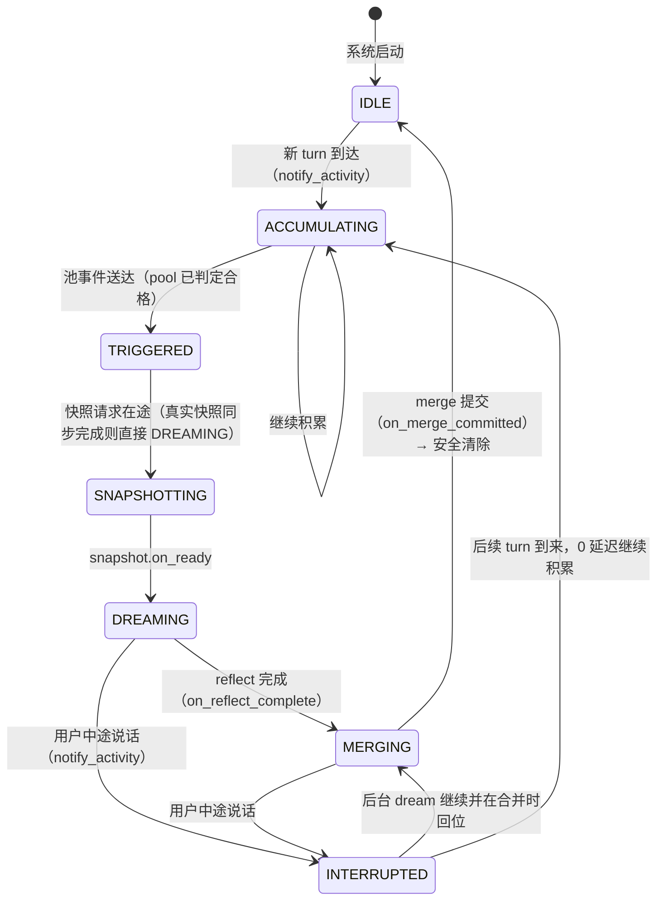
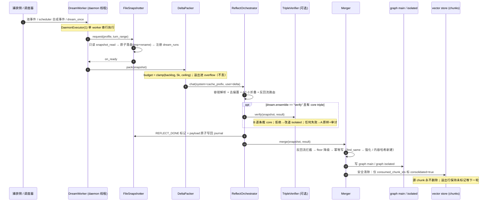
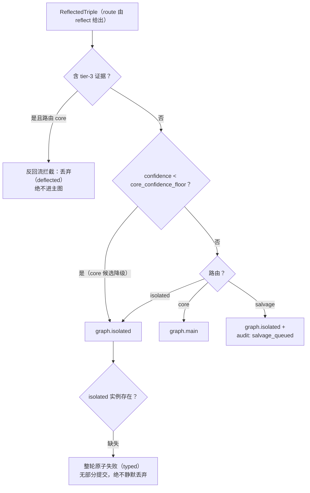

# 02 · 梦境引擎（Dream Engine）

> 一句话定位：本仓 Consolidate 阶段的批处理巩固引擎——把白天逐字捕获的 verbatim chunks 离线提炼为结构化 triple 并写回图，全程在 daemon 的 worker 线程上执行，绝不阻塞 /ingest 热路径。
>
> 状态基线：commit `02ca93d` 后（F2 根治收口）、**1349 passed / 3 skipped**（PRD-B2.3 收口记录），ruff / format / mypy 全净。本篇只描述该基线后本仓真实存在的功能；所有数字常量均以 `src/mnemoseed_local/config.py` 与各模块源码为准。行号引用一律钉在基线 commit（`02ca93d` 代码内容）之上；B6/B4a 等在途批次合入 src 后，行号引注须随基线推进重钉。
>
> 主要依据 PRD：`docs/zh/design/mvp-design.md`（§3 架构表、§4.1 模型策略与 ensemble、§4.3 做梦触发器、§5 流程图）、`PRD-A2.5-baseline-fixes.md`（异步化与失败退避、五键注册表化、budget 移除、isolated 必需化）、`PRD-B1-ensemble-verify.md`（verify 运行期消费端）、`PRD-B2.3-daemon-reliability.md`（挂起子项 RESUME 变体 + F2 根治）、`PRD-B2-roadmap.md`（B6 性能观察：drain 写序列化 / 批量提交，本篇仅作观察注脚）。

---

## 0. 功能定位与边界

### 定位

梦境引擎是记忆管线四阶段（capture → consolidate(dream) → retrieve → decay，provenance 横切贯穿、非独立阶段）中 consolidate 的落地。它与主仓（`mnemoseed/`）同源同哲学，但按本地单用户 MVP 裁剪：**单角色单路由**（唯一生成角色 `dream`，主仓的 deep_reflection / short_increment 双角色已删除，旧键给出 deprecation 报错）＋可选的 **ensemble verify 校验层**（第二个角色 `dream_verifier`，默认休眠）。

引擎在主链上做四件事：**snapshot**（原子落盘冻结视图）→ **delta**（动态预算分包）→ **reflect**（本地 LLM 提炼三分流 triple）→ **merge**（写回 graph 双实例 + 源 chunk `mark_consolidated`）。触发与失败重试由 **DreamScheduler** 按积分池规则驱动，执行由 **DreamWorker** 在 daemon 线程池上完成。

### 边界（诚实划界）

- **写侧归本篇，读侧归 03**：本篇定义的是"写侧"——merge 标记了什么（graph 节点写入 + 源 chunk 的 `consolidated=true` 标记）与 consolidation watermark 的形状（turn range 存入 MetaStore 的 per-profile `pool_state` 行）。读侧的"3λ 降权探针 / 未合并 chunk 探测"归本仓系列 `design/03-storage-and-retrieval.md`（Freshness Guard 探针以 `watermark.end+1` 起滤、命中候选融合分 ×0.8 降权后重跑选择循环、`consolidated` 的 chunk 按 λ×3 衰减——03 的 §3.5 与 §3.6 定义），本篇只给指针，不展开。
- **不做遗忘**：遗忘（decay）归 03（decay sweep 由 `DecaySweeper` 执行，consolidated chunk 按 λ×3 衰减——`snapshot.py:157` 明确引用该语义）。本篇只负责标记"已合并"。
- **不做预算上限**：`dream.token_budget_usd` 已移除（config 载入即 deprecation 报错，`config.py:470`）；TokenLedger 是纯 token 记录（append-only），无封顶、无"超支后 capture-only"、无 USD 估算。
- **不做 vote**：`dream.ensemble` 枚举仍接受 `vote` 值，但运行期无消费端——`TripleVerifier.verify` 只在 `== "verify"` 时动作，`vote` 按 off 处理（`verify.py:213`；PRD-B1 QA 观察 3 如实记录；vote 的 journal 双相位 + combiner 属 B5 挂起立项）。
- **不做"做梦解谜"**：引擎提炼的是事实性 triple，不产出洞察、不解析潜意识（理论锚不借清单，见 §2 末）。
- **不做 LLM 裁判**：无第三个"仲裁"模型；合并逻辑是确定性代码，不是 LLM 投票（mvp-design §4.1 决策 1）。

---

## 1. 流程（mermaid + 走查）

### 1.1 触发器生命周期状态机

`DreamTrigger` 维护每个 profile 的独立状态机（`trigger.py`，D5 隔离：状态绝不跨 profile 共享）：

**不变量（由构造保证）**：

- 所有公开方法都是 O(1) 状态簿记；快照请求是唯一的出站 seam 调用，reflect/merge 完成是入站回调，任何重活都不内联。
- 每 profile 同时最多一个 dream：在飞时新事件进溢出队列，逐个 drain（`_finish` 后只取一个）。
- 手动优先（FR-2.8）：`auto_trigger=False`（默认）时池事件一律记入 `pending_manual`，由 `dream --once` 消费，调度器绝不直接发射。

### 1.2 一次 dream 的完整时序

### 1.3 写侧分流决策（merge 边界）

**走查要点**：

- **snapshot 是纯只读**：`snapshot_read` 不做任何写、不加锁、不阻塞摄取热路径；`chunks` 以 `(turn_start, turn_end, chunk_id)` 确定性排序（`prompts.ordered_chunks`），全量 `ChunkStamp` 以 `stamp_json` 无损携带。
- **journal 是唯一事实源**：相位标记（`SNAPSHOT_DONE / REFLECT_DONE / MERGE_DONE`）写进快照文件内；`resume_boundary` 决定恢复边界（REFLECT_DONE 未写 → 重跑 reflect；已写 → 只跑 merge，**永不重跑 reflect**）；`result_from_payload` 从 journal 重建 ReflectionResult。未知标记保留并忽略，向前/向后兼容无需 schema 版本。
- **merge 幂等**：节点 ID 是确定性内容哈希（`sha1(profile+subject+predicate+object+polarity)` 前 32 hex），写入前用 `find_same_predicate` + object casefold 探测；同 triple 命中 → 就地强化（confidence 取 max、`reinforce_count+1`、provenance 追加 `reinforced` 事件），源链永不重写（append-only）。
- **安全清除**：`purge_snapshot` 只把 reflect 实际交给模型的 chunk（journal 里的 `consumed_chunk_ids` 白名单）标 `consolidated=true`；delta 溢出行保持未标记等下一轮更大预算/手动 run。无白名单的旧 journal 回退为全范围标记（对无截断的梦两者等价）。标记在磁盘上先写 MERGE_DONE 再做 store 标记，崩溃中途不会重放已提交的 merge（marker-before-progress）。
- **失败永不 raise**：reflect/merge 全部退化为 typed outcome，snapshot 保持 journaled，下一次 boot 恢复同一边界；`on_outcome` 把结果回告调度器做退避重发。

---

## 2. 理论锚（入选标准一句）

> 入选标准：只在"经实证验证的神经科学/心理学规律"上借用；所有预算/超时/线程等工程细节一律标注为实现机制层，不冒充理论。每条的"→设计规则"必须能回溯到本仓代码里真实存在的功能，且与主仓 REFERENCES 状态严格对齐（本篇不新增主仓未登记的理论条目）。

| 锚 | 来源 / 已验证规律 | → 设计规则（本仓落地） |
|---|---|---|
| **互补学习系统 CLS** | McClelland, McNaughton & O'Reilly 1995（主仓 R1 ✅）：海马快速习得 + 皮层缓慢整合的分工 | 批处理巩固引擎：白日逐字 chunk（海马位）→ 后台批量提炼为结构化 triple 写入图（皮层位）。对应 `dream/` 整套管线，`mark_consolidated` 后原文降为证据场景、decay λ×3（`snapshot.py:157`）。 |
| **睡眠期海马重放（sharp-wave ripple）** | Wilson & McNaughton 1994（主仓 R2 ✅）：睡眠中海马回放日间经历，驱动系统巩固 | 巩固是异步批处理而非同步内联：dream 链整体搬离 /ingest 热路径，worker 线程执行（`daemon/app.py` DreamWorker + `DaemonExecutor`）。 |
| **重建性记忆失真 + 误导信息效应** | Bartlett 1932（主仓 R51 ✅）+ Loftus 2005（主仓 R52 ✅）：回忆是重建，巩固过程系统性引入 distortion | **verify-before-commit 校验层**（`dream/verify.py`）：模型 B 逐条验证 A 的 core triple，拒绝项确定性改道 isolated 永不灭档。**如实注明**：本仓 PRD-B1 把 verify 作为架构决策交付（mvp-design §4.1 决策 1），**理论归因是本篇回接的**，PRD 原文没有理论锚章节——本篇措辞不假装 PRD 引过这些文献。 |
| **睡眠依赖记忆 triage** | Stickgold & Walker 2013（主仓 R54 ✅）：巩固是选择性的（triage）而非全量回放 | 巩固是选择性的：只对 pool 达标的窗口做梦（`DreamScheduler` 的 floor+idle / hard_deadline 规则），与"完整读、分流写"原则对位——读完整快照，但写入只按三分流 + 强化的量写回。 |
| **动态预算动机（机制层注脚）** | Borbély 1982 双过程模型（主仓 R48 ⚠️，状态照抄）+ Dement 1960 REM rebound（主仓 R50 ✅）：睡眠压力与反弹补偿 | 只为 delta 动态预算的**动机**背书：预算随积压量缩放（`resolve_delta_budget = clamp(backlog, 5k, ceiling)`）而非固定闹钟。**预算本身是机制层**，不构成独立理论锚。 |
| **Little 定律（稳态注脚）** | Little 1961（主仓 R49 ✅）：L = λW，稳态下积压 = 到达率 × 等待时间 | 稳态一致性注脚：若长期到达率超过排空能力，任何有限预算都会无界积压——所以积压 > 上限时**不放大单次预算**，而是靠"多次连续 dream 按固定节奏排空 + 溢出行永不丢弃"保证收敛（delta overflow 语义）。 |

**不借清单（02 自有，防伪理论混入）**：

- **不做"做梦 = 洞见 / 潜意识解谜"**：弗洛伊德式话术不借用；引擎输出事实性 triple，没有"梦中顿悟"机制。
- **不做遗忘**：本篇不承担遗忘；遗忘归 03（decay 引擎，`DecaySweeper`）。
- **模型自报 confidence 不作校准真值**：reflect 的 confidence 来自模型自报 + 确定性折叠，`core_confidence_floor` 的预期值如实标低（mvp-design §4.8："它过滤的是模型自报的不确定度，自信的幻觉照样穿过"）；真正的幻觉防线是 verbatim 通道 + provenance + isolated 结构（mvp-design §4.1 决策 1 原文），不是 self-report。
- **同源系统性幻觉投票无效**：ensemble verify 只滤抽样噪声/个体幻觉/格式崩坏/误路由；同源系统性幻觉无法靠投票消除（PRD-B2-roadmap 边界段原文），根本防线仍是 verbatim + provenance + isolated。

---

## 3. 实施方式（code-level）

### 3.1 模块地图（全部真实存在）

- 管线：`src/mnemoseed_local/dream/snapshot.py`（FileSnapshotter、SnapshotPhase、journal 恢复）、`delta.py`（DeltaPacker、token 估算、动态预算）、`reflect.py`（ReflectOrchestrator、StubReflectLLM、折叠/反回流）、`merge.py`（Merger、幂等写、salvage 队列）、`pipeline.py`（DreamPipeline 边界编排）、`trigger.py`（DreamTrigger 状态机 + DreamScheduler 调度）、`ledger.py`（TokenLedger）、`prompts.py`（去偏置提示词 + chunk 块文法）、`verify.py`（TripleVerifier 校验层 + StubVerifyLLM）。
- 线程底座：`src/mnemoseed_local/util/daemon_executor.py`（DaemonExecutor，daemon 线程 + 有界 close，永不注册 `_threads_queues`，卡死 worker 随进程亡——F2 根治）。
- LLM 面：`llm/routing.py`（RoleRouter 惰性物化 + 热生效 generation）、`llm/registry.py`（LLMRegistry 驱动注册表）、`llm/drivers/ollama.py`、`openai_compatible.py`（BYOK 预留）、`stub.py`、`stub_verifier.py`（测试件）。
- 接线：`daemon/app.py`（DreamWorker、_DreamRelay、boot RESUME 恢复、isolated 硬检查）、`capture/pool.py`（ScorePool 积分池）、`cli.py`（doctor 一致性检查）。

### 3.2 配置键与默认值（以 `config.py:86-103` 为准）

> 配置键的完整注册表（configwrite 校验、热生效、版本化回滚、审计）见本仓 `design/04-trust-boundary-and-config.md` §3.3；isolated 实例的硬检查面见该文 §3.4。本篇只列 dream 引擎消费的键与默认值。

| 键 | 默认 | 校验（config.py） |
|---|---|---|
| `dream.floor_pool_points` | `10.0` | 正数（:481-483） |
| `dream.idle_min_sec` | `900.0` | 非负（:484-486） |
| `dream.hard_deadline_sec` | `86400.0` | 非负（:487-489） |
| `dream.hardware_tier` | `"standard"`（`standard\|lite\|advanced`） | 枚举成员（:494-499） |
| `dream.ensemble` | `"off"`（`off\|verify\|vote`） | 枚举成员（:500-502）；`lite` 档强制 `off`（:503） |
| `dream.core_confidence_floor` | `0.0` | `[0,1]`（:509-510）；`>0` 时要求 `storage.graph.instances.isolated` 存在（:528） |
| `dream.delta_budget_ceiling_tokens` | `32000` | 整数且 `>= 5000`（:514-515） |
| `dream.reflect_batch_max_tokens` | `>= 0` | `0` | 批量反射每批 token 上限（#99），`config.py` 校验 `<= ceiling` |
| `dream.pool_forced_cap` | `50.0` | 正数（:517-518）且 `>= core_confidence_floor`（:519） |

- **移除键**：`dream.token_budget_usd` 写入即 `ConfigError`（deprecation 报错，永不静默忽略，`config.py:470`）。
- **delta 预算下限**：`delta.py:57` 常量 `DELTA_BUDGET_FLOOR_TOKENS = 5000`，不档位化；dynamic 解析为 `max(5000, min(ceiling, backlog))`（`delta.py:61-73`）。standard 档 ceiling 默认 `32000`（`config.py:102` + `delta.py:58` 双源同值）；**lite 档的 `8192` 是 mvp-design §4.8 的方向性档位值，代码默认面不内建**，由用户按档位写入该键。
- 显式预算：`DEFAULT_DELTA_BUDGET_TOKENS = 10000` 是显式传预算调用者的遗留固定默认（`delta.py:56`），显式预算优先于动态解析（回归围栏）。
- **热生效**：`Merger`/`DeltaPacker`/`ScorePool`/`DreamScheduler`/`TripleVerifier` 全部持 config 活引用或构造时活读路径，configwrite 改键无需重启 daemon。

### 3.3 主链各段

- **snapshot**：`FileSnapshotter`，`directory = CONFIG_DIR/dreams`；写盘 `tmp + os.replace` 原子替换；`MetaStore.record_dream_run` 注册 run 行；`recover()` 按 `(created_at, snapshot_id)` 升序回读未 merge 完成的快照。
- **delta**：`DeltaPacker.pack` 整块打包（不切文中），`cache_prefix`（system 模板 + 用户头 + 可选 graph digest）不计入 delta 预算；溢出进 `overflow_chunk_ids`（报告，永不 error）；`estimate_tokens` 是本地确定性估算：CJK 每字 1 token + 其余 `ceil(chars/4)`，无网络、无 tokenizer 下载（零网络约束），文件内如实标注为近似（ASCII 高熵文本最坏偏差约 4×，T6 以 provider 上报 usage 校准）。
- **reflect**：`ReflectOrchestrator.reflect` 每轮经 `resolve_llm()` 热取路由并 `on_run_started` 记录 run 的 model；容错解析（`_loads_json_array`：严格 JSON 失败后取最宽 `[...]` 区间，小模型常见 markdown 围栏）；字段级有界 coercion（tier 数字/单词、confidence 数字/`high|medium|low` 固定词表，越界即丢弃该 mention）；去偏置（`STRIP_TOKENS` 剥情绪/语气/称呼/角色扮演词，`prompts.py` system 模板规则 1-5）；AC-3 折叠按 `(subject, predicate, object)` **且 polarity** 分组，同极性折叠 confidence = `min(0.95, max + 0.05×(n-1))`（`reflect.py:748`），矛盾极性同键**双弃**并记入 `conflicts`（negation guard，防把"从不做 X"与"经常做 X"折成一条虚假强化）；tier-3 证据永不路由 core（`_route_for` + `_parse_triple` 双保险）；preference 型只接受 user-origin 证据（FR-2.12）。
- **merge**：`Merger` 三道闸：反回流（tier-3 core → 丢弃计 `deflected`）→ floor 降级（core 且 confidence < floor → isolated）→ 路由写入；`graph_isolated` 缺失且存在需要它的 triple → **原子前置失败**（typed，首个写前即抛，`merge.py:192-198`）；salvage triple 另 append 审计记录 `salvage_queued`（actor=profile），去重独立于节点写，崩溃重跑不重复入队。
- **ledger**：`TokenLedger` 按 `(profile_id, year_month)`（UTC）累计 `delta + provider 上报输出 token`（`ledger.py:61-70`），cache 前缀不计量；**无 budget 门、无拒绝审计、无 rollover 任务**——月份键自然轮回即自动复位。

### 3.4 调度器（DreamScheduler）

- 规则（`trigger.py`）：**floor+idle**（余额 ≥ `floor_pool_points` 且 profile 空闲 ≥ `idle_min_sec`）或 **hard_deadline**（最老 pending chunk 等待 ≥ `hard_deadline_sec`，**池内无 pending 则两规则皆跳过**）。余额读 MetaStore `pool_state` 持久行；drain 发生在池侧（fire 即重置为 0，同批分数永不重复触发）；scheduler 的合成事件只携带余额不再扣。
- **指纹去重**：`tick` 以 `(reason, turn_start, turn_end)` 为指纹，未变化窗口不重发（手动队列不堆积重复）。
- **失败退避（A2.5 T1，修"池已 drain 指纹不变 pending 永久积压"死锁）**：失败经 `report_outcome` 回告（worker 线程 → tick 线程消费），按 `BASE 60s × 2^(n-1)` 指数重发，单次上限 `DREAM_RETRY_CAP_S = 3600`，连续 `DREAM_RETRY_MAX = 3` 次后停止并 append 审计 `dream_retry_give_up`；成功清零连败。重发事件携带 0 余额，永不重扣。
- **循环**：`run_forever` 首次 tick 前 await resume-drain 事件，有界 `RESUME_DRAIN_TIMEOUT_S = 600`（超时照常 tick，防"恢复卡死导致调度静默停摆"——B2.3 挂起子项）；tick 周期 `SCHEDULER_INTERVAL_S = 60`；所有触发器规则键每 tick 重读，热生效。

### 3.5 ensemble verify 校验层（PRD-B1 交付）

- 形态：模型 B（`dream_verifier` 路由，默认 `ollama / gemma4:e4b`，`config.py:292-304`）逐条裁 A 的 **folded core triple**（只送 core，isolated/salvage 在主图外无可保护对象）；单次调用、**不重试**（校验层非关键路径，任何失败 = 整轮回退 A 原样 + 审计）。
- 拒绝语义：`reject → replace(route=ISOLATED)`（分歧保档，永不投票消灭、永不删除）；`accept → 原样`。
- 回退全集（`_fallback`）：LLMUnavailable / JSON 解析失败 / 覆盖不齐（缺号/多号/重号/垃圾 verdict 值）→ 返回 A 原结果 + `ensemble_verify_fallback` 审计（reason ∈ `llm_unavailable | malformed_output | coverage_mismatch`；窗口超限另加 `window_exceeded`）。
- 运行期窗口守卫：`_window_overflow` 对渲染后的判定 prompt 做 `estimate_tokens(system+user) + VERIFY_MARGIN_TOKENS(2048) > num_ctx` 预检，超窗即回退——绝不把会被静默截断的判定交给 B。
- 审计三面：`llm_role_configured`（路由物化时）+ `ensemble_verified`（{run_id, verifier_model, judged, accepted, rejected, rejected_keys, tokens}）+ `ensemble_verify_fallback`。
- **收益如实标定**（mvp-design §4.1 决策 1 原文）：滤格式崩坏、纠正误路由、滤抽样噪声/个体幻觉；**同源系统性幻觉投票无效**，根本防线 = verbatim 通道 + provenance 回溯 + isolated 结构；校验层不补召回（B1 人工验证记录发现 1：A 侧欠抽取时"无米下锅"）。
- **vote 模式明确未实施**：config 枚举接受写入，运行期按 off 处理；双相位 journal + 确定性 combiner 属 B5 挂起立项（PRD-B1 行 7 + B1 QA 观察 3）。

### 3.6 LLM 驱动面

- 角色路由：`RoleRouter`（惰性物化 + 按 generation 缓存，configwrite 变更只重建变更角色；未用角色永不校验，坏配置不炸 boot；API key 只存 env 名/`secrets:` 引用，物化时解析，审计只记引用不记值）。
- `ollama` 驱动（`drivers/ollama.py`）：原生 `/api/chat`，`stream=false`；`params → options` 白名单转发（`num_ctx/num_predict/...`，非 option 参数不泄漏）；`think` 顶层关闭（默认 `False`，防 thinking 模型烧光生成预算返回空 JSON——D4 实弹）；provider 用量从响应根字段 `prompt_eval_count / eval_count` 读取。
- `openai_compatible` 驱动（BYOK 预留）：`/chat/completions` + Bearer key，`max_tokens` 默认 2048；MVP 默认不走云端。
- `stub` / `stub_verifier`：确定性离线驱动，分别委托 `StubReflectLLM` / `StubVerifyLLM`，供测试与手动评审期，**永不作生产默认**。
- **doctor 一致性校验**（`cli.py`）：dream 路由 `estimate_tokens(cache_prefix) + delta ceiling + 生成余量(默认 2048) ≤ num_ctx`（仅 ollama 路由，非 ollama 显式 skip）；verifier 路由 `prefix + 2×ceiling + VERIFY_MARGIN_TOKENS(2048) ≤ num_ctx`（2× 是证据块随候选项重复渲染的实测扇出系数，B1.1 实弹）；外加模型存在性检查（缺失只报 `ollama pull` 提示，**绝不静默拉取**）。

### 3.7 未实施 / 在途（如实清单）

- `vote` 模式（B5 立项挂起；机制改动：双相位 journal + combiner + triple 级 model_id 归因）。
- `dream.capture_only` 硬模式（mvp-design §4.8 留待 Phase B 裁定；现状 `auto_trigger=false` 即软 capture-only，但手动 `dream --once` 仍合并）。
- advanced 档 27B 实测（硬件未到位挂起）。
- B6 性能项（drain 写序列化 / 批量提交）——仅作为 PRD-B2-roadmap 观察项记录，本篇不含实现。
- 主仓的"双时段双角色（deep_reflection / short_increment）"路线已删除，不在本仓（`config.py` LEGACY_ROLES 容忍并警告）。

---

## 4. 红线与诚实边界

- **源 chunk 永不删除**：合并后只 `mark_consolidated`，原文作为证据场景保留，decay λ×3 由 D1 sweeper 执行，provenance 完整可回放（mvp-design §3 深化项）。
- **isolated 实例必需**：无 `storage.graph.instances.isolated` 时 daemon 启动即 `RuntimeError`（`app.py:493-504`），floor>0 的 config 在载入与 configwrite 双侧都被拒；merge 侧另做原子前置失败。**绝不静默丢弃**。
- **tier-3 永不进主图**：reflect 路由层与 merge 反回流闸双重拦截，deflected 计数入 MergeSummary 供观察。
- **账本无上限**：TokenLedger 只记录不封顶；任何"超支回退"逻辑都不存在（budget 键移除即 deprecation 报错）。
- **verify 是校验层不是关键路径**：B 的每一种失败都有 A 原样 + 审计的回退；从不阻塞 reflect 边界完成。
- **journal 幂等**：断点恢复只走一个边界；reflect 绝不重跑；merge 绝不双写（内容哈希 + find_same 探测）；崩溃窗口未因恢复改造加宽（B2.3 QA 记录）。
- **理论锚诚实**：只写实证验证过的规律，每条标注来源与主仓状态；预算/超时/线程/重试全部是机制层，不冒充理论；B1 的 verify 是架构决策交付，理论归因是本篇回接，不假装 PRD 原文有理论锚；R48 状态照抄主仓 ⚠️，不擅自升级为已核验。

---

## 5. 本篇引用

> 完整引用，前缀 R# 为本仓 `docs/zh/design/REFERENCES.md` 编号；「同主仓 Rxx 状态」为主仓 REFERENCES 的编号与状态。主仓文献状态与编号以 `G:\Development\MnemoSeed\mnemoseed\docs\REFERENCES.md` 为准，本篇只作对应转述，不重核（如实标注状态照抄）。

- **R1 — McClelland, J. L., McNaughton, B. L., & O'Reilly, R. C. (1995). Why there are complementary learning systems in the hippocampus and neocortex. *Psychological Review*, 102(3), 419–457. DOI: 10.1037/0033-295X.102.3.419** —— 互补学习系统（双存储分工）。**同主仓 R1 ✅**（direct DOI hit）。
- **R2 — Wilson, M. A., & McNaughton, B. L. (1994). Reactivation of hippocampal ensemble memories during sleep. *Science*, 265(5172), 676–679.** —— 睡眠期海马重放巩固。**同主仓 R2 ✅**。
- **R34 — Bartlett, F. C. (1932). *Remembering: A Study in Experimental and Social Psychology*. Cambridge.** —— 重建性记忆：巩固引入失真，故写入前须验证。**同主仓 R51 ✅**（1995 重印版 DOI 10.1017/cbo9780511759185）。
- **R35 — Loftus, E. F. (2005). Planting misinformation in the human mind. *Learning & Memory*, 12(4), 361–366. DOI: 10.1101/lm.94705** —— 误导信息效应：重建=失真风险，verify-before-commit 的第二重来源。**同主仓 R52 ✅**。
- **R37 — Stickgold, R., & Walker, M. P. (2013). Sleep-dependent memory triage. *Nature Neuroscience*, 16(2), 139–145. DOI: 10.1038/nn.3303** —— 睡眠依赖记忆 triage：巩固是选择性而非全量回放。**同主仓 R54 ✅**。
- **R31 — Borbély, A. A. (1982). A two process model of sleep regulation. *Human Neurobiology*, 1(3), 195–204.** —— 双过程模型（睡眠压力→预算动机注脚）。**同主仓 R48 ⚠️**（状态照抄：原刊已停刊、未在 Crossref 直接命中，PubMed PMID 7185792）。
- **R33 — Dement, W. (1960). The effect of dream deprivation. *Science*, 131(3415), 1705–1707.** —— REM rebound：剥夺后补偿性反弹（积压期预算扩张的生理对位，机制层注脚）。**同主仓 R50 ✅**。
- **R32 — Little, J. D. C. (1961). A proof for the queuing formula: L = λW. *Operations Research*, 9(3), 383–387. DOI: 10.1287/opre.9.3.383** —— 稳态一致性：到达率须 ≤ 排空能力。**同主仓 R49 ✅**。

**本篇新增文献**：无。本篇未向主仓 REFERENCES 增加任何新条目；所有引用均转述主仓既有编号与状态（理论锚纪律：新增文献须登记并核验，本篇没有新增）。

**仓内依据文档**（非文献）：`docs/zh/design/mvp-design.md`（v1.3 定稿 + v1.4 修正注记，§3/§4.1/§4.3/§4.8/§5）、`docs/zh/prd/PRD-A2.5-baseline-fixes.md`、`docs/zh/prd/PRD-B1-ensemble-verify.md`、`docs/zh/prd/PRD-B2.3-daemon-reliability.md`（挂起子项 RESUME 变体 + F2 根治）、`docs/zh/prd/PRD-B2-roadmap.md`（B2.6/B6 观察与挂起项）。