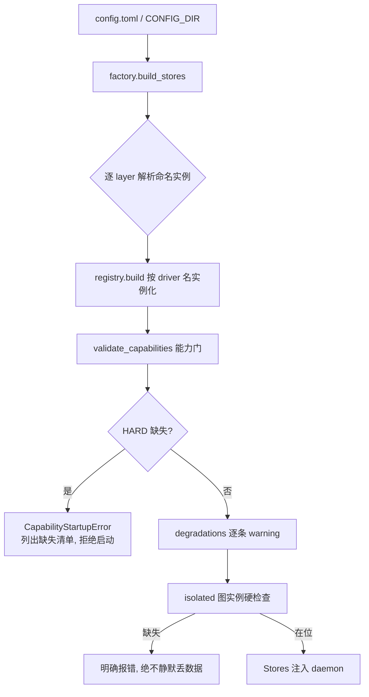

# 03 · 存储与检索（Storage & Retrieval）

> 一句话定位：本仓的存储层（四端口 + 默认驱动组 + schema 双时态版本链）与检索层（cues → hybrid 双轨 → assemble 装配）加上 decay 引擎（sweep/reinforce/model）的落地设计，以及 provenance 横切纪律。
> 状态基线：commit `02ca93d` 之后、**1349 passed / 3 skipped**（F2 根治批次收口基线；retrieve/hybrid.py 于该批并入 DaemonExecutor 并发双轨）。行号引用一律钉在基线 commit（`02ca93d` 代码内容）之上；B6/B4a 等在途批次合入 src 后，行号引注须随基线推进重钉。
> 主要依据：`docs/zh/design/mvp-design.md` §3（架构表）/ §4.4（Verbatim 直达与 consolidated 检索过滤）、PRD-A2.5（任务 T2 主检索轨 consolidated 过滤、任务 T3 isolated 实例必需化）、PRD-B2.1（理论锚 TA-1/TA-2/TA-6）、PRD-B2.4（read-surface 时间结构 M1）。budget/top-k 等数字属机制层，仅记录不上升为理论主张。

## 0. 功能定位与边界

**本篇讲什么**：从"一条对话原文落盘"到"一段相关记忆被装配回上下文"再到"这条记忆随时间淡出/被强化"的整条读面通路，以及它下面的存储基础设施。

**本篇不重复讲什么**：

- 捕获侧（stripper/scorer/stamper/ScorePool）与 dream 合并链归 02——consolidation watermark 的**写侧**（dream run 结束如何推进 watermark、如何 mark_consolidated）由 02 定义，本篇只定义**读侧**（watermark 如何被检索/探针消费）。
- recall-pending 中段自动回忆的完整细节归 06；本篇只在其与 Freshness Guard 共享"同实体重叠探针"这一处给出一句话指针。
- 宿主接入（hook / MCP 网关）、CLI 与 daemon 生命周期归 04/05 系，不在此展开。

**边界声明**：本仓库是单用户本地 daemon 的移植瘦身版。它没有多后端云拓扑、没有 driver 能力之外的任何降级形态之外的选择——能力门（capability gate）决定"哪些能力缺失时拒绝启动、哪些降级并告警"，没有静默路径。

## 1. 流程（mermaid + 走查）

### 1.1 存储解析与启动闸（boot 一次）



走查：`factory.py:85-109` 遍历 `LAYER_TYPES`，对每层用 `DRIVER_REGISTRIES[kind]` 把 config 里每个命名实例构造成驱动实例；随后 `ports.validate_capabilities` 依 `DEGRADATION_TABLE` 逐能力核对声明集——3 项 HARD（`meta.transaction` 积分池/watermark 原子性、`graph.version_chain` 版本链重放与 as_of、`vector.metadata_filter` 隔离与 freshness），缺失即抛 `CapabilityStartupError` 拒绝启动；8 项 DEGRADE 逐条打 warning 放行。isolated 图实例在 config 装载（`config.py:524-535`）、doctor 检查（`cli.py:272-284`）与 daemon 启动（`daemon/app.py:493-504`）三处硬检查，缺失时报错并给出修法（补 `[storage.graph.instances.isolated]` 表），dream merge 侧（`dream/merge.py:186-197`）在"分流/降级结果需要 isolated 却缺失"时原子失败——任何路径都不静默丢。

### 1.2 检索主流程（一次 recall）

```mermaid
sequenceDiagram
    participant C as 消费侧(MCP recall / T4)
    participant E as CueExtractor
    participant H as HybridRetriever
    participant V as 向量轨(LanceDB)
    participant G as 图轨(SQLite-Graph)
    participant A as Assembler
    participant M as MetaStore
    participant Gs as GraphStore

    C->>E: query + host/project/time_bucket
    E-->>C: ExtractedCues(entities/tools/context + intent)
    C->>H: recall(query_text, cues)
    par 并发双轨 (2-worker DaemonExecutor)
        H->>V: search(dense/sparse, min_decay=0.4,<br/>entities_allow_missing, consolidated=false, top 20)
        V-->>H: 候选 chunk(语义相似度)
    and
        H->>G: list_nodes(entities) 种子 → traverse 2-hop → decay 地板 0.4 → 池上限 20
        G-->>H: 候选 graph nodes
    end
    H->>H: 融合排序 score=α·语义+β·线索+γ·decay+δ·图中心度
    H-->>A: 排序池 + 逐轨计数
    A->>M: pool_state(profile) 取 watermark
    A->>A: 预算闸(top_k=5, 800 tokens) + 冲突成对
    A->>V: 探针 snapshot_read(consolidated=false,<br/>turn_start > watermark.end, 实体重叠)
    V-->>A: 未合并新证据 0..n
    Note over A: 命中 → 该 graph 候选 ×0.8 降权、附 ≤2 截断原文、<br/>set_flags(PENDING_CONSOLIDATION); 循环重选至成员稳定
    A-->>C: 上下文包 + dropped_count + coverage 自报 + 诚实空语义
```

走查：cues 提取是确定性、零 LLM 的（`retrieve/cues.py`，正则 + 双语标记，entities_cap=16 / tools_cap=8）。hybrid 双轨并发跑在两个 daemon 线程上，合并走"分数降序 + (kind, id)"的稳定排序，与顺序参考路径字节级一致（`hybrid.py:202-221`）；两轨读独立存储，结果与求值顺序无关。assemble 先预算闸（`assemble.py:263-334`），再对 provisional 成员跑 Freshness 探针（`assemble.py:338-394`），命中即把候选的融合分 × `freshness_demotion`（0.8）后**重跑选择循环**（`assemble.py:211-241`）直到成员不再变化——一次降权改变 top-k 成员关系也被兑现；标记最后持久化到 graph 的 `pending_consolidation` 旗标，供 dream 引擎消费。

### 1.3 遗忘与强化生命周期（常驻后台）

```mermaid
flowchart LR
    subgraph 事件[EVENT: 命中即 reinforce]
        R1[召回命中 chunk/node] --> R2{weight ≥ 0.4?}
        R2 -- 是 --> R3[rebound min(1, w+0.1)<br/>last_reinforced=now]
        R2 -- 否 --> R4[只计 usage, 不回弹<br/>sunk 由显式复活路径唤醒]
    end
    subgraph 趋势[TREND: 周期 sweep]
        S1[tick 立即一次, 此后每 interval] --> S2[逐 profile 读游标判 due]
        S2 --> S3[扫描当前版节点+未删 chunks]
        S3 --> S4[目标=min(当前权重, conf·e^(−λ·days))]
        S4 --> S5[drop ≥ min_apply_delta 才写]
        S5 --> S6[每 profile 一条 decay_sweep 审计]
    end
    R1 -. 基线刷新 .-> S3
```

走查：`decay/reinforce.py` 消费召回命中（`record_hits`），门槛下（< 0.4）的项只累计使用计数不回弹（FR-4.3 阶梯，防"随手一搜就把沉没记忆拽活"）。`decay/sweeper.py` 是 daemon 常驻异步循环，启动先补跑一次（崩溃后追赶），此后每 `decay.sweep_interval_s`（默认 86400s）一轮；曲线目标 `conf × exp(−λ × days)`，与当前权重的 min 保证单调只降；`min_apply_delta`（0.01）跳过亚阈写；`never_decay` 显式排除、已删除/已取代版本因只读当前版本而天然排除。每 profile 一轮一条 `decay_sweep` 审计（actor=daemon），携带 scanned/updated/max_drop。

## 2. 理论锚（入选标准一句 + 每条：来源/已验证规律/→设计规则；末尾不借清单）

入选标准：只收有实验与长期复现证据验证的规律；每条给出来源、规律原文级表述、以及它在检索/存储/遗忘上推导出的设计规则。理论只回答"为什么这样设计"；预算、top-k、间隔、比例系数等一律属实现机制层（见 §3），不因本篇理论而获得神圣性。

### 2.1 编码特异性（Encoding Specificity）

- 来源：Tulving & Thomson（1973）encoding specificity principle（同主仓 R4 ✅）。
- 已验证规律：遗忘的主形态是"可用但不可及（available but not accessible）"——提取成功率取决于线索与编码时上下文的重合度，而非存储强度本身。
- → 设计规则：检索面保留编码时元数据（project/host/time_bucket/entities 即 `Cues`），并把当前轮的**弱线索**（host/project/time_bucket）作为低权重分量喂进 rerank 的 β 项（`hybrid.py` `_BETA_CONTEXT_WEIGHT=0.15`），而不是拿它们过滤候选——线索重合度驱动排序、不参与取舍。focal（实体精确命中）与 non-focal（纯语义相似）的两级线索分档属 TA-2 的姊妹实现，细节在 06（recall-pending）。

### 2.2 ACT-R 陈述性记忆激活方程（排序动力学同构）

- 来源：Anderson & Schooler（1991）对人类记忆统计结构的实证（"回忆概率 ≈ 环境中需要的概率"）；ACT-R base-level learning（β = ln Σ t_j^-d，频度与时近按幂律求和）（已核验 · REFERENCES R23 ✅，本仓文档此前仅经 B2.1 立项引用）。
- 已验证规律：记忆的可用性 = 基础激活（使用频度 × 时近）+ 当前线索的扩散激活 + 噪声。
- → 设计规则：检索排序 = 基础激活 + 线索激活。本仓的 decay/reinforce 是该方程的同构物（B2.1 TA-1 原文）——sweep 按时近单调衰减、命中即回弹刷新基线，等价于 base-level 项的时近求和；本篇只做一句话引用，完整设计在 06。

### 2.3 艾宾浩斯遗忘曲线（衰减的指数形态）

- 来源：Ebbinghaus 1885/1913（同主仓 R8 📕 状态照抄）。
- 已验证规律：无复习条件下，遗忘随时间呈近似指数衰减。
- → 设计规则：decay 曲线取指数形态 `w = conf × exp(−λ × days)`（`decay/model.py:53-62`）。注意：这条锚只约束曲线的**形状**，不约束 λ 数值、间隔或门槛——那些是机制层标定项（B3 评测臂吃数据）。

### 2.4 突触稳态假说（SHY，sweep 的全局缩放语义）

- 来源：Tononi & Cirelli（2003）synaptic homeostasis hypothesis（同主仓 R6 ✅）。
- 已验证规律：睡眠中的突触全局缩放（synaptic downscaling）按比例稀释全局权重，保留相对强度关系而压低总能耗。
- → 设计规则：sweep 是**全局趋势**——它只降不升、按同一 λ 映射全局重算，不针对单条记忆做"惩罚性"削除；事件性的 reinforce 与之对立（一降一升，`decay/sweeper.py` 与 `decay/reinforce.py` 的职责分界）。稀释语义：不归零、不删档，只压低可及性。

### 2.5 干扰理论（遗忘的主引擎是干扰，不是时间）

- 来源：Wixted（2004）（R41 ✅）。
- 已验证规律：遗忘的主要决定因素是前摄/倒摄干扰的累积，时间本身只是干扰发生的载体。
- → 设计规则：**干扰项未实施**——本仓 λ 无干扰系数（`decay/model.py:21-24` 明示 FR-4.1 的干扰项 `λ_eff = λ_base × (1 + κ·interference_load)` 被 DEFERRED，需一个近邻相似读端口而存储层尚未暴露）。本篇如实记录：当前衰减只按类型分层 λ，干扰项作为已立项未落地的机制留待该读端口出现。

### 2.6 间距效应（reinforce 冷却的动机；本仓未实施冷却）

- 来源：Cepeda 等（2006）meta-analysis（R9 ✅）。
- 已验证规律：间隔复习的收益非线性高于集中复习；短窗内的重复提取回报递减。
- → 设计规则：**冷却窗口未实施**——`decay/reinforce.py:21-25` 明示 spacing-effect cooldown 被有意不做（文档描述但未钉机制，且与捕获侧 stamper 的 Hebbian 回弹保持同一扁平步进语义）。本篇如实记录：间距效应的动机被采纳（reinforce 仍是单步小回弹 + 刷新基线），但"短窗递减"的冷却机制没有落地。

### 2.7 检索诱发遗忘（反稀释/防马太效应的动机）

- 来源：Anderson, Bjork & Bjork（1994）retrieval-induced forgetting（R40 ✅）。
- 已验证规律：提取 X 会压制其竞争者；长期提取优势会重塑可访问性格局（受欢迎度自我强化）。
- → 设计规则：检索装配层以"反稀释"回应——预算闸尾裁并自报 `dropped_count`、冲突成对返回、诚实空语义，且召回命中才 reinforce（`assemble.py` + `daemon` 召回路径）；"被注入/被检索到"本身不计 reinforce（B2.1 TA-6：注入 ≠ 强化，消费证据守卫归 06）。主仓设计稿第 7 条的 MMR 类类内去重与"每 N 次放一条低权重高不确定记忆"的探索配额在本仓**未落地**，如实记录（见 §4）。

### 2.8 赫布定律（capture 近重复强化）

- 来源：Hebb（1949）"neurons that fire together wire together"（同主仓 R10 📕）。
- 已验证规律：高度重复的激活模式强化既有联结，而非重新建立新痕。
- → 设计规则：capture 侧近重复检测（`capture/stamper.py`）——写入前对 embedding 做近重复探针，相似度 ≥ 0.9 且内容判定一致时**就地强化既有 chunk**（`decay_weight` 回弹 +0.1、刷新 `last_reinforced`），不写新 shard；0.85–0.9 冲突带则标 `needs_reconcile` 并给积分池记预测误差奖励。细节归 02，本篇只在"写侧事件与读侧 reinforce 共享同一扁平步进（0.1）"处引用。

### 2.9 不借清单（03 自有）

- **Miller 7±2** 不得作为任何 top-k/预算常量的出处：工作记忆容量若被提及，只可引 Cowan（2001）"chunk 依赖的 ~4"（已核验 · REFERENCES R13 ✅，同主仓 R15 组合条目内）。本仓 top_k=5/20、budget=800 等均为机制层标定值，非容量锚。
- **"相似度越高，记忆越可信"** 不收：相似度只决定可及性（排序），不进入 provenance.confidence（情绪同理，见 §4）。
- **"向量库 = 长期记忆"** 的简化话术不收：本仓明确是双存储——verbatim 向量层（证据场景）+ 图层（合并产物），检索面是两者的合流，任何单库叙事都会漏掉"合并后 chunk 退出搜索面"这一关键语义。

## 3. 实施方式（code-level）

### 3.1 存储端口：四接口 + 能力门

`storage/ports.py` 定义四个 Protocol 端口，方法面由 PRD-08 附录 B 钉死：

- **VectorStore（海马体）**：verbatim chunk 的存取 + 元数据过滤检索。关键方法：`upsert_chunk` / `search`（dense+sparse、`ChunkFilter`、top_k）/ `near_duplicate`（**profile_id 显式隔离**的近重复探针，D5）/ `snapshot_read` / `mark_consolidated` / `purge_range` / `update_weights` / `update_chunk_state`（usage 计数与 reconcile 旗标的批量写、未知 id 静默容忍）/ `list_chunks`。
- **GraphStore（皮层）**：合并产物结构记忆 + 版本链。`upsert_node` / `get_node` / `traverse`（深度钳制 ≤2）/ `add_edge` / `bump_cooccurrence` / `find_same_predicate` / `set_flags`·`clear_flags`（四个 `GraphFlag`：needs_reconcile / pending_consolidation / conflict_group / peripheral_gaps）/ `invalidate`·`append_version`（事务原子）/ `tombstone`（GDPR 擦除，只追加不物理删）/ `versions`·`diff`·`timeline`·`as_of`（双时态回放）/ `batch_update_weights` / `query_intentions` / `list_edges`（控制台 Graph View 批量边表）。
- **MetaStore**：profile / token / 积分池与 watermark / 版本化 config / 审计 / dream run 账本。`pool_add`·`pool_state`·`advance_watermark`（原子）/ `create_owner`（单 owner 精确一次，事务内判冲突）/ `audit_append`·`audit_query` / `record_dream_run`·`finish_dream_run` / `schema_version`·`migrate`。
- **Embedder**：向量化。`embed` / `embed_batch`；输出 `EmbeddingResult(dense, sparse?)`。

能力门：`Capability` 枚举共 11 项（vector 3 / graph 4 / meta 2 / embed 3），`DEGRADATION_TABLE`（`ports.py:371-437`）把其中 3 项标 HARD（缺则拒启）、8 项标 DEGRADE（缺则告警放行）。**`graph.traverse_2hop` 与 `embed.local_inference` 虽在声明集内但不入启动闸**（`ports.py:846-847`）。

### 3.2 默认驱动组

| 端口 | 默认驱动 | 能力 | 说明 |
|---|---|---|---|
| vector | `lancedb_embedded`（`storage/drivers/lancedb_embedded.py`） | VECTOR_HYBRID_SEARCH / VECTOR_METADATA_FILTER / VECTOR_SNAPSHOT | 本地 LanceDB 目录，dense+sparse 混合检索（`_DENSE_FUSION_WEIGHT=0.5`），快照读；写路径经单把 store 级锁串行化（Windows 下多提交撞 `latest_version_hint.json` 的规避） |
| graph | `sqlite_graph`（`storage/drivers/sqlite_graph.py`） | GRAPH_TRAVERSE_2HOP / GRAPH_VERSION_CHAIN / GRAPH_COOCCURRENCE_EDGES / GRAPH_EDGE_LIST | 三张表（nodes / edges / node_versions）；**每命名实例一个独立 SQLite 文件**（`graph.main` / `graph.isolated`）；版本链写（invalidate + append_version）在 `BEGIN IMMEDIATE` 事务内原子完成 |
| meta | `sqlite_meta`（`storage/drivers/sqlite_meta.py`） | META_TRANSACTION / META_CONCURRENT_READERS | profile/令牌/积分池/配置/审计/dream 账本 |
| embed | `bge_m3_onnx`（`storage/drivers/bge_m3_onnx.py`） | EMBED_LOCAL_INFERENCE / EMBED_BATCH / EMBED_SPARSE_OUTPUT | ONNX Runtime CPU 推理，默认 1024 维、max_length 8192，dense+sparse 单次输出；**懒加载**（首用下载，失败给可执行的本地路径与重试指引，不静默） |
| embed（测试） | `synthetic`（`storage/drivers/synthetic_embedder.py`） | 同上三项 | 确定性哈希伪向量（默认 64 维），CI/测试用 |

支撑件：`_migrations.py` 结构化前向 DDL 序列（`schema_version` 表自管，`store` 标签让 graph/meta 各自只建自己的表但共享全局版本序列）；`_time.py` 的 `iso8601_utc`/`epoch_from_iso`——**所有存储时间列统一 ISO8601 UTC 文本（毫秒精度），模型层用 epoch 浮点，两者在驱动读写边界转换**；`_threadlocal.py` 每线程懒开一条 sqlite 连接（WAL + busy_timeout=5000，关闭后拒绝再开），让 hybrid 双轨可并发读而不共享句柄。

### 3.3 Schema：chunk stamp 与图节点/边

**ChunkStamp**（`schema/stamp.py`）：verbatim 通道（`text` 永不摘要化）；`cognitive_tier`（TIER_1/2/3）；`cues` 含情绪 `EmotionCue`（valence ∈[−1,1]、arousal ∈[0,1]、`peripheral_gaps`）与线索字段（project/host/task/tools_used/time_bucket/entities）；`provenance`（asserted_by / agent_id / session_id / source / confidence / asserted_at / history 事件链）；生命周期字段 `decay_weight` / `last_reinforced` / `score` / `consolidated`（dream 写回后钉 1）/ `ingested_at` / `turn_start`·`turn_end`（捕获窗口，安全 purge 与探针共同消费）。**红线：情绪只喂 scorer 的 arousal（封顶）与检索线索的 valence，永不计入 provenance.confidence**（闪回式记忆"感觉确定"并不等于准确，`stamp.py:28-31`）。

**GraphNode**（`schema/graph.py`）：11 种节点类型（USER/HABIT/PREFERENCE/ANIMA/INTENTION/CONSTRAINT/EPISODE/SKILL_SEQUENCE/DECISION/PROJECT/TOOL）；每类型 `props` 必填字段由 `NODE_PAYLOAD_SCHEMA` 钉死并在每次写边界校验；工作流旗标（needs_reconcile / pending_consolidation / peripheral_gaps / conflict_flag / conflict_group）、promotion_status（字段级载体，门逻辑未落地）、使用计数（hit_count/last_hit_at）。**双时态版本链**：`version` / `prev_version_id` / `valid_from` / `valid_to`（NULL=当前生效），`node_versions` 表是快照的 append-only 史——改写只是"旧版钉 valid_to + 新版本链接入"，永不覆盖；`as_of(timestamp)` 按 `valid_from ≤ t < valid_to` 重放当时生效的事实。**Edge**：`rel` 词汇表（has/holds/bound_by/evidenced_by/contains/supersedes/used_in/mastered/co_occurred），`co_occurred` 边每同会话共激活 +1（`bump_cooccurrence`）。

### 3.4 hybrid 双轨检索（`retrieve/hybrid.py`）

- **向量轨**：query 过 Embedder 后 `search`；`ChunkFilter` 带 `min_decay=0.4`、实体过滤（仅当驱动声明 `vector.metadata_filter`）、`entities_allow_missing=True`（**缺实体标注是"无证据"而非矛盾**，D2）、**`consolidated=False`**（PRD-A2.5 任务 T2：合并后的 chunk 是事实的证据场景，不再是新鲜检索面），top 20。
- **图轨**：`list_nodes(NodeFilter(entities))` 取种子（种子不做 decay 过滤，让"只能经由一条已衰减事实可达的永不衰减约束"仍能浮现），再 2-hop `traverse`，候选池在 `min_decay=0.4` 地板处截断、按 decay 降序取前 20；1 跳度中心度饱和于 8。
- **融合**：`score = α·semantic + β·cue_overlap + γ·decay_weight + δ·graph_centrality`，默认 α=1.0 / β=1.0 / γ=0.8 / δ=0.5；β 内部 entity 0.6 / tool 0.25 / context 0.15。每分量归一到 [0,1]，权重表达相对重要性、不必和为一。**ε·共现项当前未启用**（端口暴露不出廉价边读，`breakdown.cooccurrence` 恒 0.0，`HybridRecall.cooccurrence_term=False` 自报缺失）。
- **弱线索纪律**：host/project/time_bucket 只进 β 的 context 分量，永不过滤候选（`hybrid.py:33-40`）。实体重叠比较 casefold；向量轨的存储级元数据预过滤按原样实体匹配，故"唯一实体匹配是大写差异"的 chunk 可能在计分前被切掉——已注明（`hybrid.py:39-40`）。

### 3.5 assemble 装配与 Freshness Guard（`retrieve/assemble.py`）

- **预算闸**（`assemble.py:263-334`）：按融合分降序步行排序池，`top_k=5`、`budget_tokens=800` 双闸；超预算尾裁并计入 `dropped_count`——**丢弃永不静默**。
- **冲突成对**：`conflict_flag ∧ conflict_group` 的图候选按组原子放行（`CONFLICT_PAIR`）；组内只到单边/整组装不下时，允许最高分者单独入（`CONFLICT_OMITTED`，缺失边计入 dropped_count）——对子绝不静默拆散，且 pair 标记只用于全员在场的返回。
- **Freshness Guard**（`assemble.py:1-44` 语义、`:336-394` 实现）：在 provisional selection 之后跑探针。watermark = `MetaStore.pool_state` 返回的"**最后一次 dream run 合并的 turn range**"（`PoolState.watermark: TurnRange`），chunk 携带 `turn_start/turn_end` 捕获窗，故"自上次合并以来的新证据"精确判定为 `turn_start > watermark.end`，探针 filter 用 `turn_start = watermark.end + 1`（`:371`）把设计散文谓词（ingested_at > watermark）映射到真实存储类型（turn 号而非时间戳）。命中即：受影响图候选融合分 × `freshness_demotion`（0.8）后重跑选择循环至成员稳定；至多 `evidence_cap=2` 段截断原文（`evidence_max_chars=400`）作为 `recent_evidence` 附回；并 `graph_store.set_flags(..., [PENDING_CONSOLIDATION])` 供 dream 合并。探针同样只读 `consolidated=False`——已合并 chunk 不会重新武装 pending 或作为"新鲜证据"回载（`assemble.py:347-356`）。
- **同一实体重叠探针的另一消费方**：recall-pending 的 focal 扫描是 mirror（`daemon/memory.py:827` 的 casefold 权威重叠过滤，`auto_recall_focal_floor` 默认 0.4 镜像 hybrid `min_decay`）——两者共用同一实体重叠语义但服务不同机制（一个保合并新鲜度、一个做中段自动回忆），后者完整设计归 06。
- **诚实空**：零合格候选返回显式空 `AssembledContext`，带 `dropped_count` 与 `coverage` 自报（vector/graph 命中数、池大小、profile chunk 总数、watermark、fresh_evidence_chunks、pending_marked），不塞填充物。

### 3.6 decay 引擎（`decay/{model,reinforce,sweeper}.py`）

- **曲线**：`decay_weight = confidence × exp(−λ × days_since_last_reinforced)`，钳制 [0,1]；λ 分层（`config.py:163-180`）：fact 类 0.01（半衰期≈69 天，USER/HABIT/DECISION/PROJECT/TOOL/SKILL_SEQUENCE/CONSTRAINT）、preference 类 0.005（≈139 天，PREFERENCE/ANIMA）、episode 类 0.03（≈23 天，EPISODE/INTENTION）、chunk 伪类型 0.03。`consolidated` 的 chunk 按 `CONSOLIDATED_LAMBDA_MULTIPLIER=3.0`（`model.py:48`）倍率衰减——gist 进图后，verbatim 证据场景快速淡出。**分层 λ 的真实值以 `config.py` 为准**（`decay.lambda_per_type` 注册键可热改，未列条目回落设计默认）。
- **reinforce**：命中即事件——`min(1.0, w + 0.1)` 回弹 + 刷新 `last_reinforced`（`REINFORCE_BONUS=0.1`，与 capture 侧 stamper 的 Hebbian 回弹同一步进）；门槛 0.4 以下只计 usage 不回弹（FR-4.3）。图侧因批量端口带不了 `last_reinforced`，走全节点 upsert（`reinforce.py:122-147`）。
- **sweep**：趋势——只降不升、单调 min、`min_apply_delta=0.01` 亚阈跳过；`never_decay` 显式排除、reinforced 于本间隔内的项跳过（事件的价值立住）；每 profile 游标持久化于 meta 配置（`__decay__cursor`，刻意避开 configwrite 注册表）使崩溃后重扫幂等；每 profile 一条 `decay_sweep` 审计。
- **soft fading 生命周期（sunk/frozen/archived）未实施**：本仓只有候选地板 0.4 + 门槛下不回弹的护栏，没有主仓设计里的 sunk/frozen/archived 状态阈值。如实记录为"未实施（main repo 设计有）"。

### 3.7 provenance 横切与读面时间结构

- **provenance 只追加**：chunk 的 `provenance.history` 与图节点的版本链都是 append-only；审计（`AuditEntry.actor/action/detail/at`）由 daemon 各任务显式写，actor 归因不缺席。
- **衰减的例外**：provenance 永不衰减；`never_decay` 钉（FR-4.4，硬约束类节点）由 sweep 显式过滤；显式 pin / user 写入的 remembered 条目不在衰减面内。
  > **更正（2026-08-24，随实现批补注）**：上句后半对 chunk 不成立——`ChunkStamp` 根本没有 `never_decay` 字段，sweeper 的 chunk 路径也从无钉住豁免，显式钉住的条目实际一直按普通 chunk 速率（λ=0.03）衰减，构成静默信任缺陷。已由保留机制重设计修正：显式钉住条目现在读侧派生为 flashbulb 类，走慢衰减档 λ_pin=0.005（约 139 天半衰期），并配套同主题替换、线索救援与索引残迹；完整设计与缺陷取证见 `09-retention-redesign.md` §1–§3。原句按诚实规则保留不删，以此注为准。已 tombstone/已取代的版本因 sweep 只读当前版本而天然豁免。
- **read-surface 时间结构**（PRD-B2.4 M1）：recall 条目携带 `session_id` + `ingested_at`（chunk 为真实值，ISO 格式；graph 条目诚实 null/null——整合节点无单一会话，借 `updated_at` 会制造来源混淆，违 TA-8），详情归 06。

## 4. 红线与诚实边界

1. **合并后 chunk 退出搜索面，且双表示绝不重复命中**：主检索轨与 Freshness 探针都过滤 `consolidated=false`（PRD-A2.5 T2 + mvp-design §4.4）；检索面 = 合并产物 graph nodes + 未合并 verbatim chunks——MVP 阶段记忆一定可找回（verbatim 原文保留为证据链，可经 provenance 追溯取回，不进向量召回）。
2. **isolated 图实例必需，缺失即报错，绝不静默丢**：init 模板默认写入 `[storage.graph.instances.isolated]`（`config.py:717-719`）；启动/doctor/merge 三处硬检查。
3. **能力缺失无静默路径**：HARD 拒启、DEGRADE 告警，`dropped_count` 与 coverage 自报让"丢了多少、搜了什么"永远可见。
4. **冲突对子不静默拆散**；只有一边进池/整组装不下时以显式 `conflict_omitted` 标记呈现并计入丢弃。
5. **诚实空语义**：无合格候选给显式"无相关记忆"，绝不填充。
6. **排序 ≠ 可信**：相似度/线索只决定可及性排序；`confidence` 永不含情绪项（stamp 红线），探针/解码都不得把命中频率当成真实性证据。
7. **read-surface 判归属留给模型**：daemon 只供给 `session_id`/`ingested_at`/会话窗结构，不把缺省猜成旧会话、不做熟悉度/时间相似度检索项（TA-8/TA-9，B2.4）。
8. **未实施的诚实标注**：干扰项（λ 无 κ·interference_load）、间距冷却窗口、sunk/frozen/archived 阈值、ε·共现 rerank 项、MMR 类内去重与探索配额——全部未落地或未启用，本文不冒充已实现。

## 5. 本篇引用

- R23 — Anderson, J. R., & Schooler, L. J. (1991). Reflections of the environment in memory. *Psychological Science, 2*(6), 396–408.（已核验 · REFERENCES R23 ✅；B2.1 TA-1 立项引用）
- R28 — Anderson, M. C., Bjork, R. A., & Bjork, E. L. (1994). Remembering can cause forgetting: Retrieval dynamics in long-term memory. *Journal of Experimental Psychology: Learning, Memory, and Cognition, 20*(5), 1063–1087.（同主仓 R40 状态）
- R9 — Cepeda, N. J., Pashler, H., Vul, E., Wixted, J. T., & Rohrer, D. (2006). Distributed practice in verbal recall tasks: A review and quantitative synthesis. *Psychological Bulletin, 132*(3), 354–380.（同主仓 R9 状态）
- R13 — Miller, G. A. (1956). The magical number seven, plus or minus two. *Psychological Review, 63*(2), 81–97. DOI: 10.1037/h0043158 + Cowan, N. (2001). The magical number 4 in short-term memory: A reconsideration of mental storage capacity. *Behavioral and Brain Sciences, 24*(1), 87–114.（同主仓 R15 ✅ 组合条目；仅作工作记忆容量提及时的替代锚）
- R8 — Ebbinghaus, H. (1885/1913). *Memory: A contribution to experimental psychology* (H. A. Ruger & C. E. Bussenius, Trans.). Teachers College, Columbia University.（同主仓 R8 📕 状态照抄）
- R10 — Hebb, D. O. (1949). *The organization of behavior: A neuropsychological theory*. Wiley.（同主仓 R10 📕）
- R6 — Tononi, G., & Cirelli, C. (2003). Sleep and synaptic homeostasis: A hypothesis. *Brain Research Bulletin, 62*(2), 143–150.（同主仓 R6 状态）
- R4 — Tulving, E., & Thomson, D. M. (1973). Encoding specificity and retrieval processes in episodic memory. *Psychological Review, 80*(5), 352–373.（同主仓 R4 状态）
- R29 — Wixted, J. T. (2004). The psychology and neuroscience of forgetting. *Annual Review of Psychology, 55*, 235–269.（同主仓 R41 状态）