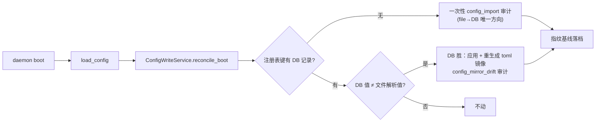
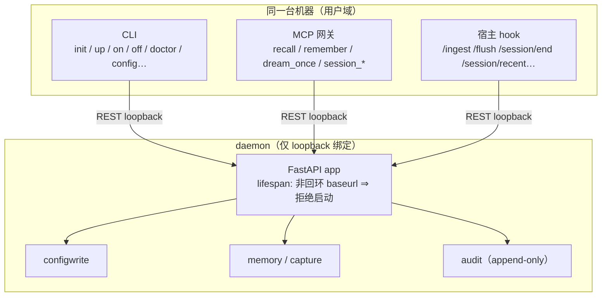

# 04 · 信任边界、隐私与配置面（Trust Boundary & Config）

> **定位**：本篇定义 MnemoSeed-Local 本地单用户 daemon 的信任边界（仅 loopback 绑定、隐式信任即正确性前提）、密钥三件套与"config 只存引用、一切展示面 redaction"、configwrite 单一写者管线与注册表全量键表、isolated graph 必需化、硬件档位与退阶通道，并如实标出「未实施/在途」项（BYOK、capture-only 硬模式、secrets store 的运行期接线）。
>
> **状态基线**：commit `02ca93d` 之后（F2 根治收口，PRD-B2-roadmap 记档 **1349 passed / 3 skipped** 全绿，ruff / format / mypy 净）。行号引用一律钉在基线 commit（`02ca93d` 代码内容）之上；B6/B4a 等在途批次合入 src 后，行号引注须随基线推进重钉。
>
> **主要依据**：`docs/zh/design/mvp-design.md` §3（config + configwrite、secrets 两行）、§4.6（许可/审计红线）、§4.7、§4.8（硬件档位 + isolated 必需化 + capture-only）；`docs/zh/prd/PRD-A2.5-baseline-fixes.md` T3（五键注册表化 + budget 移除 + isolated 必需化）；`docs/zh/prd/PRD-B2.5-daemon-onoff.md`（daemon off 哨兵及其与 configwrite/DB-primary 的刻意隔离）。

---

## 0. 功能定位与边界

### 0.1 本篇管什么

本篇是**工程信任面**文档：它回答"本系统凭什么可信、密钥放哪、配置怎么改才安全可回滚、哪些能力是硬必需、哪些退阶是诚实退阶"。全部内容锚定本仓真实实现（基线 commit `02ca93d`），先读代码、后写文档，数字常量全部取证于 `src/mnemoseed_local/`。

范围四块：

1. **信任边界**：daemon 仅 loopback 绑定、非回环 baseurl 拒绝启动；localhost 隐式信任 = 正确性前提（无账号/令牌层）；CLI / MCP / 宿主 hook 一律经 REST loopback 进入；本地单用户默认 default profile，多 profile 运行时的管理面（生命周期 + agent 绑定）见 §3.6。
2. **secrets 三件套**：`FileSecretStore` + `ChainSecretStore` + `KeyringSecretStore`（`src/mnemoseed_local/secrets/`）；config 只存**引用**（`secrets:mnemoseed/dream/<role>` 或 env-var 名）；一切展示面 redaction（字面量 `<redacted>`、写入侧校验失败）。
3. **configwrite 单一写者管线**：registry → 校验 → 外科式 TOML patch → 版本化 meta-store → 审计（actor 归因）→ 热生效；config.toml 是生成镜像，手改漂移侦测；DB-primary boot 覆层。
4. **isolated 必需化 + 硬件档位/退阶**：isolated graph 实例四层强制（init 模板 / 加载校验 / boot 硬停 / doctor 硬查）；`dream.hardware_tier` 三档与 `dream.core_confidence_floor` 确定性降级。

### 0.2 本篇不管什么（边界）

- **认知分级隔离 / 隐私架构**归主仓 `04`（认知分级 + E2EE/SaaS 面）。本仓与主仓是 sibling：同一设计哲学（信任最小化 + 诚实边界）并行演化，本篇只取本仓的本地单用户 loopback 工程面，不照搬主仓云端信任模型。
- **记忆内容语义、学习/遗忘理论**归本系列 01–03；**审计与来源（provenance）规律**归 06（本篇仅以"审计可归/provenance 只追加"为工程基线，见 §2 理论锚）。
- **daemon 生命周期**（watchdog、off/on 哨兵全流程）细节归 07 / PRD-B2.5；本篇只记哨兵与 configwrite 的关系一句话（§4.4）。
- **账号体系、云端/BYOK 托管**：明确裁掉（MVP §1）或属 Phase B 后显式 opt-in（见 §4 诚实边界）；多 profile 管理面已落地（§3.6），非 loopback 信任的 auth/token 仍未实施。

---

## 1. 流程

### 1.1 configwrite 单一写者管线（主图）

```
┌────────────── 写路径（唯一写者 = ConfigWriteService）──────────────┐
│                                                                     │
│  CLI / MCP / console ──▶ POST /api/v1/config/set                    │
│                                │  REST（loopback 强制，403 纵深）     │
│                                ▼                                     │
│                           actor 归因（X-MnemoSeed-Actor）            │
│                                ▼                                     │
│                      CONFIG_KEY_REGISTRY（闭合键表）                  │
│                                ▼                                     │
│                   键值校验 + 交叉校验                                │
│                   (lite↔ensemble 互锁、floor≤cap、                  │
│                    floor>0 ⇒ isolated 存在；422 命名键)              │
│                                ▼                                     │
│                   外科式 TOML patch                                 │
│                   (行内改写，注释/布局/兄弟键存活；                  │
│                    config.toml = 生成镜像)                          │
│                                ▼                                     │
│                   版本化 meta-store 记录（slot×1e6+version）          │
│                                ▼                                     │
│                   审计 audit_append（actor 显式归因）                 │
│                                ▼                                     │
│                   热生效 live-apply                                 │
│                   (消费端 seam：Merger / DeltaPacker / ScorePool /   │
│                    DecaySweeper / MemoryService / DreamScheduler 持  │
│                    活引用或每 tick 活读)                             │
│                    generation 递增（per-role 亦然）                   │
└─────────────────────────────────────────────────────────────────────┘
```

mermaid 同构版本：

```mermaid
flowchart LR
    S[CLI / MCP / console] -->|POST /api/v1/config/set| R[REST loopback 强制]
    R --> A["actor 归因<br/>X-MnemoSeed-Actor"]
    A --> REG["CONFIG_KEY_REGISTRY 闭合键表"]
    REG --> V["键值校验 + 交叉校验<br/>lite↔ensemble 互锁 / floor≤cap / floor⇒isolated"]
    V -->|失败 422 命名键| R
    V --> P["外科式 TOML patch<br/>config.toml = 生成镜像"]
    P --> M["版本化 meta-store<br/>slot×1_000_000+version"]
    M --> AU[审计 audit_append]
    AU --> L["热生效 live-apply<br/>消费端活引用 / 活读路径"]
    L --> G["generation 递增<br/>per-role 重建"]
```



### 1.2 走查：一次 `config set` 全链路

以 `mnemoseed-local config set dream.core_confidence_floor 0.6` 为例（对应实现 `configwrite/service.py::set`，`configwrite/routes.py::set_config`）：

1. **入口**：CLI 以 REST client 面向 daemon（config 操作强制 loopback）；请求体 `{key_path, value}`。
2. **loopback 纵深**：`_reject_remote_writes` 校验 daemon `baseurl` 主机必须为回环（`routes.py:51-59`），非回环返回 403——写面永远只对本机开放。
3. **actor 归因**：`resolve_actor` 从 `X-MnemoSeed-Actor` 读 `cli|console|mcp`，缺省 `console`；wire 值从不影响授权（本仓无令牌）。
4. **注册表命中**：`dream.core_confidence_floor` 是注册表键；未知键抛 `ConfigWriteError` → 422 并命名该键。
5. **校验**：`_validate_confidence_floor` 收 `[0,1]`；`_cross_validate_floor` 交叉校验两个不变量：新值 ≤ `pool_forced_cap`；新值 > 0 时当前 config 必须已含 `isolated` graph 实例（`service.py:199-211`）——与加载侧校验同一规则、同一来源，永不漂移。
6. **外科式 patch**：`_patch_toml` 只在目标表内改那一行（保留缩进与行尾注释），缺失表则插到最后一个表之后；`value=None` 表示清除该键行（patch 层语义）；`[dream.llm.dream.…]` 这类手写嵌套表拼写在写前被剔除，避免双重定义（`service.py:717-737,740-787`）。
7. **版本化记录**：`meta.set_config` 落一条版本记录；版本号 = `slot × 1_000_000 + version`（slot 取自排序注册表的稳定下标），一个版本号可精确解码回唯一的 (key, version) 对。
8. **审计**：`audit_append` 记 `action="config.set"` + key/version/restart_required + actor。
9. **热生效**：`spec.apply` 以 kwargs 保全重建冻结的 `DreamConfig`/`DecayConfig`/`CaptureConfig`（写一键永不重置他键），并镜像进 `config.raw`；消费端 seam 持有活引用，下一节 merge / 下一拍 sweep / 下一条 prompt 扫描即生效，无需重启（B2.3 F2 基线：有界关停保障同样适用于热改）。`generation` 递增，role 键另递增该角色 generation 使 RoleRouter 精确重建被改角色。
10. **指纹**：每次成功写/回滚后记录文件 (mtime, sha256)，供下一次 boot 漂移侦测。

### 1.3 boot 时 reconcile_boot（DB-primary 覆层）



- **settings DB 是注册表键的主存储，config.toml 是生成镜像**：首次 boot 把文件中已解析的注册表键一次性导入 DB（唯一 file→DB 方向，审计 `config_import`）；此后 **DB 永远赢**——手改文件与 DB 不符时，按 DB 重生成镜像并审计 `config_mirror_drift`，绝不反向重基线（`service.py:1002-1093`）。
- **boot-scope 键（preset / storage.* / baseurl / auth）不是注册表键**：文件域、重启生效，本覆层不触碰。
- 此机制是"手改漂移侦测"的实现载体；`daemon.off` 哨兵**刻意排除在外**（§4.4），否则陈旧的 DB 行会在下一次 `up` 静默复活用户的禁用态。

### 1.4 REST 面一览

| 端点 | 语义 | 关键约束 |
|---|---|---|
| `GET /api/v1/config` | 解析后配置，secrets 只露名字 | redaction 字面量 → `<redacted>`（`service.py:847-892`） |
| `POST /api/v1/config/set` | 单一写者写路径 | 非回环 baseurl 403；未知键/坏值 422 命名键 |
| `GET /api/v1/config/versions` | 版本化历史（注册表键，内部记录永不外泄） | 逐键从 v1 起滚读，`value` 经 `_redact` |
| `POST /api/v1/config/rollback` | 回滚（**append-only**：新记录，永不删除） | `version_id` 解码→(key,version)→还原值→patch→热生效→审计 `config.rollback` |

### 1.5 信任边界流



---

## 2. 理论锚

入选标准（照 PRD-B2.1 纪律原文）：只列**有实验与长期复现证据验证的规律**；每条给出来源、规律原文级表述、以及它推导出的**设计规则**。理论回答"为什么这样设计"；延迟/缓存/指纹/字节序等属实现机制层，不入本节。

### TA-04-1 来源监控 · 审计可归与 provenance 永不衰减

- 来源：Johnson 等 source-monitoring framework（1993）——同框架锚在 PRD-B2.1 TA-5（注入须带围栏）与 PRD-B2.4 TA-8（归因支架）。主仓理论登记 R7 已核验（✅）。
- 已验证规律：人对"内容来自记忆还是当前输入、来自哪次经历"的判别**本质上不可靠**，来源混淆是常态而非例外；归因在有外显线索时才可靠。
- → 设计规则：**本系统的写入侧必须自带永不衰减的归因结构**——provenance 只追加（`merge.py` 的 Provenance.history 版本链、reinforce 永不重写源链）、audit 全程 actor 显式归因、configwrite 每一次写/回滚/导入/drift 都落审计。**不依赖任何"事后回忆谁写的"**：归因在写入时刻由机制固化，永不随时间衰减（与 TA-5/TA-8 的"主动归因易错"同一条规律的正向推论）。其余审计/来源面细节归 06。

### 其余工程面：无借用（如实）

**configwrite / secrets / redaction / daemon.off 哨兵 / loopback 绑定 / 硬件档位 / isolated 硬检查：无理论借用。** 措辞纪律照 PRD-B2.5 先例——这些是**工程信任与控制面**，不属于记忆功能设计；理论锚纪律的"不借清单"照常适用，不得给任何机制穿认知词汇（如"写回滚是遗忘"之类一律禁止）。

### 不借清单（本篇自有）

- **启停 ≠ 遗忘、开关 ≠ 显著性**（照 PRD-B2.5 理论锚原文）：`off`/`on`、`daemon.off` 哨兵、`auto_trigger` 都是工程控制面语义，永不表述为记忆衰退或注意力旋钮。
- **隔离图 ≠ "垃圾场"隐喻**：isolated 实例不是"丢掉坏东西"的垃圾桶——它是确定性保存通道（分歧、低置信、tier-3 证据），verbatim 原文永不删除，provenance 可回放。"隔离保存"是保全语义，不是丢弃语义。
- **redaction 是安全控制，不是"过滤记忆"**：`<redacted>` 只发生在展示面，secret 值仍按引用可解析；它不是对记忆内容的过滤，也绝不给模型"看不全所以记不全"的语义背书。
- **循环依赖防伪**：不为既有工程机制事后发明理论动机（如用"遗忘曲线"包装 decay 配置、用"记忆抑制"包装哨兵）。

---

## 3. 实施方式（code-level）

### 3.1 信任边界

| 机制 | 实现锚点 | 语义 |
|---|---|---|
| daemon 仅 loopback | `daemon/app.py` `lifespan`（`app.py:659-664`）：`urlparse(config.baseurl).hostname` 非回环 → `RuntimeError` "the local MVP is localhost-only" | 非回环地址**拒绝启动**，不是告警后继续 |
| 写面 loopback 纵深 | `configwrite/routes.py:40-59`：`_is_loopback`（含 `127.*` 前缀与 IPv4-mapped IPv6）+ `_reject_remote_writes` → 403 | 读面随 daemon 绑定天然受限；写面再设一道 403 纵深 |
| 隐式信任 = 正确性前提 | `daemon/actor.py:15-19`：`X-MnemoSeed-Actor` 仅归因，`_VALID_ACTORS = cli/console/mcp`，wire 值不参与授权 | 无账号/令牌层是**有意的**（MVP §1 裁掉账号体系）；任何能到达本机回环的进程在信任模型内 |
| 多 profile 运行时 | 全部内存/摄取路由显式携带 `profile_id`（schema/turn、daemon/memory、ingest）；存储各层按 profile_id 键控 | 数据面是 N 个隐式隔离命名空间（惯例单个 `default`，无需表行）；生命周期与 agent→profile 绑定管理面见 §3.6 |
| 记忆明文不出本机 | 无任何出站内存路径；`openai_compatible` 驱动仅作代码内保留（MVP §4.8"BYOK 推迟"） | 纯本地；BYOK 属 Phase B 后显式 opt-in（§4.1「未实施/在途」） |

### 3.2 secrets 三件套

**端口**（`secrets/store.py:57-65`）：`SecretStore` 极窄五方法 `get/set/delete/exists/masked_tail`——消费端永远看不到一个完整值，`masked_tail` 最多暴露末 4 字符，响应/审计载荷无从泄全量。

| 后端 | 实现 | 权限边界 |
|---|---|---|
| `FileSecretStore` | 每名一文件 `<CONFIG_DIR>/secrets/<sanitized>.key`，`sanitize_name` 把 `mnemoseed/dream/<role>` 的 `/` 映射为 `.`；写 = tmp + `os.replace` 原子替换 | POSIX 显式 `0700` 目录 + `0600` 文件；Windows 以用户 profile ACL 为强制边界、不尝试 chmod（`store.py:124-138`） |
| `KeyringSecretStore` | 经 `keyring` 包（Windows Credential Manager / macOS Keychain / Linux libsecret），service 名 `mnemoseed` | 构造前 `_probe_keyring_store` 走完整 set/get/delete 回环探测；运行期 keyring 故障**降级 `None`/no-op**，让链子落到 file 后端，绝不炸调用方 |
| `ChainSecretStore` | 链头 = keyring（探测通过时）否则 file；`set` 写第一个可用后端并记录 `backend_used`；`delete` 清所有后端 | `MNEMOSEED_SECRET_BACKEND`（`secrets/__init__.py:47`）可强制 `file`/`keychain`，否则自动探测 |

**config 只存引用**（`secrets/refs.py`）：`SECRETS_REF_RE = secrets:mnemoseed/dream/<role>`；`api_key_env` 字段接受 env-var NAME 链 **或** 单个 `secrets:` 引用（`config.py:377-399` 形状+活角色校验；`configwrite/service.py:268-296` 写侧校验），字面 key 值一律拒绝。

**redaction 三层**：
1. 展示面：`redact_key_ref_for_display`（`refs.py:46-66`）——env 名（UPPER_SNAKE 且含下划线，防 `AKIA…` 裸大写串冒充名字）与 `secrets:` 引用原样展示；**任何其他形态（手贴字面量）→ `<redacted>`**。
2. 读面：`service.get()` / `versions()` 的 `_redact` 只对 secret 标记键放行名字（`service.py:1133-1147`）；`test_configwrite_service.py:644-668` 钉住"手改字面量不泄"。
3. 审计面：`llm_role_configured` 记录走 `redact_key_ref_for_display`；`tests/test_audit_redaction.py:40-91` 用真实 app boot + 审计回读断言 canary 字面量**全量不出现在 `/api/v1/audit`**。

**写入侧校验失败**：`_validate_env_name_list` 对非名字/非引用 token 报错 `"a literal key value is never accepted or stored"`，且错误消息不回显违规 token——密钥值连错误响应都不许回流。

**诚实边界（在途）**：`daemon/app.py:505-510` 构建 `RoleRouter` 时传 `secrets=None`——三件套在模块层实现并全测（`test_secrets_store.py` / `test_secrets_keychain.py` / `test_secrets_refs.py`），config 引用语法已全链路校验；但**运行期经 secret store 物化 key 的接线尚未打开**，当前生效的只有 env-var 链（`llm/routing.py:96-107` 引用解析走 env）。`secrets:` 引用当下解析为空串即"引用结构就位、值解析待接线"。

### 3.3 configwrite 注册表全量键表（以 `configwrite/service.py:464-610` 为准）

五组，共 **16 个注册表键 + 2 角色 × 9 字段**：

**dream 调度/触发（4）**

| 键 | 类型 | 默认 | 消费端 |
|---|---|---|---|
| `dream.auto_trigger` | bool | `true` | DreamScheduler 自动触发总门（2026-08-23 起出厂默认 ON；原 `false` 手动优先门，回滚仅需此单键） |
| `dream.floor_pool_points` | 正数 | `10.0` | ScorePool 池底（同调度器同源） |
| `dream.idle_min_sec` | 非负 | `900.0` | ScorePool / 调度器空闲窗 |
| `dream.hard_deadline_sec` | 非负 | `86400.0` | 调度器硬期限（24h） |

**dream T3a 档位/阈值（5，A2.5 五键）**

| 键 | 类型 | 默认 | 消费端 + 交叉校验 |
|---|---|---|---|
| `dream.hardware_tier` | `standard\|lite\|advanced` | `standard` | 档位锚；`lite` 且 `ensemble≠off` 拒绝 |
| `dream.ensemble` | `off\|verify\|vote` | `off` | TripleVerifier；`lite` 档锁 off（双向互锁，`service.py:173-185`） |
| `dream.core_confidence_floor` | `[0,1]` | `0.0` | Merger 活读（§3.5）；≤ `pool_forced_cap`；>0 ⇒ isolated 必须存在 |
| `dream.delta_budget_ceiling_tokens` | int ≥ 5000 | `32000` | DeltaPacker 动态预算上限（`dream/delta.py` 模块常量同源 + 镜像钉） |
| `dream.reflect_batch_max_tokens` | int >= 0（0=off） | `0` | 批量消化上限（#99）；> ceiling 拒绝 |
| `dream.pool_forced_cap` | 正数 ≥ floor | `50.0` | ScorePool 强制合并上限 |

**decay（4）**

| 键 | 类型 | 默认 | 消费端 |
|---|---|---|---|
| `decay.enabled` | bool | `true` | DecaySweeper boot 门 |
| `decay.sweep_interval_s` | 正数 | `86400.0` | 每日 sweep 节奏（NFR-4.1） |
| `decay.min_apply_delta` | 非负 | `0.01` | 跳过亚阈值写入 |
| `decay.lambda_per_type` | 类型→正数 map | 逐型默认（fact `0.01` / preference `0.005` / episode `0.03` / chunk `0.03`） | 替换语义：缺省类型回落到 sweep 时 `decay.model.lambda_for` 的设计默认 |

**capture B2.1（3）**

| 键 | 类型 | 默认 | 消费端 |
|---|---|---|---|
| `capture.auto_recall` | bool | `true` | 整管开关（2026-08-23 起出厂默认 ON；原 opt-in 默认 off，回滚仅需此单键） |
| `capture.auto_recall_focal_floor` | `(0,1]` | `0.4` | focal 扫描 floor（0 会被拒：全 decayed chunk 皆 focal） |
| `capture.auto_recall_budget_chars` | 正整数 | `1200` | pending 选择预算 |

**dream.llm.`<role>` × {dream, dream_verifier}（2 角色 × 9 字段）**：`driver` / `model` / `base_url` / `api_key_env`（secret 标记）/ `max_tokens` / `provider` / `think` / `num_ctx` / `num_predict`。默认路由 `ollama/qwen3.5:9b` + `ollama/gemma4:e4b`（A2.5 T3 对齐）。

**注册表边界**：boot-scope 键（`preset` / `storage.*` / `baseurl` / auth）**不在注册表**——文件域、重启生效。`_SLOT_KEYS = sorted(registry)` 决定 version-id 槽位；**加新键会左移既有槽位**——B2.1 D5 已记边界"version_id 解码以注册表快照为域，升级前版本的 rollback 不支持"；B2.5 因此否决注册键（哨兵三锤之一）。DB 行以 `key_path` 为键，不受槽位移影响。

### 3.4 isolated graph 实例必需化（四层强制 + 引擎原子预检）

1. **init 模板**：`default_config_toml()` 写入**激活的** `[storage.graph.instances.isolated]`（`config.py:717-719`，非注释；`test_config.py:237-244` 钉住"init 后即解析出 isolated"）。
2. **加载校验**：`dream.core_confidence_floor > 0` 时要求 `storage.graph.instances.isolated` 存在，否则 `ConfigError` 附修复提示（`config.py:528-537`）。
3. **boot 硬停**：`_build_capture` 缺 isolated 实例 → `RuntimeError`（`app.py:493-504`）——"daemon 绝不带着可能搁浅 tier-3 输出或失败 floor 降级的梦开张"；`test_daemon.py:116-137` 钉住 boot 拒绝。
4. **doctor 硬查**：`cmd_doctor` 独立检查项 + 修复提示（`cli.py:272-284`；`test_cli.py:257-266` 钉住 FAIL 与提示文案）。
5. **引擎原子预检**：`Merger._commit_triples` 在**第一次写入前**扫描全部 triple 的**有效路由**——任一 effective route 需要 isolated（floor 降级或 salvage）而实例缺失 → 整体 `ValueError`，零部分提交、零搁浅行、零主图污染（`merge.py:192-198`；`test_dream_merge.py:283-299`）。

### 3.5 硬件档位与退阶

**探测**（`hardware.py`，全零依赖、永不抛）：
- `probe_ram_gb`：win32 走 `GlobalMemoryStatusEx`（ctypes）、linux 读 `/proc/meminfo`、macOS 走 `sysctl -n hw.memsize`（2s 超时）；失败 → `None`（"unknown"）。
- `probe_max_vram_gb`：`nvidia-smi --query-gpu=memory.total` 逐 GPU 解析取最大值；无 NVIDIA / 解析失败 → `0.0`。
- `recommended_tier(vram, ram)`（`hardware.py:132-145`）：VRAM≥22 → `advanced`；VRAM≥7 或 RAM≥30 → `standard`；否则 `lite`。探测失败按 0 计，**永不虚增推荐**。

**init/doctor 荐档**：`cmd_doctor` 的 `_hardware_tier_check`（`cli.py:547-561`）探出推荐档并对照 `dream.hardware_tier` 当前值——**mismatch 是提示不是失败**（`test_cli.py:539-541` 钉住"hint only"）。

**lite 档写入侧锁**：`dream.ensemble` 与 `dream.hardware_tier` 交叉校验双向互锁——lite 下写 `ensemble≠off` 或切 lite 时 ensemble 未 off 都拒绝（`service.py:173-185`；`test_t3a_config_keys.py`）。

**floor 确定性降级**：`Merger._confidence_floor` **每次 merge 活读** config（`merge.py:124-130`，configwrite 热改即时生效）；`_effective_route`（`merge.py:162-171`）两道门：先 anti-backflow（tier-3 证据 core 直接 deflected，永不进主图）、后 floor（core 且 `confidence < floor` 且非 tier-3 → 确定性改道 `Route.ISOLATED`）。`standard` 默认 `0.0`（现状不变）——**预期值如实标低**（MVP §4.8 原文）：它过滤的是模型自报的不确定度，自信的幻觉照样穿过；幻觉真防线 = isolated 结构 + ensemble 交叉验证。

**capture-only 硬模式：未实施（如实）**。唯一已交付形态是 **boot 退化路径**：`_build_dream_llm`（`app.py:137-153`）对无法物化的 dream 路由返回 `_UnavailableLLM`（`app.py:111-134`），日志明示 "dreams degrade to capture-only until the route is fixed"——reflect 边界走既有 `LLMUnavailable` 类型路径、快照保持 journaled（FR-2.6）。`dream.auto_trigger=false` 是**软 capture-only**（自动不合并，手动 `dream --once` 仍合并）；**禁止手动 dream 的硬模式键 `dream.capture_only` 未实施，待 B4 按评测数据裁定**（MVP §4.8 + PRD-B2-roadmap B4）。

### 3.6 多 Profile 运行时：生命周期与 agent 绑定

> 本节锚定 batch/profile-runtime 批次（#109 designed scope）。数据面隔离（引擎各层按显式 profile_id 键控、跨 profile 污染测试钉死）此前已 shipped；本节落地的是**管理面**，在此之前的叙事口径是 "binding/management plane designed"。

**Profile 生命周期动词**。端口层 CRUD（`ports.py` MetaStore 的 upsert/get/list/archive_profile，sqlite_meta 驱动实现）由 daemon REST 面接线：

| 端点 / 动词 | 语义 | 关键约束 |
|---|---|---|
| `GET /api/v1/profiles`（CLI `profile list`） | 列出 profiles 表全部行 | `default` 是隐式约定命名空间，无需表行 |
| `POST /api/v1/profiles`（CLI `profile create <id>`） | 注册命名空间（冲突拒绝：重复 id → 409，insert-only 守卫在单事务内裁决竞态） | `profile_id` 非空白（ProfileRef 文法）；审计 `profile.create` 带 actor 归因 |
| `POST /api/v1/profiles/archive`（CLI `profile archive/unarchive <id>`） | 设置 archived 旗标（console FR-7.3 同源语义） | 未知 id → 404；审计 `profile.archive` |

**归档写语义（v1 如实）**：archived 只是旗标——归档从不删除数据，也不解除绑定：已绑定的 agent 在解绑前继续照常写入并带 persona 标注。

**绑定键形状**：单一注册表键 **`profiles.agent_bindings`** —— agent 标签 → profile_id 的映射，replace 语义同 `decay.lambda_per_type`（写入的映射就是映射）。它走 §1.1 的 configwrite 单一写者管线全程（校验→外科 patch→版本化记录→审计→热生效），因此受 DB-wins boot 覆层管辖（§1.3）；加载侧 `[profiles] agent_bindings` 表与注册表共享同一校验函数（同一规则、永不漂移，§1.2 先例）。热生效即时到达 daemon 写路径——persona 填充每次写入活读 live Config。

**Persona 填充规则**：daemon 写路径组装 `WriteContext` 时以 turn 的 `origin_agent` 查绑定映射：命中则经中性载体字段 `agent_label` 把绑定的 profile_id 写到 stamp 的 `persona_id` 标签；未命中保持 None。两条红线原样成立：捕获中立（capture 不读 anima/preference 状态，`agent_label` 只是普通载体）；`origin_agent` 的惰性 provenance 语义不变（只透传到同名 stamp 列，绝不参与路由或排序）。绑定**只做 persona 标注，不重写 wire profile_id 路由**。

**诚实边界（B2.5 式不借清单，工程控制面如实标注）**：

- **非 loopback 信任的 auth/token 未实施**（#109 item 3，PRD-06 仅保留端口形状）：loopback 隐式信任仍是唯一信任模型，绑定故事最终需要的令牌层属 Phase B 后显式 opt-in。
- **绑定不改变路由**：v1 中跨 profile 隔离仍由 hook/客户端显式携带的 `profile_id`（env-var 或宿主配置）承担；"第二 agent 经产品面指到第二 profile 并自动改道摄取" 属设计后续，不在本节交付内。
- **hook 载荷父子 session 关联不在范围**：#75 P1 门未关，v1 保持 flat sessions 如实入账。
- **无理论借用**：生命周期动词、绑定注册表、persona 标签都是工程控制面，照 PRD-B2.5 措辞纪律不给任何机制穿认知词汇。


---

## 4. 红线与诚实边界

### 4.1 红线（MVP §4.6 工程落点）

- **捕获中立**：评分（S = 0.3·arousal(饱和) + 0.4·novelty + 0.3·causal_chain 加权和，公式见 01 §3.2）不读 anima/偏好；capture 是纯工程面，无认知绑定。
- **provenance 只追加**：merge 的源链永不重写，reinforce 只在 history 追加 `reinforced` 事件（`merge.py:279-302`）；audit 全程 append-only。
- **记忆明文不出本机**：纯本地；无出站内存路径；BYOK 属 Phase B 后显式 opt-in——**「未实施/在途」**。
- **审计 actor 显式归因**：`config.*`、`daemon_shutdown`、`config_import`、`config_mirror_drift`、`salvage_queued`、`dream_committed`、`llm_role_configured` 全部带 actor。
- **api_key_env 展示面只露名字**：字面量渲染 `<redacted>`、写入侧校验直接失败（§3.2）。

### 4.2 诚实边界（不粉饰）

1. **secrets store 运行期接线未开**：`RoleRouter(secrets=None)`（`app.py:509`）——三件套模块全测、引用语法全链路校验，但经 store 物化 key 未接通；当前只走 env 链。写死在文档里，避免任何人误以为"secrets 引用已在运行期解析"。
2. **capture-only 硬模式未实施**：唯一交付形态是 boot 退化路径（§3.5）；硬模式键待 B4 裁定。
3. **core_confidence_floor 低预期**：standard 默认 `0.0`；过滤的是自报不确定度，自信幻觉仍穿过（MVP §4.8 原文）。
4. **version_id 槽位移边界**：注册表快照决定解码域，升级前版本的 rollback 不支持（B2.1 D5）。
5. **loopback 隐式信任的两面性**：任何能打到本机回环的进程都在信任模型内（无认证）——这是有意的设计（本地单用户），但**不是**对恶意本地进程的防护承诺；secret 文件权限（0700/0600）与 OS keyring 是纵深，不是护栏。
6. **`daemon.off` 哨兵不在 configwrite 面**：`config get` 不可见、无版本化、无 DB 镜像（B2.5 边界原文）——它必须在 daemon 缺席时持久，注册键会被 DB-primary 覆层用陈旧值复活（哨兵方案三锤之一）。哨兵与本章的关系仅此一句；全流程归 07 / PRD-B2.5。

### 4.3 与 daemon off 哨兵的关系（一句话）

daemon off 哨兵（`daemon_state.py`，`CONFIG_DIR/daemon.off` 在场=禁用/缺席=默认开）是**信任边界外沿的状态开关**：它不经过 configwrite/DB-primary（否则陈旧 DB 值会复活用户的禁用态），是"用户对记忆服务整体放行与否"的显式许可通道——信任边界的授权语义先于、且独立于配置面。

---

## 5. 本篇引用

完整引用，前缀 R# 为本仓 `docs/zh/design/REFERENCES.md` 编号；状态注明「同主仓 Rxx 状态」或「已核验 · REFERENCES Rxx ✅」。

- **代码主证据（本仓，基线 `02ca93d`）**
  - `src/mnemoseed_local/config.py`（CONFIG_DIR/CONFIG_PATH、PRESETS、T3a 键默认值、加载校验、isolated 强校验、`default_config_toml`）。
  - `src/mnemoseed_local/configwrite/service.py`（注册表、校验/交叉校验、TOML patch、版本号、reconcile_boot、redaction）与 `routes.py`（REST 面 + loopback 403）。
  - `src/mnemoseed_local/secrets/store.py` / `refs.py` / `__init__.py`（三件套、引用文法、redaction helper、默认链构造）。
  - `src/mnemoseed_local/daemon/app.py`（lifespan loopback 拒绝、isolated boot 硬停、`_UnavailableLLM` boot 退化、`RoleRouter(secrets=None)`、audit 端点）、`daemon/runner.py`、`daemon/actor.py`。
  - `src/mnemoseed_local/daemon_state.py`（哨兵）。
  - `src/mnemoseed_local/dream/merge.py`（floor 活读、确定性降级、atomic 无 isolated 预检、provenance 只追加）。
  - `src/mnemoseed_local/hardware.py`（探测 + 荐档）。
  - `src/mnemoseed_local/cli.py`（init 模板、doctor isolated/硬件档位检查）。
  - `src/mnemoseed_local/llm/routing.py`（引用解析、env 链、审计 `llm_role_configured`）。

- **测试钉（本仓）**
  - `tests/test_audit_redaction.py`（redaction helper + 真实 app 审计回读不泄 canary）。
  - `tests/test_configwrite_service.py`（读面/版本面 redaction 钉）。
  - `tests/test_config.py:237-244`（init 模板写 isolated）、`tests/test_daemon.py:116-137`（boot 拒绝无 isolated）、`tests/test_cli.py:257-266,539-541`（doctor 硬查 + mismatch 仅提示）。
  - `tests/test_t3a_config_keys.py` / `test_capture_config_keys.py` / `test_dream_merge.py:283-299`（注册表键逐键回归、lite 互锁、无 isolated 原子失败）。

- **文档依据（本仓）**
  - `docs/zh/design/mvp-design.md` v1.3：§1（裁掉清单）、§3（config/configwrite 与 secrets 行）、§4.6（许可/审计红线）、§4.7（config 键全注册热切）、§4.8（硬件档位、floor 降级、isolated 必需化、capture-only、BYOK 推迟）、§6（Phase A2.5 五键清单）、§7（已识风险 1/2/6/7）。
  - `docs/zh/prd/PRD-A2.5-baseline-fixes.md`（T3 五键注册表化 + isolated 必需化 + budget 移除；QA 观察项 9）。
  - `docs/zh/prd/PRD-B2.5-daemon-onoff.md`（理论锚"无借用"、哨兵三锤、DB-primary 复活洞、watchdog disarm 时序）。
  - `docs/zh/prd/PRD-B2.1-auto-recall.md`（理论锚入选标准、TA-5 围栏）与 `docs/zh/prd/PRD-B2.4-time-awareness.md`（TA-8 归因支架、D5 槽位移边界）——**同框架 TA 指针**。

- **理论来源（本篇 TA-04-1）**
  - R7 — Johnson, M. K., Hashtroudi, S., & Lindsay, D. S. (1993). *Source monitoring.* Psychological Bulletin, 114(1), 3–28. —— 主仓理论登记 R7 ✅（同框架 TA-5/TA-8 已核验）；本篇借用的唯一锚，限定在"写入侧 provenance/审计永不衰减、不依赖事后归因"一条。

- **声明**
  - 本篇不声明、不断言任何许可/发布状态（许可归属由另一任务持有）。
  - 「主仓 04（隔离与隐私）」仅就**tone/结构**参考（sibling，本仓不可照搬其云端信任模型）；本仓 04 全部内容锚定本仓实现。