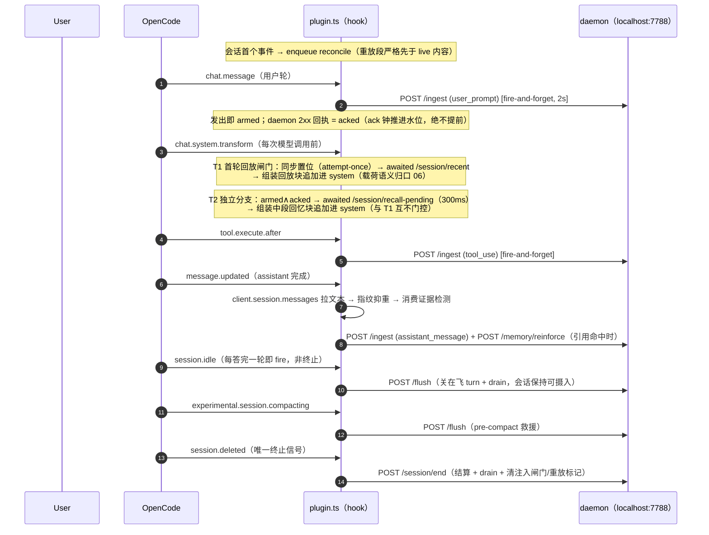
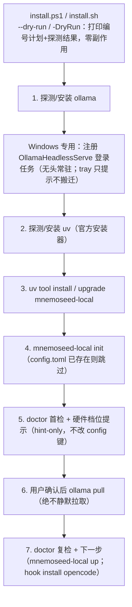

# 05 · 宿主接入（Host Integration）

> 一句话定位：本仓把「宿主对话/工具/生命周期事件 → daemon」的传输与生命周期机制、MCP 网关、CLI 动词面与安装编排壳，统一成宿主接入层——本篇只讲机制与工程面；注入载荷语义归口 06（注入面设计），durability 语义归口 07。
> 状态基线：commit `02ca93d`（F2 根治，PR #26 → issue #25）之后，1349 passed / 3 skipped（PRD-B2-roadmap 批次记录与 PRD-B2.3 收口记录同载；其后的两个 commit 均为 docs-only，代码面即此基线）。
> 主要依据：`docs/zh/design/mvp-design.md` §4.5（摄取主通道与生命周期映射）、`PRD-A3-delivery.md`（安装脚本 / OpenCode hook / MCP 网关骨架 / 模型缺失 UX）、`PRD-B2.1-auto-recall.md`（基线修正①-④）、`PRD-B2.3-daemon-reliability.md`（网关 retry）、`PRD-B2.5-daemon-onoff.md`（disabled 文案）。
> 诚实铁律：本篇只写本仓代码里真实存在的功能；所有常量先读代码取证，不引未经代码或本仓 PRD 记录支持的表述。

---

## 0. 功能定位与边界

**定位**：宿主接入层 = 三条通往 daemon 的通道，外加安装编排壳。

| 通道 | 形态 | 谁在用 |
|---|---|---|
| ① 宿主 hook | 随包分发的 OpenCode 插件（`plugin.ts`），fire-and-forget 把事件翻译成 daemon REST 调用 | OpenCode（今日唯一宿主适配） |
| ② MCP 网关 | 零依赖 stdio JSON-RPC 2.0 进程，模型经 `tools/call` 主动读写 | 任何 MCP 宿主；capture 自动通道仍归 hook 主线 |
| ③ CLI | `mnemoseed-local` 动词面，状态变更走 daemon REST | 用户 / 脚本 / 任何宿主 |

**内容所有权（本篇 own 传输/生命周期机制）**：

- 注入载荷语义（预算/围栏/自锚/排除）——归口 `design/06-session-continuity.md`，本篇只留一句话事实陈述，不展开。
- durability 语义（ack 水位、崩溃重放、per-session FIFO 的语义保证与失效边界）——一律**指针到 07**，本篇只留一句话机制陈述。
- 本篇不做的：评分、巩固、检索、衰减——全在 daemon 的 capture / retrieve / dream / decay（见 mvp-design.md 架构表），接入层不碰记忆内容。

**边界**：

- 宿主面今日只有一个：`hook` 动词的 `host` 参数 choices 只 pin `"opencode"`（cli.py:957-963），`claude_code`/`codex` 仅列于帮助文案为规划项。
- 本层纯本地：daemon 只绑 loopback（非回环 baseurl 启动/doctor/config 操作一律拒绝），无账号/token；profile 仅 `MNEMOSEED_LOCAL_PROFILE_ID` 或 `default` 单值。
- 神经科学映射沿用主仓 06：hook 是**反射弧**（宿主自动触发、零 token 捕获），MCP 是**语言通路**（模型自觉询问与陈述）——本仓移植同构，但映射只作文案框架，不构成理论借用（见 §2）。

---

## 1. 流程（mermaid + 走查）

### 1.1 OpenCode 单会话生命周期



**走查要点**：

- **到达序就是一切**：daemon 分片器按事件到达序切 turn，乱序即错绑。hook 因此把每个 session 的全部内容投递（重放、live、parked 重扫）串进**一条 per-session FIFO promise 链**（`sessionChains`，plugin.ts:907-916），且该 session 的 reconcile 重放段在首个事件时**队首入列**，严格先于任何 live 内容。
- **三个时间预算**按代码取证（plugin.ts:43-46, 83）：普通 daemon POST 2s（`TIMEOUT_MS`）、assistant parts 拉取 1.5s 竞速（`FETCH_TIMEOUT_MS`）、中段 recall pull 300ms（`RECALL_PULL_TIMEOUT_MS`，专用常量，不复用 2s）。全部 fail-open。
- **生命周期映射教义**：只推 `/ingest` 会永不 drain；把「空闲」当「终止」会在会话首轮回答后就封口——2026-08-19 dogfood 实锤 opencode 的 `session.idle` **每答完一轮即 fire**（空闲 = agent 安静，非会话结束），旧映射令后续一切 `/ingest` 被 daemon 正当地 409 拒绝且被 fire-and-forget 契约静默吞没；仅 `session.deleted` 才是终止信号（基线修正②，PRD-B2.1）。`/flush` 关闭在飞 turn 并 drain、会话保持可摄入；`/session/end` 每 session 至多一次（`settledSessions` 抑重）。
- **注入闸门**：`chat.system.transform` 是唯一被宿主 await 的处理器，因此整体包 try/catch、只走 debug 日志、绝不 reject 模型调用（plugin.ts:499-589）；T1 闸门同步置位（先于首个 await，防并发双注入），空 sessionID 或非数组 system 不消耗闸门。
- **关闭即收尾**：`/session/end` 后 daemon drain 缓冲并释放 settled 会话；daemon 自身 teardown 也先 drain 全捕获缓冲再关后台循环（QA-4，重启不丢最后一轮）。

### 1.2 MCP 网关请求路径

```mermaid
flowchart LR
    MCP["MCP Host（OpenCode 等，stdio 子进程）"] -->|行分隔 JSON-RPC 2.0| G["mnemoseed-local mcp<br/>mcp_gateway/server.py"]
    G -->|initialize / notifications/* / ping / tools/list| G
    G -->|tools/call| GC["GatewayClient<br/>refused-only 单次快重试（1.5s）"]
    GC -->|POST /memory/* 、/session/*| D["daemon REST"]
    D --> GC --> G -->|结构化 result 或 isError| MCP
    Note over G: daemon 不可达 → 握手照常、仅 tools/call 报 isError<br/>循环存活、EOF 退出 0
```

**走查要点**：网关是串行 stdio 循环（server.py:285-320），一次 `tools/call` 最多占用一个循环周期；daemon 故障经 `GatewayClient` 转为结构化 `isError` 返回，**永不整死循环**。握手（`initialize` → `notifications/initialized` → `tools/list`）在 daemon 缺席时照常完成——「模型能连上、调不动」由 isError 如实暴露，而不是连接即失败。

### 1.3 安装编排壳



**走查要点**：两脚本编排序完全一致（install.ps1 与 install.sh 注释互证）；每步「已就绪则跳过」（幂等），外部命令失败给单句原因 + 非零退出；doctor 的失败是就绪度报告、**不阻断编排**（新机器在拉模型前 dream model 检查本来就失败）。Windows 的差异只在第 2 步——用登录计划任务做无头 ollama 服务（`install.sh` 无需此步：ollama 自家安装器已带 systemd 服务）。

---

## 2. 理论锚

入选标准（同 B2.1 PRD 纪律，一句话）：**只列有实验与长期复现证据验证的规律**；每条给出来源、已验证规律、以及它在本系统推出的**设计规则**。理论回答「为什么这样设计」；延迟/缓存/预算/重试/超时属实现机制层，不入本节。

本篇自有理论锚**只有一条存在声明**，且只作归因指针；注入侧的全部理论归因（TA-1..6 的完整推导）由 PRD-B2.1 拥有、机制归口 06。

### TA-5 来源监控 —— 注入必须带围栏（存在声明）

- 来源：Johnson, Hashtroudi & Lindsay（1993），Source monitoring（主仓注册 **R7 ✅**）。
- 已验证规律：人对「内容来自记忆还是来自当前输入」的判别**本质上不可靠**，来源混淆是常态而非例外。
- → 设计规则：一切注入上下文必须带明确围栏（「此为记忆回放，非用户当下指令」），禁止裸注入。**本篇只作此存在声明**；围栏机制细节（字面量/净化/记账）属注入载荷语义（预算/围栏/自锚/排除），**归口 `design/06-session-continuity.md`**。

### 无借用段（如实声明）

本节其余全部内容均为**工程面**，不借用任何神经科学/心理学规律（照 B2.3 纪律）：

- 传输（fetch、2s/300ms/1.5s 三档超时、fail-open）——可用性工程；
- dedup（有界 FIFO Map 抑重）——防重复发送的工程手段；
- 网关 retry（ConnectError 单次快重试）——daemon 重启窗的容错；
- UTF-8 线钉死——宿主 locale 兼容；
- 安装壳、硬件探测、on/off 哨兵——部署与运维。

任何「daemon 活性」「空闲」「终止」措辞均为工程/宿主语义，永不入认知词汇。

### 不借清单（本篇自有）

- **hook 事件不携带「事件语义学」**：`session.idle` 就是「agent 安静」，不是「会话结束」——这条教义来自 2026-08-19 dogfood 实证（基线修正②），不来自任何记忆理论；
- **dedup 不是「遗忘」**：有界 FIFO 抑重与遗忘/衰减无涉，`DEDUP_CAP` 不是记忆容量；
- **fail-open 不是「弱注意」**：超时静默跳过是「宁缺勿堵宿主会话」的可用性契约，不是注意力分配的神经学隐喻；
- **on/off 不是「遗忘/显著性」**：禁用服务不是记忆衰退，开关不是注意力旋钮（B2.5 原文）。
- **「LRU」这词禁用**：本仓 dedup 是有界 FIFO（Map 插入序、超 `DEDUP_CAP` 逐最旧），不是 LRU——任何文档与代码均不得以 LRU 指代它。

---

## 3. 实施方式（code-level）

### 3.1 OpenCode hook 适配器（`hosts/opencode/plugin.ts` + `hosts/install.py`）

**分发与安装**：`plugin.ts` 随 wheel 作为 package data 分发（`install.py::plugin_bytes()` 经 `importlib.resources` 读取）；`mnemoseed-local hook install opencode` 将其写入 OpenCode 全局配置根的 `plugin/mnemoseed-local.ts`（OpenCode 启动时自动发现 `{plugin,plugins}/*.{ts,js}`）。配置根解析顺序（install.py:52-59）：`OPENCODE_CONFIG_DIR` > `XDG_CONFIG_HOME/opencode` > `~/.config/opencode`（Windows 收敛于 `%USERPROFILE%\.config\opencode`）。

**事件映射表**（wire contract 钉死，plugin.ts:10-18；`tests/test_hosts_opencode.py` 的 `EXPECTED_MAPPING` 静态解析 + 事件 JSON fixture 线形钉死）：

| 宿主事件 | 事件名（ingest 载荷） | daemon 端点 |
|---|---|---|
| `chat.message`（用户轮） | `user_prompt` | POST `/ingest` |
| `message.updated`（assistant 完成） | `assistant_message` | POST `/ingest` |
| `tool.execute.after` | `tool_use` | POST `/ingest` |
| `session.idle` / `session.error` | flush | POST `/flush` |
| `session.deleted` | session_end | POST `/session/end` |
| `experimental.session.compacting` | flush | POST `/flush` |
| `chat.system.transform`（每 session 首次调用） | session_recall_read | POST `/session/recent` |
| `chat.system.transform`（armed∧acked 用户摄取） | session_recall_pending | POST `/session/recall-pending` |
| `postAssistantIngest` 内的引用守卫 | memory_reinforce | POST `/memory/reinforce` |

**fire-and-forget fail-open**（plugin.ts:117-142）：`post()` 永不抛；`AbortSignal.timeout(2000)` 限时；失败吞入 `console.debug`，**除非** `MNEMOSEED_LOCAL_DEBUG` 生效（任意非空值）——失败升级 `console.error` + JSONL 沉槽（`<DATA_DIR>/hook-debug.jsonl`），且**每个 POST 都检查 daemon 响应状态，非 2xx 必上报**（409 被静默吞没正是 settle 封口 bug 的隐身衣，基线修正④ QA-12）。数据根：`MNEMOSEED_LOCAL_DATA_DIR` > 平台 home 下的 `.mnemoseed-local`（POSIX 安全，不落项目 CWD）。

**bounded FIFO dedup**（plugin.ts:144-155）：`seen()` 以 `Map` 保存键、插入序天然有序，超 `DEDUP_CAP = 1000` 时删**最旧**键——是有界 FIFO，不是 LRU。同一 fingerprint（如 assistant 的 `sessionID:messageID`）在途/重放期不重复 POST。

**per-session FIFO 任务链**（plugin.ts:907-916）：该 session 的全部内容投递经一条 promise 链串行（重放段队首、先于 live），保证 daemon 端到达序即正确 turn 序；handler 自身仍不 await 热路径。

**B2.2 reconcile 回放（一句话，机制不展开）**：hook 侧有崩溃重放水印（`hook-watermarks.json`，ack 钟、tmp+rename 原子写）与 FIFO 回放机制——语义与失效边界归口 **07**。

**注入面 transport 事实（一句话级，载荷语义归 06）**：`chat.system.transform` 是注入载体（`output.system` 字符串数组追加）；T1 起始回放注入存在 attempt-once 闸门（同步置位先于首个 await；空 sessionID/非数组 system 不消耗闸门；响应 `sessions` 非数组视为失败且闸门已消耗）。载荷语义（预算/围栏/自锚/排除/needle）归口 `design/06-session-continuity.md`。

**hook 生命周期 CLI**（install.py）：`install`（字节幂等覆盖，返回 `(path, changed)`）、`uninstall`（只删这一个文件，`(path, existed)`）、`status`（三态 `not-installed` / `match` / `differs` + `/healthz` 可达性探测，`PROBE_TIMEOUT_SECONDS = 2.0`）。均为本地文件操作，不触 daemon REST 写路径。

### 3.2 MCP 网关（`mcp_gateway/server.py` + `reliable_client.py` + `rest_client.py`）

**传输**：零新依赖的 stdio newline-delimited JSON-RPC 2.0——每行一个消息、无 Content-Length 框架；stdout 只走协议流量，诊断经 `logging` 走 stderr。协议面按 MCP `2024-11-05` 形状：

| 方法 | 行为 |
|---|---|
| `initialize` | 返回 `protocolVersion`（本网关恒报 `2024-11-05`，接受任意客户端版本）+ `capabilities{tools}` + `serverInfo{mnemoseed-local, 版本}` |
| `notifications/initialized` 及一切 `notifications/*` | 忽略，不响应（含 `notifications/cancelled`） |
| `tools/list` | 返回 6 个工具及 JSON Schema inputSchema |
| `tools/call` | 代理到 daemon REST（actor = `mcp`）；失败/未知工具 → 结构化 `isError`，永不杀死循环 |
| `ping` | 空结果 |
| 未知方法（带 id） | 错误 `-32601`；不可解析行 → 能抢救出 id 则 `-32700`，否则丢弃 |

**工具表 → REST 映射**（默认值与上限取证 `server.py`，与 daemon 请求模型一致）：

| 工具 | 参数 | REST 映射 | 默认 / 上限 |
|---|---|---|---|
| `recall` | `query`(必填), `top_k?` | POST `/memory/recall` | `top_k` 1..100 |
| `remember` | `text`(必填) | POST `/memory/remember` | — |
| `supersede` | `superseded_node_id`(必填), `successor_node_id`(必填) | POST `/memory/supersede` | — |
| `dream_once` | — | POST `/memory/dream_once` | — |
| `recent_sessions` | `n_sessions?`, `n_per_session?` | POST `/session/recent` | sessions 默认 2、≤5；per_session 默认 20、≤100 |
| `session_windows` | `n_sessions?` | POST `/session/windows` | sessions 默认 3、≤10 |

**audit actor**：`build_client()` 对 `resolve_client(args)` 做 `replace(actor=ACTOR)`，`ACTOR = "mcp"`（server.py:54, 133-140）；每次调用经 `X-MnemoSeed-Actor` 头归因到 `mcp`。

**握手与故障语义**：daemon 不可达**不是启动错误**——`initialize`/`tools/list` 照常工作，仅 `tools/call` 以 `isError` 暴露连接问题，循环存活、EOF 退出 0。

**GatewayClient（B2.3）**（reliable_client.py）：薄包装，duck-type 内层 client（`.post(path, body)` / `.profile_id`）；**至多一次快重试，仅当首败 `DaemonUnavailableError.__cause__` 是 `httpx.ConnectError`**（loopback refused = daemon 重启窗）；重试腿经 `dataclasses.replace(client, timeout=RETRY_TIMEOUT_SECONDS)` 产出有界孪生客户端（`RETRY_TIMEOUT_SECONDS = 1.5`；无 `timeout` 字段的 stub 回退同 client，如实记注）。RestError / TimeoutException / 无 cause 一律零重试；重试状态 per-call 局部，无实例级消耗态。

**disabled 诚实文案（B2.5）**：`serve()` 启动时读一次 `daemon_state.is_disabled()`（`CONFIG_DIR/daemon.off` 哨兵，缺席 = 默认开），注入 `GatewayClient` 的 down-hint；disabled 时 refused-after-retry 文案 = `cannot reach {base_url}: memory service is disabled by the user (run 'mnemoseed-local on' to re-enable)`。标准 down hint / timeout hint / 422 文案字节不动（pin 碰撞审计保字节）。

**UTF-8 线钉死**（server.py:262-282）：`_force_utf8_lane` 对双道 stdio 现场 `reconfigure`——输入道只钉编码 UTF-8；输出道钉 UTF-8 + `newline=""`（关掉 Windows text-mode 的 `\n→\r\n` 翻译，保住严格换行分帧）。cp936 乱码 + CRLF 翻译是双坑（2026-08-18 go-live smoke 实锤），`7023746` 修复；回归测试 `test_serve_forces_utf8_and_untranslated_newlines_on_stdio_lanes` 复现 live 同指纹的解码错位（byte 0xa1 = em-dash 的 GBK 头字节，roadmap 行内记录 @1035），钉死「em-dash 在 UTF-8 线上存活 + 线上无 `\r\n`」。

### 3.3 CLI 动词全表（`cli.py`，取证 build_parser）

| 动词 | 子谓词 | 说明 |
|---|---|---|
| `init` | — | 写默认配置（`--force` 覆写）+ 三行 next-steps（doctor / `ollama pull` / up）；本地操作 |
| `up` | — | 启动 daemon；第一闸见 `daemon.off` 哨兵 → stderr 字节钉 + rc 1；ollama 路由先做 dream model 预检（缺失/不可达 → rc 1 + 附修复提示）；storage 栈预构建失败 → 单行错误 |
| `on` | — | 删哨兵；已运行则报 already on 不重启；否则委托 `up` 路径 |
| `off` | — | marker-first → best-effort POST `/daemon/shutdown` → ≤15s 轮询监听消失 → 五分支存活感知报告；探针 1s 上限 |
| `status` | — | `/healthz` + `/api/v1/config`（`--json`） |
| `doctor` | — | 自检清单：config / loopback-only / dream ctx window / isolated graph / hardware tier（恒 ok）/ storage / dream llm / dream model / ensemble verifier / verifier ctx window |
| `recall` | — | POST `/memory/recall`（`--top-k`） |
| `remember` | — | POST `/memory/remember` |
| `dream` | `once` / `status` | POST `/memory/dream_once` / `/memory/dream_status` |
| `forget` | — | POST `/memory/forget_this`（`--kind node\|chunk\|entity`） |
| `config` | `get` / `set` / `rollback` | GET/POST `/api/v1/config*`；**loopback-only**（非回环拒绝） |
| `uninstall` | — | 移除配置目录（`--purge` 连数据文件，路径校验只删 CONFIG_DIR 内；`--yes` 跳确认） |
| `hook` | `install` / `uninstall` / `status` | 宿主 hook 生命周期（`host` choices 只 pin `opencode`） |
| `mcp` | — | 前台 stdio 网关循环（§3.2） |

要点：状态变更动词统一经 `DaemonClient` 走 daemon REST（FR-7.12）；`init`/`up`/`doctor`/`uninstall` 为本地操作；`up` 的 preflight 与 doctor 的 dream model 检查**同源复用同一 `_role_model_check`**（单一文案源，绝不静默拉取）。

**eval 入口不是 CLI verb**（B3）：`uv run python -m mnemoseed_local.eval matrix|canary|rescore`——明确标注非产品面、无 CLI 动词、无 daemon 端点（`eval/__main__.py` 模块 docstring 原文）。

### 3.4 安装与首次体验（`install.ps1` / `install.sh` / `hardware.py`）

**编排序**（两脚本一致，§1.3 图）：1 探测/安装 ollama → 2 探测/安装 uv → 3 `uv tool install`（已装则 `uv tool upgrade`）→ 4 `init`（已存在跳过）→ 5 `doctor` 首检 + 硬件档位提示 → 6 **用户确认后** `ollama pull <model>` → 7 doctor 复检 + 下一步。

- 拉取目标 = 当前配置 ACTIVE `[dream.llm.dream]` 的 `model` 键，缺席回退内置默认 `qwen3.5:9b`——与 doctor/up 的检查目标同源（「拉的就是查的」）；`-Yes`/`--yes` 跳确认；**模型绝不静默拉取**。
- `--dry-run` / `-DryRun`：打印编号计划 + 命令存在性探测结果，零副作用（CI smoke 唯一可验证形态）。
- 幂等：每步「已就绪则跳过」；任一外部命令失败单句原因 + 非零退出；`install.ps1` 硬拒 `param()` 之外的遗留参数（防 `-DryRunn` 类拼写错误滑入真实安装路径，PRD-A3 QA D-T1-1）。
- Windows 专用第 2 步：注册 `OllamaHeadlessServe` 登录计划任务跑 `ollama serve`（无头常驻；API 未活时立即启动一次）；stock tray 自启快捷方式只给提示、**绝不动另一产品的自启项**；调度失败仅提示不失败。
- `--tier` / `-Tier` 是 hint-only：只打印 `config set dream.hardware_tier <tier>` 指引，**从不改 config 键**。
- doctor 的 hardware tier detail 是钉死的机器可读契约：`recommended tier "standard" (vram=12GB, ram=32GB); current tier "standard"`——脚本按此提取并做提示。

**硬件探测**（`hardware.py`，零新依赖、永不 raise、探针失败降级为 unknown）：`probe_ram_gb`（Windows ctypes `GlobalMemoryStatusEx` / Linux `/proc/meminfo` / macOS `sysctl -n hw.memsize` 2s 超时）；`probe_max_vram_gb`（`nvidia-smi --query-gpu=memory.total`，坏行不毒害其它 GPU、缺席视为 0.0）；`recommended_tier`（VRAM ≥ 22 GiB → `advanced`；VRAM ≥ 7 GiB 或 RAM ≥ 30 GiB → `standard`；否则 `lite`）。

**dream model 检查**（`_role_model_check` / `models_contain`，cli.py:419-471）：名称规格化（`name` 与 `name:latest` 等价、pinned 非 latest tag 不匹配）；缺失 → FAIL 附 `ollama pull <model>`；服务器不可达 → FAIL 附启动 ollama 提示；非 ollama 路由显式 skip；`up` 预检同源复用，缺失/不可达 → rc 1 + stderr 单句错误，**绝无对 `ollama pull` 的子进程调用**。

---

## 4. 红线与诚实边界

**红线（设计稿与 PRD 级，代码内实现）**：

- **绝不静默拉取模型**（bge-m3 懒加载先例复用）；模型拉取只在用户明确确认后进行。
- **安装壳绝不改用户 config 键**（`--tier`/`-Tier` 只打提示；doctor 的荐档与实际档位不一致也只是提示）。
- **卸载只删自己安装的物**：`uninstall_plugin` 只删 `plugin/mnemoseed-local.ts` 这一个文件；`uninstall --purge` 只删 CONFIG_DIR 内（路径前缀校验后才动手）。
- **只绑 loopback**：非回环 baseurl 在启动（lifespan 拒绝）、doctor（loopback-only 检查）、config 操作（loopback-only 拒绝）三处一致拒绝。
- **诚实报错 pin**：down hint、timeout hint、disabled hint、422 文案全部字节钉死（`test_mcp_gateway_retry.py:92-100` 等 pin 碰撞审计保证旧文案字节不动）。
- **「LRU」这词禁用**（同 §2）：有界 FIFO 就是有界 FIFO。
- **内容中立**：接入层不读内容语义、不做价值判断；评分不读 anima/偏好、provenance 只追加、audit actor 显式归因（cli/mcp/console/dream）——均为既有 daemon 红线，接入层不绕过。

**已知边界（如实记录，不粉饰）**：

- **注入闸门是有代价的 fail-open**：daemon 缺席时每 session 每进程至多付一次 2s 等待；首轮回放每 session 至多一次（attempt-once），重启 opencode 即重注入（TA-3 语境切换语义）。
- **idle-flush 与同轮 assistant POST 是良性竞态**：两条 fire-and-forget POST 的到达序不保证；flush 先到则 assistant 文本落进紧随的独立 turn——内容不丢、检索无碍，chunk 边界略丑（B2.1 记录接受）。
- **水位是 ack 钟不是发送钟**：崩溃前最后一个 cadence 内已 acked 的轮次会被多重放，由 daemon 近重复吸收吸收（代价良性）；daemon 接受 POST 但崩溃在 drain 之前，最多丢当前一轮（B2.2 如实声明）。
- **混合版本不受支持**：新 hook + 旧 daemon（无 `budget_chars`/`slot_consumed` 字段）在丢失响应路径回退到修复前行为——字段缺席回退已记档（B2.1 QA NIT-9）。
- **网关 disabled hint 启动读一次**：穿越 off 仍存活的 gateway 进程持旧 hint 到其生命周期末（B2.5 记录）。
- **关停路径摘了 bounded-crash 安全网**：`off` 的 teardown 若永久卡，daemon 保持活尸（监听已失）且如实报「may still be shutting down」——与 F2 的被察觉的意外僵尸不同，这是可见、用户发起的（B2.5 记录）。
- **doctor 是报告者不是门禁**：doctor 的 dream model 失败提示运行修复路径，但运行时仍以 LLMUnavailable 降级 + 审计兜底（capture-only 尊严退路）。

---

## 5. 本篇引用

**本仓设计/PRD（不作为理论引用计，为工程依据）：**

- MnemoSeed Local 设计稿 v1.3/v1.4，`docs/zh/design/mvp-design.md`——§4.5（摄取主通道 ①②③、生命周期映射、去重单元）、§4.8/决策 8（三档硬件、模型 UX）、§6（Phase A3）。本仓既有。
- PRD·Phase A3 交付包，`docs/zh/prd/PRD-A3-delivery.md`——任务 T1（安装脚本）/ T2（OpenCode hook）/ T3（MCP 网关骨架）/ T5（模型缺失 UX + 硬件荐档）及其 QA 记录。本仓既有。
- PRD·B2.1 自动回忆，`docs/zh/prd/PRD-B2.1-auto-recall.md`——理论锚 TA-1..6、基线修正①-④、T1/T2/T3 注入与消费证据设计定案、收口记录。本仓既有。
- PRD·B2.2 崩溃耐久，`docs/zh/prd/PRD-B2.2-crash-durability.md`——ack 水位、per-session FIFO 重生回放、幂等性与边界。本仓既有（durability 语义归口 07）。
- PRD·B2.3 daemon 可靠性，`docs/zh/prd/PRD-B2.3-daemon-reliability.md`——D5 网关 retry、诚实报错、门禁 1349 passed / 3 skipped 记录。本仓既有。
- PRD·B2.5 daemon on/off，`docs/zh/prd/PRD-B2.5-daemon-onoff.md`——哨兵文件、`off`/`on`/`up` 早拒绝、网关 disabled 文案、理论锚「无借用」。本仓既有。
- PRD·B2 路线图，`docs/zh/prd/PRD-B2-roadmap.md`——批次记录（含 `7023746` UTF-8 修复与 byte 0xa1@1035 记录、`02ca93d` 门禁 1349 passed / 3 skipped）。本仓既有。

**理论引用（编号对应本仓 `docs/zh/design/REFERENCES.md`）：**

- R7 — Johnson, M. K., Hashtroudi, S., & Lindsay, D. S. (1993). Source monitoring. *Psychological Bulletin*, 114(1), 3–28. —— 同主仓 R7 ✅（主仓 `docs/REFERENCES.md` 注册为 R7，Crossref 验证）。
- R23 — Anderson, J. R., & Schooler, L. J. (1991). Reflections of the environment in memory. *Psychological Science*, 2(6), 396–408. —— 已核验 · REFERENCES R23 ✅（本仓 PRD-B2.1 既有引用，主仓注册未收录）。
- R4 — Tulving, E., & Thomson, D. M. (1973). Encoding specificity and retrieval processes in episodic memory. *Psychological Review*, 80(5), 352–373. —— 同主仓 R4 ✅（同主仓 R4 文献、主仓用途不同；本仓用途见 PRD-B2.1 TA-2）。
- R24 — Murdock, B. B. (1962). The serial position effect of free recall. *Journal of Experimental Psychology*, 64(5), 482–488. —— 已核验 · REFERENCES R24 ✅（本仓 PRD-B2.1 TA-3 既有引用）。
- R25 — Howard, M. W., & Kahana, M. J. (2002). A distributed representation of temporal context. *Journal of Mathematical Psychology*, 46(3), 269–299. —— 已核验 · REFERENCES R25 ✅（本仓 PRD-B2.1 TA-3 既有引用）。
- R26 — McDaniel, M. A., & Einstein, G. O. (2000). Strategic and automatic processes in prospective memory retrieval. *Applied Cognitive Psychology*, 14(S1), S127–S144. DOI: 10.1002/acp.775. —— 已核验 · REFERENCES R26 ✅（本仓 PRD-B2.1 TA-4 既有引用）。
- R28 — Anderson, M. C., Bjork, R. A., & Bjork, E. L. (1994). Remembering can cause forgetting: Retrieval dynamics in long-term memory. *Journal of Experimental Psychology: Learning, Memory, and Cognition*, 20(5), 1063–1087. —— 同主仓 R40 ✅（主仓 R40 同文献、主仓用途为 decay 反馈；本仓用途见 PRD-B2.1 TA-6）。

**同源对照（风格/结构参照，非内容依据）：**

- 主仓 `docs/design/06-host-integration.md`（Host Integration & Installation Experience）——本仓本篇的结构与措辞风格同源，但内容严格限缩为本仓实际实现的子集（OpenCode 首发、MCP 骨架、本地 CLI、安装壳），未移植主仓的账号/onboard/云端/多宿主矩阵等本仓不存在的面。

---

## 附录 A · daemon REST 面全表（inception 受众，方法+路径一行一条）

| 方法 | 路径 | 用途 |
|---|---|---|
| GET | `/healthz` | 存活 + 能力门快照 |
| GET | `/health` | 版本 / 驱动信息 |
| GET | `/api/v1/audit` | 审计读取（actor/action 过滤、分页） |
| POST | `/daemon/shutdown` | 关停（respond-then-exit；无注入 hook 时 503） |
| POST | `/ingest` | 摄取（user_prompt / assistant_message / tool_use，202） |
| POST | `/session/end` | 会话结算 + drain + 清注入槽（未捕获会话 200 no-op） |
| POST | `/flush` | 关在飞 turn + drain（不结算，会话保持可摄入） |
| POST | `/memory/recall` | 混合检索 |
| POST | `/memory/remember` | 钉入事实（verbatim） |
| POST | `/memory/audit` | 单点审计 |
| POST | `/memory/timeline` | 时间线 |
| POST | `/memory/export` | 导出 |
| POST | `/memory/forget_this` | 删除（chunk / node / entity） |
| POST | `/memory/supersede` | 显式取代（关闭旧版本 + SUPERSEDES 边，单一事务） |
| POST | `/memory/dream_once` | 手动单节梦境 |
| POST | `/memory/dream_status` | 梦境触发状态 / 待处理队列 |
| POST | `/session/recent` | 时序会话尾部（B2；`exclude_session_id` / `self_session_id`） |
| POST | `/session/windows` | 逐 session 时间窗（B2.4；ISO 起止、chunk 计数、active） |
| POST | `/session/recall-pending` | 中段 auto-recall pull（B2.1 T2；enabled/budget_chars/slot_consumed） |
| POST | `/memory/reinforce` | 消费证据强化（B2.1 T3；≤64 id） |
| GET | `/api/v1/config` | 解析后配置（secrets 只显 env 名） |
| POST | `/api/v1/config/set` | 单键配置写入（版本化 + 热生效） |
| GET | `/api/v1/config/versions` | 配置版本历史 |
| POST | `/api/v1/config/rollback` | 配置回滚（append-only） |