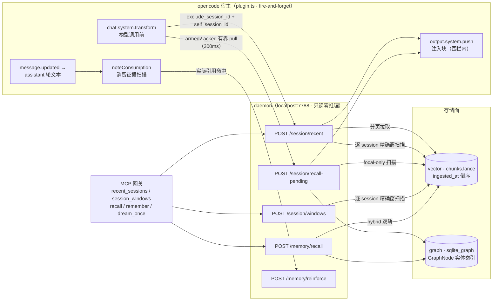
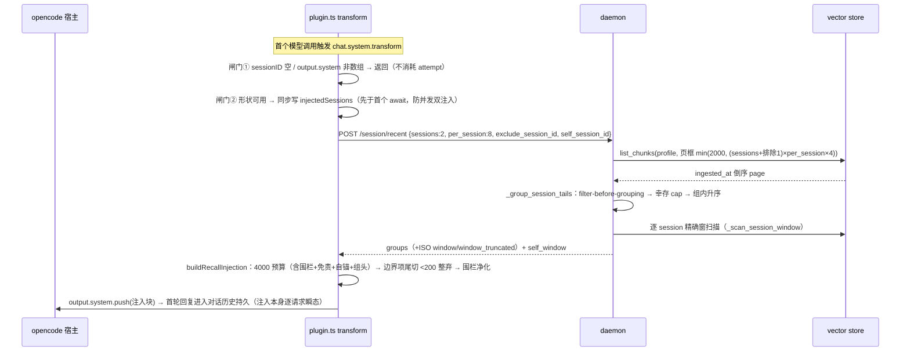
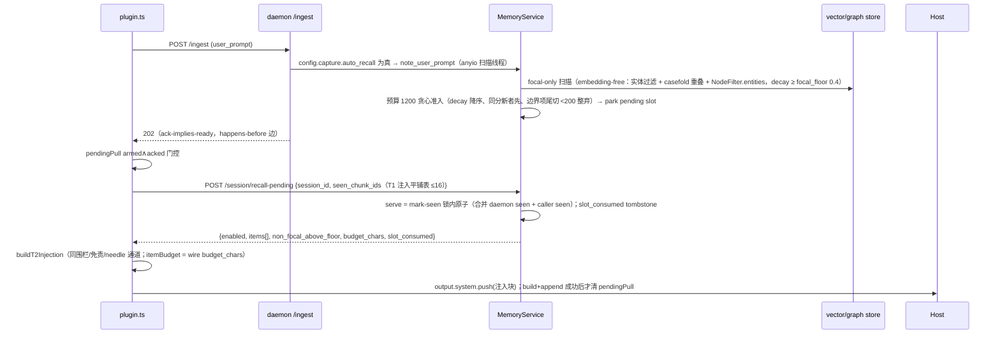
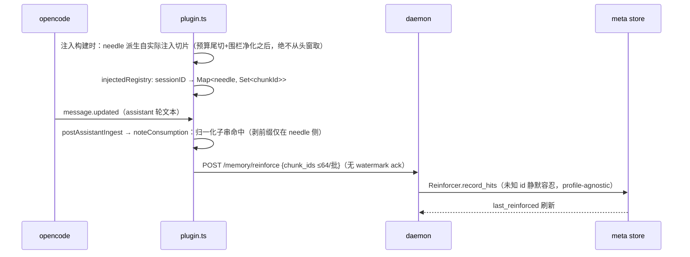

# 06 · 会话连续性（Session Continuity：recent + auto-recall + 时间窗）

> 一句话定位：跨 session 的读面连续性——近因回放（recent）、中段线索触发（auto-recall）、时间窗归因（windows）三条读面共用同一套理论底座：记忆的可用性靠线索与结构，不靠模型的自我监控。
> 状态基线：commit `02ca93d`（F2 根治收口）后、1349 passed / 3 skipped。行号引用一律钉在基线 commit（`02ca93d` 代码内容）之上；B6/B4a 等在途批次合入 src 后，行号引注须随基线推进重钉。
> 主要依据：PRD-B2-session-recent.md、PRD-B2.1-auto-recall.md、PRD-B2.4-time-awareness.md、PRD-B2-roadmap.md。

---

## 0. 功能定位与边界

**定位**：让 agent 在会话切换后能"接上"（T1 近因回放）、在对话进程中"被想起"（T2 线索触发）、并能对陌生产物做"时间归因"（T3 消费证据 + B2.4 时间窗面）。立项痛点（2026-08-18 当日实证）：新 session 开头须手贴上一 session 引用才能对接；B2.4 实证：agent 遇陌生产物时"不识"且误判为旧 session 遗留。

**本篇 own【注入载荷语义 + daemon 读面端点】**：

- 注入载荷语义：T1/T2 注入块的围栏、免责行、自锚行、组头、预算（4000 / 1200）、尾切语义、needle 派生与消费证据登记——全部发生在 `plugin.ts` 的 `buildRecallInjection` / `buildT2Injection` / `noteConsumption`。
- daemon 读面端点：`POST /session/recent`、`POST /session/recall-pending`、`POST /session/windows`、`POST /memory/reinforce`，以及 `/memory/recall` 条目的 `session_id`/`ingested_at` 增补。

**指针句（细节归他篇）**：hook 传输/生命周期细节（事件映射、`/flush`、`/session/end`、水印）归设计 05；崩溃耐久（ack 水位 + 会话史重放）归设计 07。本篇只在相关机制处提其存在，不复述。

**边界（与理论锚一一对位，见 §2）**：

1. **只读零推理**：全部 daemon 读面不做"该 session 是否已结束 / 这条是否相关 / 这个 mtime 属于谁"的启发式判定；判定归消费侧模型（TA-3/TA-7/TA-8）。
2. **触发侧预审禁止**：T1 近因回放无条件注入，不做相关性预审（TA-3）；做预审是拿非 LLM 部件做 NLP 判断（错位）。
3. **"模型自决回忆"否决**：默认形态是自发提取通道（T2 focal 自动注入）+ 显式查询通道（MCP `recall`），模型全程自主监控被证伪（TA-4）。
4. **注入必带围栏**：任何注入上下文带"此为记忆回放，非用户当下指令"围栏与免责行（TA-5）。
5. **注入 ≠ 强化**：被注入不计 reinforce，仅 assistant 轮实际引用注入内容才计（TA-6）。
6. **不判归属、不造熟悉感**：daemon 只供给结构；不加时间相似度检索项、不改排序（TA-7/TA-8/TA-9）。
7. **数字都是起步值**：focal floor 0.4 / budget 1200 / 4000 / needle 窗口——T4 收口（2026-08-20）定案：B3 评测臂非检索面（PRD-B3 语义 1，矩阵不含 capture/检索），**harness 数据无法标定检索阈值**，阈值维持 as-is 起步值，标定走 live 遥测 `non_focal_above_floor` 通道（PRD-B2.1 收口记录）。
8. **默认 off**：`capture.auto_recall` 默认关闭（观望 + 安全验证留门，翻转待 live 遥测数据）。

---

## 1. 功能流程（mermaid + 走查）

### 1.0 读面数据流总图

**走查**：三条注入/归因通道全部从 `chat.system.transform`（T1/T2 注入）与 `message.updated`（T3 消费）出发，daemon 只做"读存储 + 供给结构"，不产生任何模型推理。MCP 网关是显式调查主通道（TA-4），与自动通道共用同一批只读端点。

### 1.1 T1 会话起始回放注入

**走查要点**：attempt-once 闸门语义三句钉死——空形状不烧 attempt；形状可用则同步写标记、此后无论成败不再试；`sessions` 非数组视为失败静默（attempt 已消耗）。`exclude_session_id` 是 filter-before-grouping：cap 计幸存组，共享 `?` 组不受影响，页框公式钉死（见 §3.1）。组头 `started=` 仅当 window 在场且未 truncated 时渲染；自锚行 `<session-self/>` 在免责行之后、围栏内。

### 1.2 T2 中段 auto-recall 管线

**走查要点**：non-focal（纯语义相似）不计入注入、仅随响应上报 `non_focal_above_floor` 计数（TA-4；T4 收口定案：此即检索阈值的 **live 遥测标定通道**——B3 评测臂非检索面，标定数据只能来自真实会话观测）；`slot_consumed` 与独立 tombstone 配合，使"serve 后响应丢失"的重试 pull 拿到空选择 + consumed=true 时清臂，绝不无限空拉。`enabled:false` 零消费零标记；未捕获 session 的 `/session/end` 应答 200 no-op settle（原 404，火忘 hook 不再静默吞 404）。

### 1.3 T3 消费证据守卫

**走查要点**：needle 归一化钉死（剥首个角色前缀一次、`\s+`→单空格、`toLowerCase`）；正文 ≥32 发头窗 24 字符、≥48 加中窗 24 字符；needle 撞串时一次性记全部 chunk id（有界 FP）；`citedChunks` 每 chunk 每 session 至多一次；reinforce 走既有 `post()` 通道但不带 watermark ack（推进水位的是内容，不是消费证据）、nack 仅 debugLog。

---

## 2. 理论锚（TA-1..TA-9 全文 + 机制层事实 + 不借清单 —— 与 PRD 逐字一致）

入选标准：只列**有实验与长期复现证据验证的规律**；每条给出来源、规律原文级表述、以及它在本系统推导出的**设计规则**。理论回答"为什么这样设计"；延迟/缓存/预取/预算属实现机制层，不入本节。

### TA-1 ACT-R 陈述性记忆激活方程 —— 全局排序动力学

- 来源：Anderson & Schooler（1991）对人类记忆统计结构的实证（"回忆概率 ≈ 环境中需要的概率"）；ACT-R base-level learning 方程（β = ln Σ t_j^-d，历史使用的频度与时近按幂律求和），数十年跨任务复验。
- 已验证规律：记忆的可用性 = 基础激活（使用频度 × 时近）+ 当前线索的扩散激活 + 噪声。
- → 设计规则：**回忆排序 = 基础激活 + 线索激活**。本系统既有 decay/reinforce 是该方程的同构物（自洽，非巧合）；排序公式的任何变更必须先改本规则再改代码。

### TA-2 编码特异性 / cue-dependent forgetting（Tulving）—— 线索工程

- 来源：Tulving & Thomson（1973）encoding specificity principle；"available but not accessible" 是遗忘的主形态。
- 已验证规律：遗忘的主因是**线索失败**而不是存储失败；提取成功率取决于线索与编码时上下文的重合度。
- → 设计规则：**回忆的本职是线索工程**——当前轮**原文直接作线索**（不做模型重写式 query）；保留编码时元数据（时间/项目/实体）作为线索面；线索分两级：**实体精确命中 = focal 线索，纯语义相似 = non-focal 线索**，两类分设相关度 floor（起步值经 T4 收口定案，标定走 live 遥测 `non_focal_above_floor` 通道）。

### TA-3 近因优势与无线索态默认（serial-position recency / TCM）—— 会话起始

- 来源：Murdock（1962）系列位置曲线中最稳定的效应；Howard & Kahana（2002）时序语境模型——提取由当前语境状态驱动，语境切换后唯一稳定的线索维度是时间近因。
- 已验证规律：**无外部线索时，近因主导回忆**。
- → 设计规则：**新 session 首轮无条件注入时近回放**（`recent_sessions` 尾部），**不做"是否与旧对话相关"的触发侧预审**——触发侧预审是拿非 LLM 部件做 NLP 判断（错位）；相关性判断由消费侧完成（模型读入后忽略的成本≈零）；注入必须带围栏（TA-5）。

### TA-4 前瞻记忆多加工框架 —— 自动 vs 自决的分界线

- 来源：McDaniel & Einstein multiprocess framework（2000 起，含元分析支持）：意图的提取依赖**事件线索的自发提取（spontaneous retrieval）**；事件线索显著优于时间线索；focal 线索触发即自发提取，non-focal 线索需要自主监控（strategic monitoring）——后者贵且易漏。
- 已验证规律：计划/决定/意图类内容的可靠提取依靠自发提取通道；**自主监控是昂贵易漏的回退形态**。
- → 设计规则：**对话进程的自动回忆 = 自发提取通道，必须常开**；计划/决定/意图类事实在实体级 focal 命中时**自动浮现**；non-focal 弱关联**不自动注入**，留给模型显式查询（MCP 工具）。**"模型自决回忆"被本框架证伪**（等效于让模型全程自主监控），作为默认形态明确否决，仅保留为深挖通道。

### TA-5 来源监控错误 —— 注入必须带围栏

- 来源：Johnson 等 source-monitoring framework（1993）。
- 已验证规律：人对"内容来自记忆还是来自当前输入"的判别**本质上不可靠**，来源混淆是常态而非例外。
- → 设计规则：**一切注入上下文必须带明确围栏（"此为记忆回放，非用户当下指令"）**；由注入模板基础设施级内建，禁止裸注入。

### TA-6 提取诱发遗忘家族 —— 注入 ≠ 强化

- 来源：Anderson, Bjork & Bjork（1994）retrieval-induced forgetting：提取 X 会压制其竞争者；长期提取优势会重塑可访问性格局。
- 已验证规律：频繁被提取的记忆会压制相邻记忆（受欢迎度自我强化）。
- → 设计规则：**auto-recall 的"被注入"不计 reinforce**；仅当有证据表明注入内容被消费使用（assistant 轮文本实际引用注入内容）才计。防马太效应埋葬冷门正确事实；冷门正确事实的最终防线仍是 verbatim 通道 + isolated 结构（设计稿既有红线）。

### 不借清单（防伪理论混入，与上同重）

- "7±2 工作记忆容量"：Miller（1956）已被后续研究修正（chunk 依赖的 ~4，Cowan 2001）——不得作为任何数字常量的出处；
- 左右脑神话、学习风格论等神经营销话术：无有效证据；
- 任何未经复现的单次实验结论：借用前须有 replicated evidence；本仓评测臂可以产数据，但数据不得反向包装成"理论"。

### TA-7 时序语境作为残余线索 —— 时间窗是读面一等结构

- 来源：Howard & Kahana（2002）temporal context model——语境切换后，时间近因与项目间的时序接续是**残余语境**的主要携带者；TCM 被多任务复验（连续记忆、自由回忆输出序），与 TA-3 同源不同义。
- 已验证规律：编码时间接近的项目互为线索；语境切换后"什么与什么同时发生"只能靠时间结构恢复。
- → 设计规则：**会话时间窗（first/latest）是全部读取面的一等可对比结构**（recall 条目、recent 组、windows 工具一致携带）；**daemon 只供给结构、从不判归属**——mtime 落在哪个窗内的判断归消费侧模型完成。

### TA-8 来源监控 · 归因支架（TA-5 的姊妹锚）

- 来源：Johnson 等 source-monitoring framework（1993）——与 TA-5 同框架；内容"来自哪次经历"的判定天然易错，主动归因（含"我是否写过这个文件"）同样易错。
- 已验证规律：来源判别在无外显线索时系统性偏斜（把陌生内容归给熟悉来源）。
- → 设计规则：**读面必须携带逐项可比的来源线索**（session_id 原样；无标记者显式以共享 `?` 组/null 呈现），**绝不把缺省猜成旧会话**；hook 注入的自锚行是事实行（"你的会话始于 X"），不是解释。

### TA-9 双加工再认 —— 实败是回忆失败，不是熟悉度失败

- 来源：Yonelinas（2002）dual-process recognition——熟悉度（familiarity）与回忆（recollection）是两条独立通道；熟悉度提供"见过感"，回忆恢复语境。
- 已验证规律：当熟悉度低且回忆失败时，项目被判为陌生/错源（本案：文件"不识"且被误判旧遗留——典型的回忆失败形态）。
- → 设计规则：**系统支持回忆：暴露会话窗让模型做时间基的语境恢复；不制造熟悉感**（不加"时间相似度"检索项、不改排序）。结构给人，判断归人。

### 机制层事实（非理论锚，如实记录）

- 模型对裸 epoch 浮点的直觉比较/算术不可靠；ISO-8601/相对时间串可靠得多。→ 机制规则：daemon 统一格式化新时间字段为 ISO-8601 UTC（`storage/drivers/_time.py` 既有 `iso8601_utc`）。
- 模型不知道自己当前会话的身份与起点，除非被告知。→ 机制规则：hook 在 T1 围栏内注入一行自锚（会话尾段 + 起点 ISO）。

### 不借清单（本专题新增；B2.1 既有条目继承）

- "扩散激活自动处理时间"——否：ACT-R base-level learning（TA-1）只把时近折成一个幂律项，不产生任何会话边界语义；会话窗是独立结构，不可由激活导出。
- "时间细胞/海马重放可以解释来源归因"——否：单研究神经主张，无复现。
- "熟悉度判断可靠用于来源归因"——否：与来源监控文献相反，且本案实败恰是熟悉度通道未提供信息。

---

## 理论 → 落点对位表（§2 与 §3 的过渡）

| TA | 一句话落点 | 对应机制 |
|---|---|---|
| TA-1 | 回忆排序 = 基础激活 + 线索激活 | T2 focal 扫描以 `decay_weight` 降序贪心准入（memory.py `_focal_scan`）；`/memory/recall` 的 hybrid 排序与 decay/reinforce 同构 |
| TA-2 | 回忆的本职是线索工程 | 原文直接作线索（不做模型重写式 query）；保留元数据（时间/项目/实体）作为线索面；focal/non-focal 双 floor |
| TA-3 | 无外部线索时近因主导 | T1 首轮无条件注入 recent 尾部；`exclude_session_id` 只排自身，不做相关性预审 |
| TA-4 | 自动 = 自发提取常开，自决被证伪 | T2 focal 命中自动注入；non-focal 仅计数不上报注入；MCP `recall` 是显式深挖通道 |
| TA-5 | 注入必须带围栏 | `RECALL_FENCE_OPEN/CLOSE` + `RECALL_DISCLAIMER` 基础设施级内建；`sanitizeRecallText` 单趟净化 |
| TA-6 | 注入 ≠ 强化 | T3 消费证据守卫：needle 派生实际注入切片，assistant 实际引用才 reinforce |
| TA-7 | 时间窗是一等可对比结构 | `POST /session/windows`、recent 组窗、recall 条目 ISO 字段、`self_window` 一致携带；daemon 从不判归属 |
| TA-8 | 读面携带逐项来源线索 | `session_id` 原样 / 共享 `?` 组 / null；自锚行是事实行（尾段 + 起点 ISO） |
| TA-9 | 支持回忆、不制造熟悉感 | 暴露会话窗做时间基语境恢复；无"时间相似度"检索项、不改排序 |

---

## 3. 实施方式（code-level）

### 3.1 daemon 读面端点（`daemon/memory.py`）

- **`POST /session/recent`**（路由 `memory.py:1122`，服务 `session_recent` `memory.py:677`）：请求 `{profile_id, sessions=2 (1..5), per_session=20 (1..100), exclude_session_id?, self_session_id?}`；响应 `{profile_id, sessions: [{session_id, latest_at(epoch), chunks[{chunk_id,text,ingested_at,turn_start,turn_end}], window:{first,latest}(ISO), window_truncated}], self_window}`。分组纯函数 `_group_session_tails`（`memory.py:298`）——`_discover_session_ids`（`memory.py:218`）倒序首见取组、`exclude_session_id` **filter-before-grouping**（cap 计幸存组、共享 `?` 组不受影响）、组内升序（`tail.reverse()` 阅读序）。分页守卫钉死（`memory.py:696`）：`min(2000, (sessions + (1 if exclude_session_id else 0)) × per_session × 4)`。组窗与 `self_window` 走共享 DRY helper：`_scan_session_window`（`memory.py:259`，逐 session 精确扫描，`window_truncated = page.total > SESSION_WINDOW_SCAN_LIMIT(2000)`，`memory.py:97`）+ `_window_iso`（`memory.py:286`，非正 epoch → null 防 1970 陷阱）。
- **`POST /session/windows`**（路由 `memory.py:1141`，服务 `session_windows` `memory.py:730`）：请求 `{profile_id, sessions=3 (1..10)}`；响应 `{profile_id, sessions: [{session_id, window(first/latest ISO), chunk_count, active, window_truncated}]}`。`active` = 在 `capture.sessions()` 进程内缓冲注册表中（守卫 seam 经路由注入 `active_sessions`，`memory.py:1129-1130`）；`?` 组 `chunk_count: null`（诚实未知）。
- **`POST /session/recall-pending`**（路由 `memory.py:1152`，服务 `recall_pending` `memory.py:886`）：请求 `{profile_id, session_id, seen_chunk_ids?≤16}`；响应钉死 `{enabled, items[{kind,id,text}], non_focal_above_floor, budget_chars, slot_consumed}`。focal-only 扫描 `_focal_scan`（`memory.py:789`）embedding-free（`CueExtractor` 实体 + casefold 重叠 + `NodeFilter.entities`，`decay_weight ≥ capture.auto_recall_focal_floor`，排除当前 session `provenance.session_id`，`_SCAN_PAGE_LIMIT=50` 封顶）；non-focal 计数 `_non_focal_count`（`memory.py:860`，`NON_FOCAL_FLOOR=0.4`，只计不选）。预算权威在 daemon：贪心 `decay` 降序、同分新者先（毫秒量化，`round(ingested_at,3)` 与 ISO-8601 ms 可表示精度一致），边界项 T1 同款尾切（切片 = 剩余−2、"…" 标记、`_MIN_SLICE_CHARS=200` 整弃）。serve = mark-seen **锁内原子**（`self._pending_lock`，`memory.py:917`）；per-`(profile,session)` 生命周期：pending slot + `_pending_consumed` tombstone + `_scan_seq` 单调扫描序号 + `_session_epoch` settle 纪元（`end_session` `memory.py:950` 一并清空并 bump epoch；NIT-5 并发防线：stale scan 不得覆盖新 slot、settle 前起跑的 scan 不得 re-park）。
- **`POST /memory/reinforce`**（路由 `memory.py:1166`，服务 `reinforce` `memory.py:968`）：请求 `{profile_id, chunk_ids≤64, node_ids≤64}`，`model_validator` 至少一表非空否则 422（`ReinforceRequest` `memory.py:199`）；走既有 `Reinforcer.record_hits`（未知 id 静默容忍契约）；响应钉死 `{"status": "ok"}`。**profile-agnostic（如实）**：`profile_id` 故意不转发——id 是不可猜的 store 键、usage 由 hook 引用守卫服务端证实，无跨 profile 猜表面可防。
- **`/memory/recall` 条目增补**：`AssembledEntry` 增默认字段 `session_id`/`ingested_at`（`retrieve/assemble.py:124-125`），唯一构造点 `_entry`（`assemble.py:398`）从候选 chunk 直读（热路径零额外 store 读，`assemble.py:419-424`）；载荷渲染 ISO（`_entry_payload` `memory.py:482`：`ingested_at` 经 `iso8601_utc`；graph 条目诚实 null/null——整合节点无单一会话，绝不拿 `updated_at` 充数，违 TA-8）。

### 3.2 捕获面联动（`daemon/ingest.py`）

- **focal 预取**：`POST /ingest` 对 user_prompt 在返回 202 前同步跑 `note_user_prompt`（`ingest.py:52-75`，`asyncio.wrap_future` + 模块级 daemon 扫描线程池 `scan_executor` `ingest.py:40`——F2 根治的第二僵尸向量封死；`config.capture.auto_recall` 为真才跑，失败仅 warning，绝不 fail ingest）。**ack-implies-ready**：hook 的 ack 回调是 happens-before 边。
- **200 no-op settle**：`/session/end` 对从未捕获的 session 应答 `TurnRange(0,-1)` 而非 404（`ingest.py:89-95`），随后照常执行 `memory.end_session`（`ingest.py:122-124`）。

### 3.3 hook 注入载荷（`hosts/opencode/plugin.ts`）

- **常量取证**：`MAX_INJECT_CHARS = 4000`（`plugin.ts:56`，含围栏+免责+自锚+组头，最终 append 整串 ≤4000）；`MIN_SLICE_CHARS = 200`（`plugin.ts:57`）；`SESSION_TAIL_SESSIONS = 2` / `SESSION_TAIL_PER_SESSION = 8`（`plugin.ts:54-55`）；`RECALL_FENCE_OPEN/CLOSE`、`RECALL_FENCE_SANITIZED`、`RECALL_DISCLAIMER`（`plugin.ts:61-65`）；`REINFORCE_BATCH_SIZE = 64`（`plugin.ts:72`，防腐：当前 2×8 不可达，防常量变更后超限单 POST 422 整批丢失）；`RECALL_PULL_TIMEOUT_MS = 300`（`plugin.ts:83`，专用常量，不复用 2s）；`RECALL_PULL_MAX_CHARS = 1200`（`plugin.ts:84`，旧 daemon 缺字段回退）。
- **T1**：`onChatSystemTransform`（`plugin.ts:499`）——三句闸门：空 sessionID / `output.system` 非数组 → 立即返回不消耗 attempt（`plugin.ts:508-510`）；形状可用 → **同步**写 `injectedSessions`（`plugin.ts:517`，先于首个 await）；`sessions` 非数组静默视为失败。`fetchSessionTails`（`plugin.ts:431`）单次 awaited 读（body 带 `exclude_session_id` + `self_session_id`，零新增 awaited 调用）；`buildRecallInjection`（`plugin.ts:297`）做预算累计（组间新→旧、组内新 chunk 先计、边界 chunk 保尾部切片、切片预算 <200 整弃）、围栏净化 `sanitizeRecallText`（`plugin.ts:240`）、组头 `ended=` + `started=`（`groupStarted` `plugin.ts:268`，window 在场且未 truncated 才渲）、自锚行 `sessionSelfLine`（`plugin.ts:274`，self_window 在场时恰一行）、属性统一 `escapeAttr`（`plugin.ts:260`）转义。
- **T2**：`pendingPull` 旗（`plugin.ts:207`）：user ingest 发出 = armed、其 ack 回 = acked（`postUserIngest` `plugin.ts:747`）；armed∧acked → `pullPendingRecall`（`plugin.ts:464`，300ms fail-open，body `seen_chunk_ids` = `t1InjectedChunkIds`）；`buildT2Injection`（`plugin.ts:391`）itemBudget 取 wire `budget_chars`（字段缺席回退 1200），无切片下限守卫（daemon 是唯一预算权威）；build+append 成功后才清 pendingPull（`plugin.ts:565`）；`enabled∧items空∧slot_consumed` → 清臂（防丢失响应后的无限空 pull，`plugin.ts:572`）；T1/T2 两支独立判定，互不门控（D8）。
- **T3**：needle 派生自**实际注入切片**（预算尾切 + 围栏净化之后，`buildRecallInjection` 内 `registerNeedles` `plugin.ts:281`，从原文头窗取 needle 会强化从未注入的内容，违 TA-6）；归一化 `normalizeRecallText`（`plugin.ts:213`：剥首个角色前缀一次、`\s+`→单空格、`toLowerCase`）；`needlesOf`（`plugin.ts:223`：≥32 发头窗 24、≥48 加中窗 24）；`injectedRegistry`（`plugin.ts:196`）needle 撞串一次性记全部 chunk id（有界 FP）；`noteConsumption`（`plugin.ts:841`）挂在 `postAssistantIngest`（`plugin.ts:776`）中心点（live/重扫/重放三道全覆盖）；`citedChunks`（`plugin.ts:199`）每 chunk 每 session 至多一次；≤64 分批（`plugin.ts:869`）；reinforce 走 `post()` 但无 ack（非内容，绝不推进回放水位）、nack 仅 debugLog。

### 3.4 配置（`config.py`）

- 三键注册：`capture.auto_recall`（bool，默认 **false**）、`capture.auto_recall_focal_floor`（float ∈ (0,1]，默认 **0.4**）、`capture.auto_recall_budget_chars`（正 int，默认 **1200**）——常量 `DEFAULT_AUTO_RECALL_FOCAL_FLOOR`/`DEFAULT_AUTO_RECALL_BUDGET_CHARS`（`config.py:107-108`），`CaptureConfig`（`config.py:207-220`），`load_config [capture]` 段（`config.py:629-650`，零 floor 拒收）。as-is 边界：`_SLOT_KEYS = sorted(REGISTRY)` 因 `capture.*` 字母序前移导致既有 version_id 槽位移——DB 行以 key_path 为键不受影响，仅 wire-id 解码受影响（升级前版本 rollback 不支持，如实记）。

### 3.5 时间格式化（`storage/drivers/_time.py`）

- `iso8601_utc(epoch)`（`_time.py:16`）：epoch → `%Y-%m-%dT%H:%M:%S.mmmZ`；`epoch_from_iso` 反向。daemon 是唯一格式化权威：**全部新时间字段** = ISO-8601 UTC，同一比较结构内绝不混 epoch 与 ISO；hook 不重格式化（`isoEnded` `plugin.ts:255` 仅作旧 daemon 回退）。

---

## 4. 红线与诚实边界

**红线（理论锚派生，任何改动先改 §2 再改代码）**：

1. 排序公式 = 基础激活 + 线索激活；变更必须先改 TA-1 规则（TA-1）。
2. 回忆的本职是线索工程：原文直接作线索，不做模型重写式 query（TA-2）。
3. 首轮无条件时近回放，禁触发侧预审（TA-3）。
4. 自动回忆 = 自发提取常开；模型自决回忆否决（仅深挖通道）（TA-4）。
5. 一切注入必带围栏，禁止裸注入（TA-5）。
6. 被注入不计 reinforce，仅实际消费才计（TA-6）。
7. 时间窗是读面一等结构；daemon 只供给结构、从不判归属（TA-7）。
8. 读面逐项携带来源线索；绝不把缺省猜成旧会话；自锚行是事实行（TA-8）。
9. 支持回忆、不制造熟悉感：无时间相似度检索项、不改排序（TA-9）。

**诚实边界（如实记录）**：

- 窗是 **chunk 摄入窗**，非 session 真值（火忘延迟、30s 重放重叠、hook 捕获滞后、daemon 宕机空洞）；亚分钟级 mtime 对比不可靠，模型应以 ±分钟对待（B2.4 §边界 1）。
- graph 条目永 `session_id:null`、`ingested_at:null`——整合节点无单一会话，不造假（B2.4 §边界 6）。
- 共享 `?` 组 = 无标 pin 聚集，非 session；`chunk_count:null`（诚实未知）。
- 任何窗外产物（非捕获工具所建、特性前遗留、他机）→ 诚实空结果"无可归因"，绝不猜（B2.4 §边界 3）。
- `active` 进程内局部——daemon 重启清空缓冲注册表，直到各活 session 下次 ingest（B2.4 §边界 5）。
- 重启丢 seen-set = TA-3 语境切换重注入，不持久化；重启即重注入是语义而非泄漏（B2.1 如实边界）。
- 实体标注缺失的 chunk 永不被中段回忆（focal 是元数据实体命中——系统性盲，观测数据留 live 遥测 `non_focal_above_floor` 说话；T4 收口：评测臂非检索面，不产此数据）。
- needle 引用检测是子串启发式：幻觉式复述计 FP（+0.1 有界回弹可承受）、复述面目全非漏记 FN（verbatim 冷门防线不受影响）；<32 字符短 chunk 永不可记（对短事实的系统性盲）；needle 撞串多 chunk 同记（FP 有界）；崩溃重放与 needle 注册无共同链 → 双向有界误差（每 chunk 每 session 至多一次 +0.1）。
- **注入逐请求瞬态**：注入只存在于该 session 首个模型调用的 system 数组（之后各步 transform 被闸门短路），其效力靠"首轮回复进入对话历史"持久——token 红线的有意选择，不是缺陷。
- **T2 默认 off**：管线随构建发船但行为不变，翻转待 live 遥测数据（T4 收口定案，见 §0 边界 7/8）。
- 混合版本不受支持：新 hook + 旧 daemon（缺 `budget_chars`/`slot_consumed` 字段）回退到修复前行为；旧 daemon + 新 hook（缺 `window`/`self_window` 字段）逐字节回退今日渲染。
- serve=mark-seen 后 warmup transform 可吞 pending 批——"服务过但未进模型调用"的有界 FN 窗（记录备查）。
- 注入至多迟一个模型调用（transform 早于 ack → 跳过本轮 pull，pending 槽 serve 前一直存活，**绝不丢**）。
- version_id 槽位移边界（§3.4）——升级前记录的 in-range old version_id 可能 silent 回滚到**错误的键**。
- 冷门正确事实的最终防线仍是 verbatim 通道 + isolated 结构（设计稿既有红线），消费证据守卫只是削弱马太效应的第一层。

---

## 5. 本篇引用

完整引用，前缀 R# 为本仓 `docs/zh/design/REFERENCES.md` 编号，按正文出现次序；状态注明「同主仓 Rxx 状态」或「已核验 · REFERENCES Rxx ✅」：

- R23 — Anderson, J. R., & Schooler, L. J. (1991). Reflections of the environment in memory. *Psychological Science*, 2(6), 396–408. —— 已核验 · REFERENCES R23 ✅（TA-1，主仓 REFERENCES.md 未注册）。
- R4 — Tulving, E., & Thomson, D. M. (1973). Encoding specificity and retrieval processes in episodic memory. *Psychological Review*, 80(5), 352–373. —— 同主仓 R4 ✅（TA-2）。
- R24 — Murdock, B. B., Jr. (1962). The serial position effect of free recall. *Journal of Experimental Psychology*, 64(5), 482–488. —— 已核验 · REFERENCES R24 ✅（TA-3）。
- R25 — Howard, M. W., & Kahana, M. J. (2002). A distributed representation of temporal context. *Journal of Mathematical Psychology*, 46(3), 269–299. —— 已核验 · REFERENCES R25 ✅（TA-3/TA-7，TCM）。
- R26 — McDaniel, M. A., & Einstein, G. O. (2000). Strategic and automatic processes in prospective memory retrieval: A multiprocess framework. *Applied Cognitive Psychology*, 14(S1), S127–S144. —— 已核验 · REFERENCES R26 ✅（TA-4）。
- R7 — Johnson, M. K., Hashtroudi, S., & Lindsay, D. S. (1993). Source monitoring. *Psychological Bulletin*, 114(1), 3–28. —— 同主仓 R7 ✅（TA-5/TA-8）。
- R28 — Anderson, M. C., Bjork, R. A., & Bjork, E. L. (1994). Remembering can cause forgetting: Retrieval dynamics in long-term memory. *Journal of Experimental Psychology: Learning, Memory, and Cognition*, 20(5), 1063–1087. —— 同主仓 R40 ✅（TA-6）。
- R27 — Yonelinas, A. P. (2002). The nature of recollection and familiarity: A review of 30 years of research. *Journal of Memory and Language*, 46(3), 441–517. —— 已核验 · REFERENCES R27 ✅（TA-9）。
- R13 — Miller, G. A. (1956). The magical number seven, plus or minus two. *Psychological Review*, 63(2), 81–97. —— 同主仓 R15 组合条目内 ✅（不借清单；主仓 R15 为 Miller 1956 + Cowan 2001 的组合条目，如实注明）。
- R13 — Cowan, N. (2001). The magical number 4 in short-term memory. *Behavioral and Brain Sciences*, 24(1), 87–114. —— 同主仓 R15 组合条目内 ✅（不借清单；同上条目内）。

> 维护规则：任何新增理论引用须在 `docs/zh/design/REFERENCES.md` 注册并核验后，方可标注为已验状态。