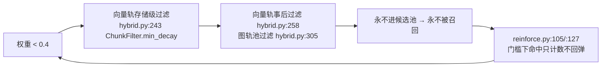
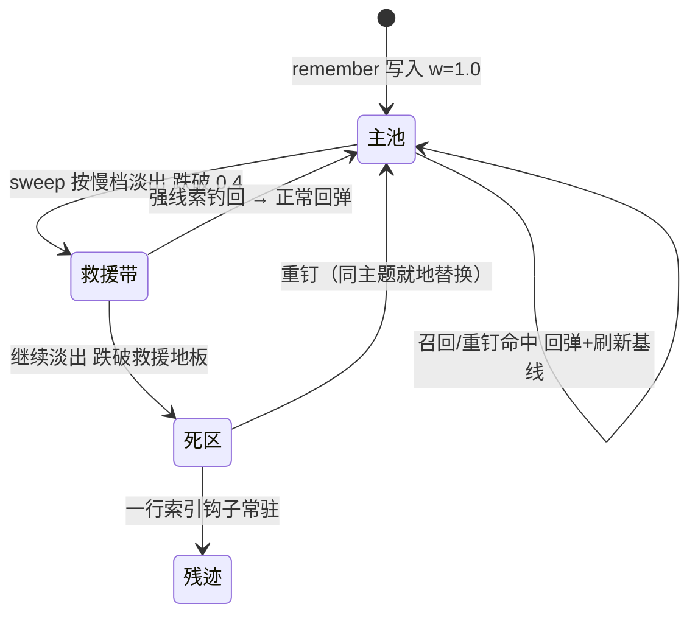

# 09 · 保留动力学重设计（Retention Redesign：钉住条目去永久化）

> 一句话定位：把「钉住」从文档承诺的"永不遗忘"改造成统一保留动力学下的一个慢衰减记忆类——淡得慢（偏好档量级，约 139 天半衰期）、被想起就加固、同主题重钉就地替换并留修订史、跌破地板后留一行可按图索骥的索引残迹、强线索能把弱痕迹钓回来。
> 状态基线：设计文档批次（docs-only）。行号引注钉在 2026-08-24 的 main 工作树；实现批开工时须按当时基线 commit 重钉。
> 主要依据：`docs/zh/design/mvp-design.md`（FR-4.1..FR-4.4）、design/01 §5（遗忘与强化生命周期）、design/03 §1.3/§3.4/§3.6（候选地板、融合排序、衰减引擎）、2026-08-23 产品评审结论（单存储：记忆是大脑，笔记视图是同一批条目的收据渲染）、所有者 2026-08-23/24 拍板（统一保留动力学，不做永不遗忘）。

## 0. 功能定位与边界

**本篇讲什么**：显式钉住条目（`/memory/remember` 写入、`provenance.source == "memory.remember"`）的完整保留动力学——慢衰减档位、强化通路、同主题替换语义、线索救援准入、索引残迹渲染，以及存量钉住的一次性迁移。

**本篇不讲什么**：

- 普通捕获 chunk 的衰减与强化归 03（§1.3、§3.6），本篇只在其上增加一个类分支；
- 图节点 `never_decay` 白名单（FR-4.4，硬约束类节点）维持现状——不扩大也不废除；
- 笔记本界面/模块、独立主题键索引、跨 profile 一切：v1 明确出界（§6）。

**边界声明**：本篇是对一个正确性缺陷的修复设计，不是功能扩张。缺陷本体：文档与测试注释都声称钉住内容受保护，代码里并不存在该保护。

## 1. 背景：一个静默的信任缺陷（诚实版）

### 1.1 三方矛盾

| 表面 | 声称 | 实际 |
|---|---|---|
| 设计文档 | "显式 pin / user 写入的 remembered 条目不在衰减面内"（`docs/zh/design/03-storage-and-retrieval.md:209`，此句为错误表述，待随实现批修正） | 对 chunk 不成立：`ChunkStamp` 根本没有 `never_decay` 字段（`schema/stamp.py:73-98` 全字段清单），sweeper 的 chunk 路径无任何钉住豁免（`decay/sweeper.py:260-281`） |
| 测试注释 | "FR-4.4 never-decay whitelist: a pinned node (user pin flips never_decay)"（`tests/test_decay_sweeper.py:240-253`） | 该测试只覆盖图节点的白名单分支，且生产写路径没有任何一处把 `never_decay` 置真——所谓保护以死分支形式存在 |
| 代码 | `remember()` 以 `decay_weight=1.0` 普通入库（`daemon/memory.py:540`），此后按 chunk 伪类型 λ=0.03 衰减（分层表在 `config.py`，解析在 `decay/model.py:65-80`） | 半衰期 ≈ 23 天（ln2 ÷ 0.03） |

### 1.2 缺陷发现与存量核查

- 发现于 2026-08-23（保留机制讨论中的代码核查，不是用户报障）——这正是"静默"的含义：没有报错、没有提示，需要的记忆就是不在了。
- 存量核查（2026-08-23 会话内完成，2026-08-24 任务简报复核口径一致）：12 条活钉住全部健在；最早一条距上次强化约 4 天，当前权重 ≈ 0.886。算术自洽验证：1.0 × exp(−0.03×4) ≈ 0.887，与观测吻合——证实钉住确实在按普通 chunk 速率衰减。
- 按现速率推算：最早一条约再过 26 天跌破候选地板 0.4（hybrid `min_decay`），此后进入死区（§1.3）。窗口紧迫，设计与实现之间不设长间隔。

### 1.3 死通道：为什么淡出的钉住救不回来

现有动力学存在一条单向棘轮：

掉到 0.4 以下的条目进不了候选池（两道硬过滤），即使偶然被命中也不回弹（门槛护栏）。唯一的救回方式是显式重钉且语义相似度落在强一致带内（`daemon/memory.py:556-572`）——措辞一变就落空（§3.3 的重复缺口）。对钉住内容而言这是双重错误：它们恰恰是最可能被用户在几个月后拿具体线索来追问的内容。

## 2. 理论锚

入选标准同全系列：只收有实验与长期复现证据验证的规律；每条给来源 / 已验证规律 / 设计规则。理论回答"为什么这样设计"；一切数值（λ、阈值、条数上限）仍是机制层标定项，不因理论获得神圣性。

### 2.1 显著性调制巩固（salience-modulated consolidation）

- 来源：Roozendaal & McGaugh（2011）Memory modulation（本地 R44 ✅）；McGaugh（2018）Emotional arousal regulation of memory consolidation（本地 R45 ✅）。McGaugh（2004）The memory consolidation hypothesis 是该假说的经典综述陈述，本轮未能核验（试探 DOI 解析到同刊他文、标题检索未命中），按诚实规则不入册，论点已由 R44/R45 覆盖。
- 已验证规律：显著/重要事件的巩固更持久——调制系统在编码后时间窗内调节巩固强度，决定痕迹存续的持久性，但不改变痕迹的内容，也不保证其真实性。
- → 设计规则：钉住条目获得独立慢衰减档 λ_pin（量级取偏好档；开放问题 1 已定 0.005）。显著性信号 = 用户显式钉入这个动作本身（元记忆里的最高权威信号，Nelson & Narens 1990，本地 R36 ✅），不是情绪评分——捕获中立红线原样保留：系统不得自行给内容判显著性喂给巩固。档位只调持久性，永不触碰 provenance.confidence。

### 2.2 提取练习 / 测试效应（retrieval practice）

- 来源：Roediger & Karpicke（2006）（本地 R46 ✅，摘要即含规律原文级表述：延迟测验中"测过"显著优于"重学"，尽管重学者主观信心更高）。
- 已验证规律：提取行为本身巩固记忆；回忆一次胜过重读一次。
- → 设计规则：被召回（含经线索救援钓回的低权重钉住）即走正常强化回弹（+0.1、刷新基线，`decay/reinforce.py` 既有语义）。这是一次有意的契约修订：既有"门槛下命中只计数不回弹"护栏（FR-4.3 阶梯）对救援带入池的条目放宽（§3.5），因为救援命中的消费证据质量与普通召回等同；"注入不等于强化"守卫不变。

### 2.3 可用 ≠ 可及（availability vs accessibility）

- 来源：Tulving & Pearlstone（1966）（本地 R47 ✅）。
- 已验证规律：信息可以在册而暂时取不回；提取失败不等于存储消失——给合适线索后可达性恢复。
- → 设计规则：跌破救援地板的钉住不删除、不归零（原文永远完整保留，verbatim 通道红线），降格为一行索引残迹仍挂在召回面（§3.6）；线索救援（§3.5）正是"给合适线索恢复可达性"的机制化。

### 2.4 编码特异性 / 线索依赖提取（encoding specificity）

- 来源：Tulving & Thomson（1973）（本地 R4 ✅，已在册；本篇将其确立为救援准入的主锚）。
- 已验证规律：提取成功率取决于线索-痕迹匹配度而非单纯存储强度；强线索可以提取弱痕迹。
- → 设计规则：候选准入从单一硬地板改为两级——主池照旧（权重 ≥ 0.4 无条件入池），救援带内的钉住类条目凭足够强的线索匹配度也可入池。排名纪律是**显式强制的，不是涌现性质**：被救候选在融合排序中恒排在全部正常候选之后（确定性降位，实现为两处排序键里的 rescued 位——检索合并 `retrieve/hybrid.py` 的 `_merge` 与装配准入 `retrieve/assemble.py` 的 `_select`，后者决定服务面最终顺序与 top-k 截断）——弱痕迹可以入池，但绝不挤掉健康记忆。融合公式本身不变（score = α·语义 + β·线索 + γ·权重 + δ·中心度，`retrieve/hybrid.py`）。阈值数值属机制层标定（开放问题 3）。

### 2.5 知道感（feeling of knowing）

- 来源：Koriat（1993）（本地 R48 ✅）。
- 已验证规律："认得出但想不起"是真实可测的元认知状态；线索引发的熟悉感能预测随后能否找回——这正是人翻笔记本找东西的实际工作方式。
- → 设计规则：残迹形态 = 一行"日期 + 原文头部逐字切片"（逐字截取，永不概括改写），作用是当知道感钩子：模型看到残迹可以主动发起显式查询把它钓回来，或用户看到后重钉修正。

### 2.6 不借清单（09 自有）

- **艾宾浩斯曲线的外推产品** 不借：R8 只锚定指数形状（03 §2.3 先例）。任何"固定复习日程表""遗忘曲线 App 式间隔算法"都不进本设计——强化时机由真实使用事件驱动，不由调度器假装人脑复习。
- **"闪光灯记忆 = 生动 = 准确"** 不借：Neisser & Harsch（1992，本地 R16 ✅）的教训照旧成立。慢衰减档借的是调制理论的持久性半边，绝不是大众心理学的"闪光灯拍照"半边；档位永不喂 confidence。
- **"过目不忘 / 照片式记忆"** 不借：不存在永生档。统一动力学的含义恰是钉住也会淡、也能被修正。
- **梦特异性主张** 不借：无证据支持睡眠期机制对"显著言语事实"存在可工程化的选择性处理。dream 引擎对本类的唯一接触面仍是既有合并语义（02 定义），本设计不给它任何新职责。
- **倒 U 型唤醒曲线** 本篇不重新借用（01 已用于 arousal 饱和帽）：钉住的显著性来自用户声明，与情绪评分无关。

## 3. 机制设计（code-level）

### 3.1 档位判定：零 schema 变更

钉住类在读侧从 `provenance.source` 派生（常量 `EXPLICIT_PIN_SOURCE = "memory.remember"` 定义于 `daemon/memory.py:83`，写入点 `memory.py:535`）——不加字段、不加列、不加迁移。λ 解析沿用既有分层先例（`decay/model.py:65-80`：显式映射项 > 类型默认 > 回落；consolidated 的 3× 乘数 `CONSOLIDATED_LAMBDA_MULTIPLIER` 是"读侧修饰符"的现成形态）：

- `decay.lambda_per_type["pin"] = <开放问题 1>` 注册为 configwrite 键，热生效与其他衰减键同机制；
- sweeper `_chunk_target`（`decay/sweeper.py:260-281`）现在写死 `lambda_for("chunk", ...)`（`sweeper.py:278`）；改为先按 source 判类再传类型名——pin 类取 `"pin"`，其余路径字节级不变；
- 图节点 `never_decay` 白名单（`sweeper.py:251`）不动，与本设计正交。

单调性契约不变：sweep 只降不升（min 语义，`sweeper.py:281`），强化只升并刷新基线（`reinforce.py:114-120`）。

### 3.2 强化通路：复用两条既有路径，不加第二套

- **被动**：召回命中 → `Reinforcer.record_hits`（`decay/reinforce.py:87-97`），+0.1 回弹 + 刷新 last_reinforced；
- **主动**：重钉落入强一致带 → 就地回弹（`daemon/memory.py:556-572`）。

修订仅一处语义：经救援准入（§3.5）入池又被召回的低权重条目放行回弹——`reinforce.py:105` / `:127` 的门槛判断需要感知"本次命中是否经救援入池"（实现形态留实现批定，候选携带入池旗标最直接）。本设计钉死的语义：救援召回 = 真实消费 = 正常回弹。

### 3.3 同主题替换：堵住重复缺口

现状缺口：重钉措辞变化后，语义相似度落在冲突阈与强化阈之间、或文本一致性判定既非"一致"也非"冲突"时，fall-through 到新建 chunk（`daemon/memory.py:587-592`）——同一主题新旧两条并存，旧的继续按自己的速率淡出。

设计：同主题带内（近重复探针以现有冲突阈命中，`memory.py:546`）分支收口到同一实体（实现批修正后的判定顺序：冲突 → 逐字相同 → 类边界 → 替换）——

| 子情形 | 行为 | 现状对照 |
|---|---|---|
| 文本逐字相同 | 就地回弹刷新——判定**先于带强**：任何带强（含弱带）的逐字重钉都走纯强化，不产生自我取代事件 | 原设计仅强相似带回弹；弱带逐字重钉曾误标 superseded |
| 文本判定冲突 | 在同一实体上标 needs_reconcile（不变）——真正的说法矛盾留给显式裁决，不静默覆盖 | 不变 |
| 判定一致但换措辞（含强相似带） | **就地替换**——同 chunk_id upsert 新 verbatim 文本 + 权重回弹刷新 + 向既有 `provenance.history` 追加一条 `ProvenanceEvent(action="superseded", ...)`。原表把"强相似 ∧ 一致"归入纯回弹，实现批修正为替换 | 原表该格为"就地回弹刷新" |

类边界红线（QA BLOCKER 修复语义）：替换分支只对**钉住类**开放——带内命中的是普通捕获 chunk 时一律落为新 chunk，捕获的 verbatim 会话文本永不被钉住路径改写（provenance 保持 capture 籍不动）。

- action 词汇表已有 `superseded` 值（`schema/stamp.py:55`）；首条 created 事件在钉入时生成（`memory.py:538`），修订史追加在同一条链上，不建第二实体;
- superseded 事件的 detail 携带 `{superseded_text, superseded_at}`：被替换原文退居 provenance 史（append-only 红线兑现"原文永不销毁"），搜索面上只剩最新版本；
- 成本注记：history 随每次修订增长（含旧全文）。钉住低频且短小，可接受；丢弃旧文的替代方案违反 verbatim 保全，否决。

### 3.4 被取代权威

替换就位后（§3.3）：搜索面只有最新措辞，权威性由结构保证——旧版本在结构上不可再见，无需额外排序规则；`memory.audit` 详情（`memory.py:596-622`）回放完整修订链（created → 各次 superseded，含日期与被替原文）。"修正版压过旧版、历史显示修订日期"由此同时成立。

### 3.5 线索救援准入

两级准入替代单一硬地板（主战场是向量轨；图轨种子不过滤的既有语义不受影响）：

| 带 | 权重域 | 准入条件 | 行为 |
|---|---|---|---|
| 主池 | ≥ 0.4 | 无条件 | 现状不变 |
| 救援带 | [救援地板, 0.4) | 仅钉住类 ∧ 线索匹配度 ≥ 救援阈值 | 入池、排名靠后、命中即正常回弹（§3.2） |
| 死区 | < 救援地板 | 不可入池 | 仍有索引残迹（§3.6）+ 重钉复活 |

实现注记（如实）：向量轨现为存储级预过滤（`hybrid.py:243` ChunkFilter.min_decay）+ 事后过滤双闸（`hybrid.py:258`）。而元数据视图不含 provenance.source（`schema/stamp.py:100-118` metadata_filter_view 字段清单），预过滤层无法表达"钉住类放宽"。两条路线留实现批择一：(a) 预过滤整体放宽至救援地板、事后过滤处执行"低于主池地板者必须是钉住类 ∧ 线索达标"联合判定——最简，但淡出的普通 chunk 会占用 top-K 窗口且受影响面随存量单调增长；(b) 元数据视图增补一个 additive 的钉住标记位，驱动层物化该标记让预过滤自身表达"仅放宽钉住类"。救援地板与线索阈值均为标定项（开放问题 3），上线前必须过评测臂材料。

**实现批落地记录（2026-08-24；QA 修正轮由路线 (a) 改判 (b)）**：采用**路线 (b)**——元数据视图增补 `explicit_pin` 布尔位（`ChunkStamp.metadata_filter_view()`），LanceDB 驱动物化同名列（存量行为 NULL，pin 过滤子句回落 `provenance.source` 判类，NULL 永不改类籍）；`ChunkFilter.pin_min_decay` 使预过滤自身表达两带准入：主地板以下必须"显式钉住 ∧ 权重 ≥ 救援地板"才进向量轨 top-K 窗口——淡出的非钉住 chunk 从此在存储层即被排除，不再消耗窗口名额（路线 (a) 的"多捞有界、top-K 截断限界"论断对普通 chunk 不再成立，已废）；"钉住类 ∧ 线索达标"联合事后判定保留为纵深防御（候选携带 rescued 旗标直通强化通路）。阈值经新增的 `eval rescue` 标定臂 ACCEPTED：rescue_floor = 0.15、cue_min = 0.20（见 §7 第 3 条），常量在 `config.py` 的 `[recall]` 段。

### 3.6 索引残迹

跌破救援地板的钉住类条目在召回面保留一行残迹：

- 形态：`<日期> + 原文头部逐字切片（固定字符数）`——逐字截取，永不概括（verbatim 红线的直接应用）；
- 通路：确定性扫描（钉住类 ∧ 权重 < 救援地板，按 ingested_at 降序，行数封顶），零模型调用（token 经济红线：管道不做 LLM 调用）；
- 渲染位置（MCP recall 显式响应 vs T2 自动注入）= 开放问题 2（已定：仅 MCP recall 显式响应）；
- 目的不是恢复可用性，而是提供 Koriat 式知道感钩子：据此发起显式查询（走救援带）或重钉（走替换）。

### 3.7 生命周期总览

## 4. 迁移与爆炸半径

### 4.1 存量一次性重建

- 规则：对全部 `source == memory.remember` 的活 chunk，按新类速率从各自 last_reinforced 基线（缺失回落 ingested_at，与 sweep 同规则）重算有效权重 `conf × exp(−λ_pin × days)`，经既有批量权重端口写入（`VectorStore.update_weights`，`sweeper.py:212` 同款），无新端口；
- 幂等：确定性重算，崩溃重跑无害；单条 daemon 审计记录迁移统计，不做逐条审计噪声；
- 零 schema 变更：类判读自 provenance.source（§3.1）；
- 时机：实现批合入后的首次启动执行一次；对现存 12 条是从 0.03 到 λ_pin 的纯增益重建（例：最早一条按 0.005 计，约 183 天后才触地板，而不是 30 天）。

### 4.2 爆炸半径（如实）

| 影响 | 方向 | 处置 |
|---|---|---|
| 慢衰减钉住长期占据 top-K 与预算 | 有意为之：用户显式声明的记忆理应优先浮现 | 不缓解；预算尾裁 + dropped_count 自报保可见性 |
| 晚年钉住先穿焦点地板、后穿候选地板的不对称窗 | T2 自动注入的焦点门槛（auto_recall_focal_floor，默认镜像 0.4，design/03 §3.5）与救援准入解耦后，出现"MCP 显式召回得回、自动注入不见"的窗口 | 如实记录为本设计的有意不对称；是否给注入面配残迹 = 开放问题 2 |
| 预过滤放宽多捞候选 | 路线 (b) 后仅钉住类的救援带行可多捞：增量 ≤ 带宽 × 存量钉住数，与普通 chunk 数量无关 | top-K 截断限界；评测臂盯召回质量与延迟 |
| 钉住 ∧ 已合并（dream merge 打 consolidated 标）的交互 | 双语义正交叠加：向量轨 `consolidated=False` 预过滤使该 chunk 退出召回面（证据角色保留，design/03 §4），衰减按钉住慢档 λ 再乘 consolidated 乘数（3×）叠速 | 如实记录，本设计不加特例；残迹扫描不查 consolidated 标——死区的已合并钉仍渲染一行钩子，可据此显式查询或重钉 |
| 替换误伤（两个确属不同主题被判同主题） | 冲突阈未动、探针未动，风险面与现状一致 | 冲突子情形保留 needs_reconcile 而不静默覆盖；误替换可从 provenance 史找回原文 |

## 5. 范围护栏（绑定）与复开触发器

- **单存储**：不建独立笔记本模块或第二存储（2026-08-23 产品评审定案：记忆是大脑，笔记视图是同一批条目的收据渲染）。残迹与修订史都是既有条目的视图，不是新实体。
- **永不删除钉生条目**：任何路径不得物理删除 `source == memory.remember` 的条目；tombstone/GDPR 语义之外无删除。
- **浏览/只读视图推迟**：dogfood 窗口结束前不做。复开触发器（任一满足即立项）：
  - (a) 所有者出现每周手工浏览记忆库的真实习惯需求；
  - (b) 评测指标：陈龄钉住救援召回 Recall@5 ≥ 0.7（30 天以上人工造龄材料）连续两轮不达标——说明残迹 + 救援不足以兑现"按图索骥"；
  - (c) 反复发生"找不到明明记得钉过的东西"事故（≥ 3 次/月）。

## 6. 出界（v1 明确不做）

- **独立主题键索引**：同主题判定先骑近重复探针（§3.3），独立的主题键与索引结构不做；
- **笔记本界面/模块**：见 §5 护栏；
- **跨 profile 一切**：profile 隔离红线，无例外。

## 7. 开放问题（已全部裁决，2026-08-24 所有者拍板 + 标定落地）

1. **慢档速率**：✅ 已定 **0.005**（≈139 天半衰期）——沿用已标定的偏好档，"特别记的事就该明显比普通事耐久"，档次感清晰。实现为 `config.py` 的 `DEFAULT_LAMBDA_PER_TYPE["pin"]`（注册键 `decay.lambda_per_type.pin` 可热改）。
2. **残迹渲染位置**：✅ 已定 **仅进 MCP recall 显式响应**——自动注入保持克制，残迹是给所有者和代理"主动翻"用的；T2 focal 扫描面保持原样（`daemon/memory.py` 的 `index_residue` 载荷只挂在 `/memory/recall` 响应上）。dogfood 后如需复议再走变更。
3. **救援带参数**：✅ 已定并经评测标定 **rescue_floor = 0.15、cue_min = 0.20**（ACCEPTED）。标定方式与召回阈值同纪律：新增 `eval rescue` 臂（MCP-recall rig × 8 材料 × 20 组 floor×cue_min 网格，synthetic embedder 零活模型），门禁条 bar（噪声准入=0、救援回弹率=1、死区泄漏=0、救援命中率≥0.75、排名纪律=1——被救候选永不排在正常候选之前），在全网格全绿，恢复率标量在守住条 bar 的前提下选出最深可救带——0.15 让 0.22 权重的钉仍可达，0.20 仍能钓回"查询双实体命中其一"的半重叠线索并拦下更弱的匹配。数值落在 `config.py` 的 `DEFAULT_RECALL_RESCUE_*` 常量注释里，随批入册。

## 8. 本篇引用

- 新登记：R44 Roozendaal & McGaugh (2011)；R45 McGaugh (2018)；R46 Roediger & Karpicke (2006)；R47 Tulving & Pearlstone (1966)；R48 Koriat (1993)——均本轮 Crossref 直接核验（REFERENCES.md 同批更新）。
- 沿用在册：R4 Tulving & Thomson (1973)、R8 Ebbinghaus（只锚形状）、R16 Neisser & Harsch、R36 Nelson & Narens——状态照抄在册，对应本篇列已加 09。
- 未入册说明：McGaugh (2004) The memory consolidation hypothesis 本轮未能核验，详见 REFERENCES.md 本节注。
