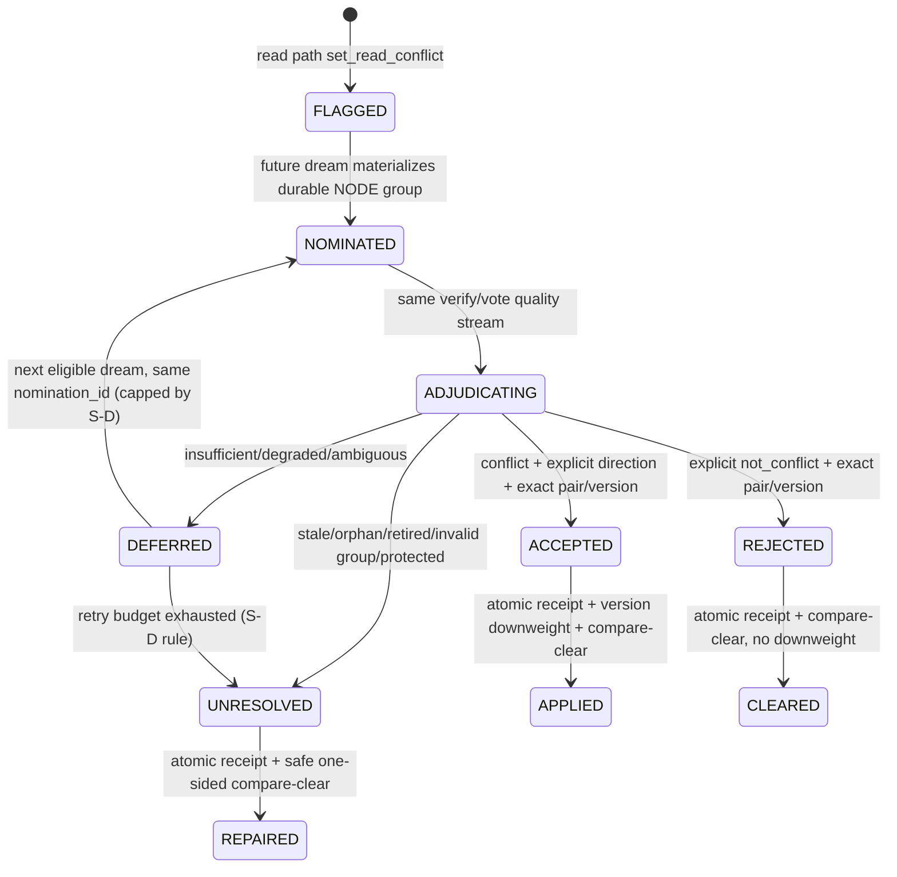

# 12 · 可逆冲突和解（Read Conflict Reconciliation）

> 一句话定位：读路径只把「两条当前记忆看起来矛盾」记成可逆证据指针；离线 dream 才能在同一条 verify/vote 质量门后裁决，并且只用版本链降低已确认落后侧的可及性，绝不就地改写历史。
>
> **状态：设计先行稿（docs-only）**。基线 commit `203f951`（PR #194）。本篇不授权生产实现、migration、配置/default 变更、数值 bar、#113 detector/E2 激活，也不授权任何 agent-facing feedback API。未来实现必须另行通过稳定性受控评测、架构复核和实施授权。
>
> 依据：issue #123；PR #146（读侧 `read_conflict_id`）；PR #150 + #182 / issue #151（共享 ErrorEvent composite pointer + evidence-fate 基板）；PR #194（真实 vote eval + report v1.2）；#123 pilot 评论 `issuecomment-5656423604`。pilot 的完整本机报告不在仓库，数字只作为设计风险输入，不是 CI 权威或 bar 来源。
>
> 理论锚：**不适用（not borrowed）**。本篇是已有机制的工程协调与安全契约，不新增认知理论，不把 PRD-B2.13 的 R49-R53 当作阈值出处。

---

## 0. 产品承诺与边界

### 0.1 目标用户承诺（实现后）

用户需要的是：系统发现旧、新记忆可能冲突时，不会因为一次相似度命中或一次模型失败就静默删改记忆；下一次离线 dream 可以复核，且所有处置可审计、可重放、保留原始来源。

### 0.2 本篇只冻结什么

- #123 与未来 #113 E2 共用**一条** dream verify/vote 裁决流，不各建一套 judge、downweight 或 disposition 语义；
- 四态 disposition：`accepted` / `rejected` / `deferred` / `unresolved`；
- 非互惠、孤儿、版本漂移、崩溃重试和幂等应用契约；
- corrected-memory downweighting 只走版本链，绝不修改原历史；
- #123 与未来 #113 E2 的所有权边界；
- 所有数值均保持 TBD，并写明取得数值前必须满足的证据门。

### 0.3 明确不授权

- 不新增或修改 `src/`、migration、配置键/default、daemon wiring；
- 不启动 #113 A/B/C detector，不打开 `dream.experience_channel.enabled`；
- 不把 `dream.ensemble` 默认从 `off` 改成 `verify`/`vote`；
- 不新增 `/memory/reconcile`、`memory/feedback`、MCP tool 或用户显式反馈入口；
- 不自动 invalidation、tombstone、删除或重写 graph/chunk；
- 不实现 lesson、INTENTION、standing rule、SKILL_SEQUENCE 或 E3 delivery；
- 不设 downweight 幅度、quorum、timeout、每批容量、重试次数或任何通过线；
- 不触碰 `mnemoseed-orchestrator`。

---

## 1. 当前真实基线与缺口

### 1.1 已有能力

1. **读侧提名**（PR #146）：`retrieve/assemble.py` 在两条同实体、当前生效的陈述看似矛盾时调用 `GraphStore.set_read_conflict(a, b)`；两端只保存 peer `node_id`。读路径零模型调用，不判定孰对，不改写 text、confidence 或 provenance。
2. **共享证据基板**（PR #150 + #182）：`ErrorEvent` 是 append-only 提名行；`EvidencePointer` 明示 CHUNK/SESSION/NODE；多源事件用同一 `composite_group_id`；CHUNK 证据退休可在读侧解析为 `evidence_retired`。`dream.experience_channel.enabled` 默认 `false`。
3. **B5 vote**：生产 dream 已有 A/B seat + deterministic combiner；vote divergence 写入 isolated 并标 `needs_reconcile` / `conflict_flag`，但 merge 不写 `conflict_group`。GraphStore 虽有生成随机 `conflict_group` 的通用 `set_flags(..., CONFLICT_GROUP)` 原语，当前没有生产 vote caller。PR #194 让 eval rig 真正跑双席，并在 report v1.2 记录 `VoteMetrics`、`model_id`、`vote_disagreement`。
4. **图版本链**：`GraphNode` 有 `version` / `prev_version_id` / `valid_from` / `valid_to`，SQLite graph 有 `append_version`、`supersede_link` 和历史查询。

### 1.2 尚不存在

- 没有消费 `read_conflict_id` 的 dream-side reconciler；
- 没有把一对 NODE 指针原子物化为 durable composite nomination 的写入原语；
- 没有 pair-scoped typed adjudication output；当前 reflect/verify/vote 输出不能证明自己裁决的是指定 node pair；
- 没有 compare-and-clear；当前 `clear_read_conflict(node_id)` 会无条件清一侧，可能误清已被新 read 覆盖的 peer；
- 没有「版本更新 + 两侧条件清除 + 幂等 receipt」同库原子事务；
- 没有 reconciliation receipt/outbox；MetaStore audit 与 GraphStore 是不同持久化边界，不能假装跨库原子；
- merge 只会 OR `needs_reconcile` / `conflict_flag`，不会消费或清除；
- `needs_reconcile` / `conflict_flag` 是无 owner/generation 的 lossy boolean，`conflict_group` 也不是 read-conflict pair identity；现状无法判断哪个 nomination 有权清它们；
- 当前 `Merger.merge()` 内部直接调用 `trigger.on_merge_committed`，没有可安全插入的 post-merge reconciliation seam。

因此，本篇只能冻结 future contract；把现有方法拼起来直接上线会产生错清、双 downweight 或「audit 已写但 graph 未写」的静默分叉。

---

## 2. 红线与不变量

| ID | 不变量 | 可执行含义 |
|---|---|---|
| R-1 | nominate, never adjudicate on read | read path 只 raise/refresh pointer；零 LLM、零权重写、零 clear |
| R-2 | one adjudication stream | #123 与 #113 E2 复用相同 seat routing、typed decision schema、quality gate、downweight applier；不得第二 judge |
| R-3 | prefer under-flag | 证据不足、任一 seat 失败、pair/version 不匹配，一律 `deferred` 或 `unresolved`，绝不猜 winner |
| R-4 | version-chain only | `accepted` 只追加新版本降低 loser 的 `decay_weight`；不改 confidence/text/history row，不 tombstone |
| R-5 | verbatim/provenance intact | 原 chunk 和 node 历史保留；只追加 `ProvenanceEvent(action="reconciled")` 与 receipt/audit |
| R-6 | append-only ledger | `error_events` 不 UPDATE/DELETE；disposition 不回写 ledger row |
| R-7 | evidence-fate first | retired/missing/stale evidence 不得 accepted；先判证据命运，再调用模型 |
| R-8 | profile isolation | nomination 两端、ledger group、graph mutation、audit 都必须显式同一 `profile_id`；绝不猜 |
| R-9 | compare-and-clear | 仅当当前 pointer 仍等于 nomination 捕获的 expected peer 时才清；新 pointer 永不被旧结果清掉 |
| R-10 | idempotent application | 同一 `nomination_id` 重放不得产生第二个 graph version、第二次 downweight 或不同 disposition |
| R-11 | no metric-as-verdict | `VoteMetrics` 是校准统计，不是 pair disposition oracle；不得从 aggregate count 直接 accepted/rejected |
| R-12 | no number by prose | 本篇所有数值参数保持 TBD；需要稳定性受控数据 + 单独 ratification 才能写默认值 |
| R-13 | identity is not presentation | `conflict_flag` / `conflict_group` 只可作展示/检索标记；没有 exact target+version+owner 时不得用作 nomination identity 或清除权威 |

---

## 3. 单一共享裁决流

### 3.1 候选来源与 canonical kind 闭集

共享流只接受引用型 nomination；source 永远不是 correctness verdict。本篇冻结的 canonical kind 只有 `read_conflict` 与 `vote_disagreement`；未来 #113 增加 kind 走 append-only contract review，不能复用旧值。

| candidate source | canonical kind | #123 当前/未来所有权 | 备注 |
|---|---|---|---|
| graph `read_conflict_id` pair | `read_conflict` | #123 | 本篇唯一允许未来新增的 #123 source |
| merged triple `vote_disagreement=True` / node `needs_reconcile` | `vote_disagreement` | shared | 已有单点信号，但当前无 durable pair/group；不能安全配对时只 deferred |
| `ErrorSignalType.PUBLISHED` + NODE/CHUNK pointer | carrier-only | shared | 复用 E1 基板，不新增 enum；本身不是 kind，须带 explicit nomination linkage，否则不得推断 underlying kind |
| user correction / event outcome / process omission | future extension | #113 | 仍 gated behind #75；canonical kind 尚未冻结，本篇不得启动 |

### 3.2 Durable nomination envelope（未来契约）

未来 consumer 接收的最小 envelope（#113 可携带多源 evidence；只有要执行 pair downweight 的 nomination 才必须带 exact NODE target pair）：

```text
nomination_id           dedicated immutable identity; stable target/version/generation derivation + unique constraint
profile_id              required, explicit, same on every endpoint
canonical_kind          normalized closed kind; raw carrier is not identity
composite_group_id      one group for all source rows
evidence                 one or more immutable EvidencePointer + ErrorEvent row ids
source_channels          raw flag/ledger families retained for provenance, not dedup identity
source_generation        persisted marker generation; distinguishes a later re-raise of the same pair/version
left                     {node_id, expected_version, expected_peer_id}
right                    {node_id, expected_version, expected_peer_id}
captured_at              observation metadata only; never a threshold
```

约束：

- 一对 read-conflict 必须以**同一事务** append 两条 NODE `ErrorEvent` 行，共享一个已持久化的 `composite_group_id`；禁止先写一条、以后补另一条；
- `nomination_id` 必须由 canonical kind/profile/canonical target node ids + expected versions + persisted `source_generation` 的稳定契约派生、在 durable append 时固定并受唯一约束；不得把 wall clock 放进 identity，也不得在 retry 产生新 id。两端 node ids 必须先做 order-canonicalization（如 sorted join），`a→b` 与 `b→a` 必须得到同一 id——否则同一 pair 会凭两个 id 各自 downweight 一次，绕过 per-id 幂等；
- 当前 `read_conflict_id` 和 generic flags 都没有 generation。S-A 必须先增加可持久化的 source generation，且其写入必须与 flag raise/ledger append 同事务（存于何处——graph 列、ledger carrier 或两者——由 S-A contract review 冻结，但 crash 时不得出现「flag 已写、generation 丢失」的半态）：同一次 flag/source group 的 scanner 重跑保持 generation；terminal clear 后再次 raise，或出现此前未见的 durable source group，才产生新 generation。ownerless flag 被反复扫描不得推进 generation；否则无法同时满足 retry dedup 与「同 pair/version 的后来新证据可重开」；
- `composite_group_id` 只把 source rows 归组，不是 nomination identity。现有 E1 的窗口哈希（profile/session/turn-window/detected-at）不能证明 NODE pair；S-A 必须新增专用 immutable carrier/unique key，并冻结 pair-group 派生，禁止借窗口哈希相等性判成员；
- carrier → canonical kind 的归一映射表（PUBLISHED 行到 underlying kind 的 join 规则、非 NODE evidence 的 target 定义）由 S-A contract review 冻结；本篇只冻结归一原则——carrier 与 source channel 都不是 identity；
- `PUBLISHED` 是 ledger carrier，不是独立 canonical kind；同一 target pair/version/generation 的 `vote_disagreement`、`PUBLISHED` carrier 或其他多源观测须先归一 underlying kind，再得到一个 `nomination_id`；source channel/row 数量不参与 dedup identity；
- 当前 PUBLISHED row 与 vote triple 之间没有 join key。S-A 必须增加显式 nomination/source-generation linkage；无 linkage 的 carrier 只能 `deferred`，禁止按 pointer、时间窗口、text 或 model 猜 kind；
- 非 NODE evidence 只提供证据，不能隐式成为 graph target；任何 negative action 都要求 producer 显式给出 exact two-`NodeTarget` pair，否则留在 `deferred`/future #113 positive-artifact 流；
- group 不完整、跨 profile、重复 endpoint、空 endpoint 或版本缺失时，不进入模型；分类为 `unresolved`/`deferred` 并审计（read-conflict 残组按 §6 规则，single-source carrier 按 `deferred`）；
- 当前 `ErrorEvent` 没有 `nomination_id`、unique nomination carrier 或 group atomic append port；未来实现必须先做 contract/migration review，不得把字段塞进 `reason` 字符串；
- materialization 前，graph flag scanner 只是 recovery source；unique nomination 落地后，ledger group 才是 retry/消费 authority，graph flag 不得再生成第二组。

### 3.3 Pair-scoped typed adjudication output（未来契约）

当前 `ReflectionResult` / `VerifyResult` / `VoteMetrics` 无法证明输出针对指定 pair。共享流未来必须产生 typed result：

```text
nomination_id
left_node_id / left_version
right_node_id / right_version
verdict = conflict | not_conflict | insufficient
winner_node_id?         required only for conflict with direction
loser_node_id?          required only for conflict with direction
target_node_ids         exact pair; must equal nomination targets
evidence_event_ids      exact immutable source group
quality = verified | voted | degraded
reason_code             closed enum, no free-text control flow
```

verify/vote 是这个 typed result 的质量门，不是另一个 state machine。禁止：

- 用 `agreement_triples > 0` 推断 pair 不冲突；
- 用 `disagreement_parties > 0` 推断某个 endpoint 是 loser；
- 从 `model_id` 字符串或 `_vote_overlay` 的 SPOP text key 猜 node identity；
- 从 graph `needs_reconcile` 反推模型 verdict；
- 在 pair/version 未 exact-match 时应用结果。

当前 B5 是 triple extraction/combine，不是 pair adjudicator：verify 只处理 CORE triples，combiner 的 polarity guard 把双方从 `triples` drop 后只把 key 留在 `ReflectionResult.conflicts`。未来 S-B 的 pair adapter 不得忽略 `conflicts`；但当前 conflict tuple 也没有 node/version identity，单独出现时只能强制 `deferred`，不能证明指定 pair。只看 surviving triples 同样不得产出 disposition。nomination 到 verify/vote seat 的 prompt/routing/activation 归 S-B 单独冻结；在 S-B 落地且明确激活前，默认 `ensemble=off` 表示没有合法裁决席，所有 nomination 只能 `deferred`，不能把现有 extraction 输出拉伸成 pair verdict。

### 3.4 逻辑时序



---

## 4. 四态 disposition

以下全部是**未来生效契约**，不是当前运行能力或实现授权。

| disposition | 必须满足 | graph effect | pointer effect | retry |
|---|---|---|---|---|
| `accepted` | typed result 明确 `conflict`、winner/loser；endpoint id/version/profile exact-match；quality gate 非 degraded | loser 追加新 version，只降低 `decay_weight`；confidence/text/旧版本不变 | 两侧 compare-and-clear；任一侧已改变则整次 CAS 不应用 | terminal for this nomination |
| `rejected` | typed result 明确 `not_conflict`；endpoint exact-match | 无 downweight；可追加 receipt，不改语义内容 | 两侧 compare-and-clear | terminal；S-B typed `not_conflict` 落地前此路径不可达 |
| `deferred` | evidence/quality 不足但 endpoint 仍可重试且不涉 protected 端点 | 无 graph mutation | 不清 | 同一 nomination_id 下次再试；backoff/count cap 由 S-D 冻结（§4.1.1），耗尽后 `unresolved` 收口，绝不无限 burn |
| `unresolved` | missing/retired/stale version、非法/半个 group、无法安全配对、protected endpoint 的安全收口 | 无 downweight | 只 compare-clear 仍指向 stale peer 的活侧；绝不改 peer 的新 pointer | terminal for this captured nomination；新 evidence 可产生新 nomination |

### 4.1 强制映射到 `deferred`

- `vote=None`、provider timeout、seat unavailable、JSON/typed-output invalid；
- A/B 任一 seat collapse 未恢复；
- 只有 single-side survivor（含 SALVAGE）；
- combiner polarity conflict 把两侧都 drop；
- verify/vote 没有 pair-scoped exact endpoint/version；
- 模型认为 conflict 但没有明确 winner/loser；
- **不是** deferred：protected/`never_decay` endpoint。nomination 不因 protected 而被禁止入队，但发现 protected 端点时以 `unresolved(protected_endpoint)` terminal 收口——receipt/audit 记录事实、不动 graph、不清其他 marker；其自动处置政策另行冻结，不在本篇。

### 4.1.1 deferred 的重试上限归 S-D（防无限 burn）

`deferred` 不设无限重试。每个 nomination 的 backoff/count cap、以及重试耗尽后的终态（`unresolved` 收口或保留），是 S-D 的 ratification 前置项；在 cap 数据 ratify 前，S-D 不得激活消费。本篇只冻结「必须有上限、耗尽必收口」，数值 TBD。

### 4.2 禁止把「两侧都接受」直接当 rejected

两个陈述都可能在不同时间或作用域为真。除非 typed result 明确输出 `not_conflict` 且 pair/version exact-match，否则保持 `deferred`。under-flag 的代价是 flag 多留一轮，不是误伤仍真实的旧事实。

### 4.3 各 disposition 的 marker 清除集（明确版）

今天可清的 marker 只有 #123 envelope 捕获并验证的 `read_conflict_id`；`accepted` / `rejected` / `unresolved` 的「compare-and-clear」一律只指它：

- #123 `read_conflict` 只拥有 envelope 捕获的 `read_conflict_id`，只能 expected peer/version compare-and-clear；
- `needs_reconcile` / `conflict_flag` 当前没有 source owner/generation，是 lossy 展示位；future schema 在能把 marker 绑定到 nomination 前，任何 terminal disposition 都不得清它们，宁可 under-flag。它们的 retention/清位出口必须在 S-C 的 marker-binding contract review 里冻结（含 under-flag 堆积的上限与 operator 可见性），S-C 未冻结前不得激活任何清除；
- `conflict_group` 只在 production producer 原子写入 exact members + owner generation 后才可作为展示组被同一 receipt 条件清除；当前通用随机 group 和 merge 未分组的 vote flag 都不得反推 pair；
- 一个 nomination 只能清自己声明并验证的 marker，不能顺手清另一 source 新写的 flag。

---

## 5. Downweight 与版本链

未来 `accepted` 的唯一负向动作是：为 loser 创建 `version + 1` 的当前 revision，继承原 `node_id` 与全部语义/来源字段，只把 `decay_weight` 调低（幅度 TBD），追加：

```text
ProvenanceEvent(
  action = "reconciled",
  actor = "dream-engine",
  detail = {nomination_id, winner_node_id, prior_version, disposition}
)
```

必须不变：

- `confidence`；
- `props` 中的 statement/object/text；
- 已存在 provenance 事件和 source chunk ids；
- `created_at`；
- 历史 `node_versions` payload；
- `never_decay` 节点（见 §4.1：发现即 `unresolved(protected_endpoint)` 收口，绝不 downweight）。

本篇不授权 `supersede_link` 或 tombstone。若未来要把明确时间替代关系写成 `SUPERSEDES` edge，须独立 contract review；普通 read-conflict accepted 只降低可及性，不删除历史、不宣布永久错误。

该 downweight 是一次可审计 append，不是永久 ceiling/pin。之后真实的新 evidence 仍可按现有 reinforcement 语义回弹，正常 decay 也继续运行；这正是「可逆」的一部分。若未来数据要求永久上限，必须另立契约，不能在 S-C 偷加。

### 5.1 当前原语不能直接复用

- `append_version` 不是 nomination-idempotent receipt；传错 version 可 `INSERT OR REPLACE`；
- `clear_read_conflict(node_id)` 没有 expected peer/version guard；
- GraphStore 与 MetaStore 分库，graph mutation + audit 不能靠两个独立调用假装原子。

未来实现必须在 **GraphStore 数据库内**新增一个 transaction boundary、immutable application receipt 与 durable audit outbox（名称不在本篇冻结），原子执行：

1. 校验 profile、两端当前 version 与 expected pointer；
2. 检查 `nomination_id` receipt 是否已存在；
3. 必要时 append loser version；
4. compare-and-clear 可清的 pointer；
5. 写同库 immutable reconciliation receipt，并写独立 outbox delivery record；
6. commit 后由 outbox 驱动 repair，按 nomination/action 唯一键幂等补 MetaStore audit（当前 audit port 无此唯一键，也须在 S-C contract review 中补齐）。application receipt 永不改写；outbox 的 delivered 状态或 append-only delivery ack 由 S-C 冻结，但绝不反向控制 graph mutation。

没有同库 receipt/CAS，就不得开工 disposition applier。

---

## 6. 非互惠、孤儿与 stale 处理

`set_read_conflict` 可以覆盖旧 pointer，所以 reciprocity 从来不是不变量。

以下处理均为未来契约；当前无 consumer。

| observed shape | 处理 |
|---|---|
| `a -> b` 且 `b -> a`，两端 current/version 匹配 | 可进入 adjudication |
| `a -> b`，`b -> c`，无 durable pair envelope | `unresolved`；仅 CAS 清仍为 `a -> b` 的 a；绝不碰 `b -> c` |
| pointer peer 缺失 / closed / tombstoned | `unresolved`；仅清活侧旧 pointer |
| durable envelope 已捕获 a/b，但当前 pointer/version 已变 | 旧结果不得应用；`unresolved(stale_revision)`，新 evidence 另建 nomination |
| 一端跨 profile | invalid group；audit + 不调用模型，不跨 profile 清理 |
| composite group 只有一个 row | incomplete group；不调用模型；repair/`unresolved`，绝不猜另一端 |

任何 reparation 都是「条件清除 + receipt + audit」，绝不自动写回 reciprocal pointer。

NODE evidence-fate 以 `GraphStore.get_node()` 的 current revision 可见性（`valid_to IS NULL`）与 `versions()` 历史链为准；CHUNK 沿用现有 read-time `evidence_retired`；SESSION-kind fate 当前没有通用 API，禁止猜测或把 `None` 当 live。CAS 零行更新表示 endpoint 已 stale/closed，必须落 `unresolved` receipt/audit，不得声称 `cleared`。

「单行 group」的 `unresolved` 只适用于承诺原子双行 append 的 read-conflict pair（单行 = 崩溃/写半残留）。合法的 single-source vote/PUBLISHED carrier 不是残缺双行组：没有 exact pair/linkage 时保持 `deferred` 等待新 durable source group，不得按残组规则 terminal `unresolved`。

---

## 7. Crash、retry 与写入顺序

### 7.1 Authority

- nomination authority：MetaStore durable unique nomination carrier + attached append-only ErrorEvent group；
- application authority：GraphStore 数据库内的 reconciliation receipt + version chain；
- operator history：MetaStore `reconcile_*` audit（可由 receipt 修复）；
- snapshot journal 只承载原 dream reflect/merge，不新增 `RECONCILE_DONE` phase，不改冻结的 `resume_boundary`。
- retry discovery：durable unique nomination/ledger group 为主；graph flag scanner 只修复「flag 已写但 nomination 尚未物化」窗口。

### 7.2 未来执行位置

逻辑位置是一次成功 regular merge 后、dream 完成通知前的 bounded reconciliation attempt；但当前 `Merger.merge()` 内部直接调用 `trigger.on_merge_committed`，尚无安全 seam。未来 implementation preflight 必须先把「graph commit」与「trigger completion/safe-clear」解耦，再接 reconciler。约束：

- reconciliation failure 不回滚已成功的 regular merge，也不丢 nomination；写 `deferred` 后照常完成 dream；
- reconciliation success 不是 `MERGE_DONE` / safe-clear 的前置条件；future seam 必须用 `finally` 保证普通 merge completion callback，即使 adjudicator/provider/audit 失败也不能把已提交 snapshot 永久卡住；
- outbox pump 的 owner（哪个线程/组件驱动 outbox→MetaStore audit 补写）、同步/异步边界、以及与下一次 dream 的排序键，是 S-D seam 设计的必答题，不得留白到实现现场即兴决定；
- 同 profile 串行，不能与下一次 dream 的 graph write 并发；
- capture/ingest 热路径永不等待（reconciliation 与 outbox 补写都在 dream worker 线程内，不在 HTTP ingest 路径上）；
- deferred nomination 的 evidence 生命周期：merging dream 的 safe-clear 只按既有 watermark 语义清 capture buffer，绝不清 ErrorEvent ledger row——ledger 是 append-only 的 evidence authority。若未来发现某 evidence 面也被 safe-clear 影响，S-D 必须冻结 evidence pinning 规则，否则 `deferred` 不可达 retry 一律禁止；
- 每 dream 处理量、模型 timeout、retry backoff 全部 TBD，不能从本篇取值。

### 7.3 Crash windows

| crash point | restart behavior |
|---|---|
| durable nomination 前 | graph flag 仍在；未来 scanner 可重新 materialize |
| nomination 后、model 前 | 同 nomination_id 重试 |
| model 后、graph CAS 前 | 崩溃即丢弃 in-flight typed result（它不是 authority）；重启后同 nomination_id 重新 adjudicate。禁止「先持久化 result、再重放」的双轨——要么 S-B 冻结单一 durable result store，要么永远重新裁决，不得两者皆可；未冻结前唯一合法行为是重新裁决 |
| graph receipt commit 后、Meta audit 前 | receipt 表明已应用；只补 audit，绝不第二次 downweight |
| Meta audit 后 | receipt + nomination/action audit dedup，terminal |
| deferred audit 后 | 同 nomination_id 下次尝试；attempt audit 用 `(nomination_id, dream_run_id)` 幂等 |

---

## 8. B5 pilot 与「不设 bar」

PR #194 后的本机 no-bar pilot（完整文件位于 org evidence `evidence/2026-09-14-b5-vote-pilot-no-bar.md`，不随本仓提交；下表为该文件的定性摘录，**非仓内可验证事实、非 bar**）只有 3 个成功 vote run：

| run | agreement | disagreement parties/groups | single-side | polarity conflict | recall |
|---|---:|---:|---:|---:|---:|
| 1 | 0 | 0 / 0 | 14 | 0 | 0.75 |
| 2 | 0 | 0 / 0 | 17 | 0 | 0.75 |
| 3 | 1 | 4 / 2 | 9 | 0 | 0.62 |

同时 8 个 canary 行中 5 行因 seat timeout/format failure 降级为 `vote=None`。这组数据只支持两件事：

1. instrument 能诚实区分成功与 degraded；
2. 当前硬件/timeout 下样本稳定性不足，不能 ratify 任何 reconciliation 数值。

### 8.1 全部 TBD 的数值表

| 参数 | 当前值 | 取得值前的门 |
|---|---|---|
| downweight delta/factor | TBD | stability-controlled rerun + false-obsolete eval + 单独 ratification |
| accepted quorum / margin | TBD | pair-scoped adjudication eval；不得使用 aggregate VoteMetrics 替代 |
| per-dream nomination cap | TBD | latency/token/capture soak，证明不饿死 regular dream |
| reconciliation timeout | TBD | 同硬件固定 seat 的 timeout 分布 |
| deferred retry/backoff | TBD | burn 与成功率数据；S-D 激活前置 |
| max unresolved retention | TBD | operator burden + stale repair 数据；含 protected-endpoint 收口的可见性 |

现有 `SINGLE_SIDE_SALVAGE_FLOOR`、`read_conflict_min_frame`、`read_conflict_token_sim`、`core_confidence_floor` 都不是 reconciliation bar，禁止借用。

---

## 9. Operator observability（未来 additive-only）

不新增 route/tool。未来只在已有面增加：

- dream status：`reconcile.accepted/rejected/deferred/unresolved` counts；
- error-events：继续显示 `composite_group_id` 与 evidence-fate；
- Atlas/console：复用 `read_conflict` / `needs_reconcile` badge；
- audit actions：`reconcile_accepted` / `reconcile_rejected` / `reconcile_deferred` / `reconcile_unresolved`，detail 只含 id/version/reason code，不复制记忆正文。

诚实边界：现有 console memory list 已显示 chunk/node `needs_reconcile` badge，recall metadata 只透出 chunk `needs_reconcile`，node recall 不透出该位；`read_conflict` 已有 recall flag。当前没有 disposition count、nomination/receipt linkage 或 terminal marker ownership。上面的 `reconcile_*` 也是未来 audit taxonomy，须在 S-E 命名评审；本篇不借 #123 顺手补任何一面。

---

## 10. #123 与 #113 E2 所有权

| concern | #123 | future #113 E2 | shared contract |
|---|---|---|---|
| nomination source | read-conflict flag raise/materialize/clear/repair | correction/outcome/process detectors（仍 gated #75） | ErrorEvent/EvidencePointer/composite group |
| adjudication seats | 不自建 | 不自建 | dream verify/vote routes + typed pair decision |
| negative action | 不自建第二套 | 不自建第二套 | version-chain downweight + receipt/CAS |
| positive artifacts | 不做 | lesson / INTENTION / standing rule | provenance/evidence-fate red lines |
| delivery | 不做 | E3 injection + disable/forget bundle | none in this design batch |
| activation/config | 不改 | owns future `experience_channel` enable decision | current default remains false |
| measurement | pair false-obsolete / deferred / recurrence eval | E4 recurrence + detector FP | no bar without ratification |

先落地的一方必须实现已授权范围内的 shared contract，后落地一方复用；不得复制 typed schema、receipt、audit taxonomy 或 downweight applier。若 #123 先落地，其验收只能消费 `read_conflict`，不得以「shared」名义顺带启动 #113 detector、lesson 或 delivery；每个实施 issue 必须单列获批的 shared layer 与 source-specific layer。

---

## 11. Rejected alternatives

1. **读路径直接选 winner/清 flag**：拒绝。读侧没有 model consensus，且会把 under-flag FP 变成不可见写入。
2. **#123 单独再建一个 LLM judge**：拒绝。与 PRD-B2.13 的单流红线冲突，成本与语义双重分叉。
3. **把 aggregate VoteMetrics 当 disposition**：拒绝。它没有 nomination/node identity，agreement/disagreement 计数不能说明指定 pair 的方向。
4. **就地改 confidence/text 或 UPDATE 历史 payload**：拒绝。破坏 provenance 和 as-of replay；downweight 只走新 version 的 `decay_weight`。
5. **ledger row 回写 status**：拒绝。error_events 有 append-only trigger；状态在 receipt/audit。
6. **两个库依次写，当作原子**：拒绝。必须 graph receipt/outbox repair；audit 可补，downweight 不可重复。
7. **polarity drop / single-side 当 winner**：拒绝。两者都没有双席方向性证据，只能 deferred。
8. **新增用户 feedback API/MCP tool**：拒绝。违背 derived-signal-only 产品边界。
9. **新增 snapshot reconciliation phase**：拒绝。`resume_boundary` 是现有 dream crash contract；reconciliation authority 独立由 ledger+receipt 承载。

---

## 12. 未来实现切片（全部未授权）

| slice | 内容 | 开工前置 |
|---|---|---|
| S-A | atomic composite NODE nomination + scanner/recovery | owner 单独授权 #123 production；MetaStore contract/migration review；#75 只约束 #113 source |
| S-B | pair-scoped typed result + shared verify/vote quality gate | stability-controlled B5 rerun；无数值 ratification不得设 threshold |
| S-C | GraphStore receipt/CAS + version-chain downweight + compare-clear | migration/contract/atomicity QA；false-obsolete eval fixture |
| S-D | dream completion seam refactor + bounded serialized consumer | crash/retry design QA；证明 regular merge/safe-clear 不回归；retry/burn/retention ratification 后才可激活 |
| S-E | existing-surface observability | S-C/S-D landed；零正文 audit test |

稳定性受控 calibration 与 bar proposal 不属于上述实现切片：样本量、硬件、timeout 必须先预注册，再走独立 ratification issue。无该裁决，任何切片都不得偷带数值。

本篇合并后，issue #123 仍保持 OPEN；不得因为 design landed 就关闭或启动 S-A。

---

## 13. 未来测试矩阵（实现门，不是当前声称）

### Nomination / evidence fate

- reciprocal pair → atomic two-row group；
- one-sided overwrite、missing peer、closed version、tombstoned peer；
- cross-profile pair、half group、duplicate endpoint；
- crash after flag before nomination → S-A 必须自带 crash-injection + scanner harness，断言 exactly-once recovery（零恢复或双恢复都算失败）；
- window-hash collision / PUBLISHED+vote duplicate source → one dedicated nomination identity；
- reversed endpoint order（`a→b` 提交后又见 `b→a`）→ 同一 `nomination_id`，零额外 downweight（钉 order-canonicalization）；
- PUBLISHED without explicit nomination linkage / non-NODE evidence without exact targets → deferred, zero graph mutation；
- one-row read-conflict crash residue → unresolved；legal single-source vote carrier → deferred；
- deferred evidence survives merging dream 的 safe-clear（ledger rows 仍在，retry 的 evidence-fate 仍 resolvable）；
- append-only ledger UPDATE/DELETE trigger remains active。

### Disposition

- exact typed conflict + direction → accepted；
- exact typed not_conflict → rejected；
- no direction、pair mismatch、version mismatch → deferred/unresolved；
- `vote=None`、seat timeout、unrecovered collapse、single-side、SALVAGE、polarity drop → deferred；
- `never_decay` loser → `unresolved(protected_endpoint)` terminal 收口，zero graph mutation、zero marker 清除；此后同 generation 不再入队。

### Atomicity / idempotency

- old nomination cannot clear a newer peer pointer；
- crash after graph receipt before audit → one version only，audit repaired；
- same nomination replay N 次（N 与并发 harness 由 S-C 测试计划冻结，禁止只跑 N=1）→ one receipt / one downweight / one terminal audit；
- accepted mutation preserves confidence/text/provenance history and all prior versions；
- rejected/unresolved perform no downweight；
- #123 terminal disposition clears only its unchanged read pointer；ownerless `needs_reconcile` / `conflict_flag` remains under-flagged；
- a later genuine reinforcement may rebound reconciled decay weight without rewriting the prior reconciliation version；
- concurrent same-profile dream/reconcile serializes；cross-profile stays independent。

### No-regression / governance

本小节前四条同样适用于每个实现切片（S-A..S-E 的 PR 须各自复验）；docs-only staged-path 检查只约束本设计批：

- read path zero LLM calls and unchanged ranking/output（S-A 实现批须配 golden fixture，把「排序输出逐字节不变」变成可失败断言，不许只口头声称）；
- defaults remain `ensemble=off` and `experience_channel.enabled=false`；
- no new route/MCP tool；
- PR #194 vote truthfulness/collapse/delimiter tests（`tests/test_eval_vote_193.py` 及其同族 eval vote 测试文件，S-B 落地时按当时实际文件清单钉死）remain unchanged and green；
- 本设计批 closeout 检查：stage 后 `git diff --cached --name-only` 仅含 `docs/`，`git status --short` 无越界 untracked。实现切片的 staged-path 预期（`src/` + migration 属预期路径）由各切片 issue 单列，不复用此条。

---

## 14. 本设计批完成条件

1. 本页与 design/02、PRD-B2.13、PRD-B2-roadmap 的协调指针合并；
2. 独立 design QA 给出 `CLOSABLE`，0 BLOCKER / 0 IMPORTANT；
3. TBD 表不含 normative number，pilot 明示非 bar；
4. stage 后 `git diff --cached --name-only` 仅含 `docs/`，并用 `git status --short` 核对 untracked 文件也没有越界；
5. #123 保持 OPEN，#75/#113/#122 状态不变，生产默认与 runtime 不变。
