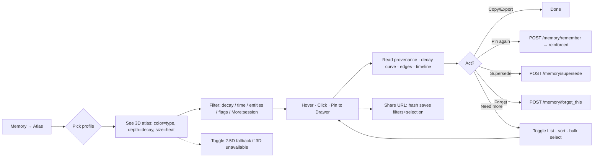

# 08 · Memory Atlas 长期记忆浏览页 — UX 规格

> 归属：Memory 路由的增强（Overview / Memory / Dream / Config / Profiles / System·Doctor / Audit）。本页命名 `Memory Atlas`（控制台路由 `#/memory/atlas`，侧边栏文案 "Memory Atlas"），不新增顶级路由，只在 Memory 下增加二级视图。
> 技术前提：单 HTML 零构建（**待建**：需在 `daemon/app.py:create_app()` 新增 `app.mount('/', StaticFiles(...))` 同源托管，与 `GET /healthz` 同 `loopback` 信任（见 `src/mnemoseed_local/daemon/app.py:54-60,121-125` loopback 与 `app.py:1115-1180` health/audit），无鉴权 token）。无模型调用，无云。
> 状态：设计规格（docs-only），已锁定 5 项待决策（见 §19）。未写产品代码。实现前需工程确认 §15.2 后端需求。

---

## 1. 概述与边界

### 1.1 目标

让用户在 30 秒内获得"我的长期记忆长什么样"的全景感，并能点进任意一条看清来龙去脉（来源、衰减、分歧、演变），决定下一步（钉住 / 修正 / 忘掉 / 产看审计）。

### 1.2 边界

- **只做浏览与跳转**：详情抽屉为只读详情 + 跳转动作（复用已有动词），不引入新的写入语义。
- **不做**：鉴权、云同步、新的写入动词、相似度主控、就地大段文本改写（见 §11 与 §19）。
- **不新增顶级路由**：Atlas 是 Memory 下的二级视图，与现有 Search 共存。

### 1.3 技术约束

- 零构建：单 HTML + 原生 ES 模块（`importmap`），与**待建** `StaticFiles` 同源托管一致（需在 `daemon/app.py:create_app()` 新增 `app.mount('/', StaticFiles(...))`，与 `GET /healthz` 同 `loopback` 信任，见 `app.py:54-60,121-125` + `1115-1180`）。
- 无新增 Python 依赖首版可行（PCA 用 `numpy` 已间接存在；UMAP 后续再议，见 §19 决议 1）。

---

## 2. 用户与任务

### 2.1 谁

已使用 MnemoSeed 一段时间（数日至数周）的本地用户（开发者 / 重度对话用户），对"记忆在后台自动沉淀"有模糊感知，想回答"我到底记住了什么？哪些快淡忘了？哪些是钉住的？冲突在哪里？"

### 2.2 心理模型

用户想的是"按主题/时间/重要度翻我的记忆"，不是"我想看 vector vs graph 的技术分层"。UI 说人话（`Fact · Preference · Episode · Habit…` 11 种 `NodeType`），内部再映射到 `vector chunks` / `graph nodes`。

### 2.3 ONE thing（首要任务）

30 秒内获得全景 + 任意一条的来龙去脉 + 可操作的下一步。

### 2.4 当前失败

只能通过 `POST /memory/recall` 问一句看几条片段，或 `POST /session/recent` 看会话尾巴，**看不见全貌**。衰减、冲突、钉住、图谱关系都在黑盒里。

### 2.5 成功信号

- 首次进入 3 秒内看到点云分布与筛选计数。
- 悬停即得"这是什么/多新鲜/是否冲突"，点击即得全链路详情。
- 任何筛选组合空结果都有可操作提示，不抛 raw JSON。

---

## 3. 信息架构与路由

```
Memory（现有）
├─ Overview（保留：召回搜索框 + 5 条结果 + coverage）
└─ Atlas（新增，本规格）— 3D ↔ List 双模 + 右侧 Details Drawer
```

- Memory 路由顶部放二级 Tab：`Search | Atlas`（Search 即现有召回面，不动）。
- Atlas 内部顶部工具栏：左侧 `3D / List` 分段切换（segmented control），中部全局筛选，右侧 `Profile` 选择器 + `Density`（LOD）开关。
- Drawer 常驻或可收起（桌面默认展开，移动端默认收起为底部 Sheet）。
- 路由：`#/memory/atlas`，URL hash 同步 `profile_id + filter state + selected_id + viewMode`，支持分享与后退。

---

## 4. 真实数据地基（不虚构字段）

本页所有映射均来自已落地 schema/端口，**禁止臆造**。行号以 `0e79e37` 为准：

**Vector Chunk（`src/mnemoseed_local/schema/stamp.py:85-138` `ChunkStamp` + `metadata_filter_view()`）**
`chunk_id, profile_id, text, cognitive_tier(1-3), model_id, persona_id, origin_agent, cues{project, host, task, tools_used[], time_bucket, entities[], emotion{valence, arousal, peripheral_gaps}}, provenance{asserted_by, agent_id, session_id, source, confidence, asserted_at, history[ProvenanceEvent{at, action, actor, detail}]}, decay_weight[0,1], last_reinforced, score, consolidated(bool), ingested_at(epoch), turn_start/end, rules[], explicit_pin(派生: `source==memory.remember` 见 `stamp.py:63-69` `EXPLICIT_PIN_SOURCE`/`is_explicit_pin`))`

`metadata_filter_view()` 暴露的可筛字段（同 `stamp.py:85-138`）：`chunk_id, profile_id, cognitive_tier, model_id, project, entities, consolidated, decay_weight, ingested_at, turn_start/end, explicit_pin`

**Graph Node（`src/mnemoseed_local/schema/graph.py:20-34` `NodeType` + `67-112` `GraphNode`）**
`node_id, profile_id, node_type(11种见 `graph.py:20-34`: USER/HABIT/PREFERENCE/ANIMA/INTENTION/CONSTRAINT/EPISODE/SKILL_SEQUENCE/DECISION/PROJECT/TOOL), entities[], props{statement/rule/summary/...}, confidence, decay_weight, never_decay, last_reinforced, reinforce_count, needs_reconcile, pending_consolidation, peripheral_gaps, conflict_flag, conflict_group, promotion_status, hit_count, last_hit_at, version, prev_version_id, valid_from, valid_to(null=现行), cognitive_tier, provenance, created_at, updated_at, is_current(`graph.py:110-111`)`

**Edge（`src/mnemoseed_local/storage/ports.py:152-194` `EdgeKind`/`EdgeEntry`/`EdgeFilter`）**
`edge_id, src, dst, kind(RELATION/COOCCURRENCE 见 `ports.py:152-157`), weight, created_at`，经 `EdgeFilter{profile_id, node_types[], created_after/before, tier, min_weight}` + `list_edges` 分页（已落地，`storage/ports.py:630-736` `VectorStore.list_chunks`/`GraphStore.list_nodes`/`list_edges`）

**Filter/分页原语（`src/mnemoseed_local/storage/ports.py:77-93` `Page`/`PageResult` + `105-132` `ChunkFilter` + `143-150` `NodeFilter` + `152-194` `EdgeKind`/`EdgeEntry`/`EdgeFilter` + `630-736` `list_*`）**

- `ChunkFilter`（`ports.py:105-132`）：`profile_id, min_decay, pin_min_decay, ingested_after/before, session_id, turn_start/end, entities[], consolidated?, needs_reconcile?, entities_allow_missing, rules_not_null` + `Page{offset, limit}`（`ports.py:77-82` `Page` / `85-93` `PageResult`）
- `NodeFilter`（`ports.py:143-150`）：`profile_id, node_type?, entities[], min_decay`
- `EdgeFilter`（`ports.py:152-194`）：`profile_id, node_types[], created_after/before, tier, min_weight`（端点必为 `valid_to IS NULL` 的现行节点）
- `AuditEntry/AuditFilter`（`ports.py:274-293`）、`TimelineEvent`（`ports.py:205-211`）、`Capability`（`ports.py:350-373`）等复用

**Retrieval 侧已落地但本页不作 3D 主坐标的派生**

`HybridConfig{min_decay≈floor, rescue_min_decay=0.15, rescue_cue_min=0.2}`（`config.py:127-128` `DEFAULT_RECALL_RESCUE_FLOOR/CUE_MIN` 与 `config.py:140-150` `DreamConfig` 上下文，`RecallConfig:269-270`）、`decay.model{λ per type, half_life≈69/139/23d, pin λ=0.005}`（`config.py:188-208` `DEFAULT_LAMBDA_PER_TYPE` + `src/mnemoseed_local/decay/model.py:69-101` `decay_weight`/`lambda_for`/`half_life_days`）、`assemble{conflict_pair/omitted, pending_consolidation, rescued}` — 仅用于图例与详情文案，不作 3D 主坐标。

**Daemon 已有端点（`src/mnemoseed_local/daemon/memory.py:127-208` / `app.py:54-60,121-125` + `1115-1180`）**

- `RecallRequest{profile_id, query, host?, project?, time_bucket?, top_k?, budget?}`（`memory.py:127-137`）
- `RememberRequest{profile_id, text, rules?}`（`memory.py:139-143`）、`AuditRequest`（`memory.py:145-155`）、`TimelineRequest{profile_id, node_id?}`（`memory.py:157-159`）、`ExportRequest{offset, limit≤500}`（`memory.py:162-165`）、`ForgetRequest{chunk_id?, node_id?, entity?}`（`memory.py:168-178`）、`SupersedeRequest`（`memory.py:181-184`）、`SessionRecentRequest/SessionWindowsRequest`（`memory.py:193-208`）
- `GET /healthz`（`app.py:1115-1130`）、`GET /api/v1/audit`（`app.py:1165-1180`）、`GET /api/v1/observability`（`app.py:1157-1164`）已具备；`loopback` 信任见 `app.py:54-60,121-125`

---

## 5. 技术选型：3D 方案

### 5.1 主选：Three.js（ESM via importmap，无构建）

```html
<script type="importmap">
{ "imports": { "three": "https://cdn.jsdelivr.net/npm/three@0.160.0/build/three.module.js",
               "three/addons/": "https://cdn.jsdelivr.net/npm/three@0.160.0/examples/jsm/" } }
</script>
```

- 理由：真 3D（透视、深度缓冲、z 排序、raycast 拾取）、节点 10k 仍可用 `InstancedMesh` + `Points` 做到 60fps；CSS 3D 无深度缓冲、靠 DOM，>1k 即失速且无法表达密度/重叠；Canvas2D 伪 3D 需自写投影与遮挡，维护成本更高。
- 体积：`three.module.js` ~150KB（gzip ~45KB），本地 loopback 加载可接受；离线时走下述降级。
- 交互：`OrbitControls`（阻尼 `enableDamping`）、`Raycaster` 悬停/点击、窗口 `resize` 自适应 `devicePixelRatio`。
- KISS 约束：不用后处理、不引物理引擎、不引 `three/addons` 之外的新依赖；着色仅顶点色 + 尺寸，无纹理。

### 5.2 降级（Fallback）：Canvas2D 伪立体

- 条件：`import("three")` 失败 / 离线 / CSP 拦截时自动切换；顶部给 `Banner: 3D unavailable — showing 2.5D fallback`。
- 实现：同一份 `positions: Float32Array` 用等轴测投影 `x' = x - z·0.5, y' = y - z·0.5` 投到 2D canvas，点大小按 `1/(1+z)` 缩放，悬停仍用最近点距离拾取。无旋转，仅平移/缩放。
- 保证：双模（3D/List）与过滤/详情逻辑与主路径完全复用，仅渲染层替换。

### 5.3 离线策略（已决 — 决议 5）

- **首版：CDN 优先（importmap 直连 `cdn.jsdelivr.net`），不 vendor**。离线/拦截时自动降级为 2.5D，不阻塞首版发布。
- **后续：若真实用户反馈离线可用诉求强烈**，再 vendor 一份 `three.module.min.js` 随**待建** `StaticFiles` 同源托管（`daemon/app.py:create_app()` 新增 `app.mount('/', StaticFiles(...))`，见 `app.py:54-60,121-125` + `1115-1180`，~150KB 常驻体积），切换为同源 `importmap` 而无需改业务代码。
- 选择理由：本地 loopback 场景离线率低，首版不为小概率增体积；降级已保证可用性。

### 5.4 不选

- CSS 3D DOM：节点上限低、动画掉帧、无实例化。
- WebGPU / Babylon：体积与复杂度超预算，违背零构建小而美。

---

## 6. 布局

### 6.1 桌面（≥1024px）

```
┌─ TopBar ───────────────────────────────────────────────────┐
│ [Search | Atlas*]   [● 3D | List]   [Profile ▾]  [Density ▾] [⟲ Refresh] │
├─ FilterBar ────────────────────────────────────────────────┤
│ Kind [All ▾]  Type [All ▾]  Decay [All ▾]  Time [Last 30d ▾]  Entities [⌕ ]  Flags [☑ conflict …] [More ▾]  Sort [Recent ▾]   [Clear]  1,248 items · 3 truncated │
├─ Main ───────────────────────────────────────────────────┤
│                        │  Drawer (360px, resizable 320-480) │
│   Canvas (flex:1)      │  ──────────────────────────────── │
│   · 3D 点云 / 2.5D     │  Title + Kind badge + ID copy     │
│   · 坐标轴图例（右下）  │  Provenance · Decay · Edges       │
│   · 悬停卡片           │  Timeline · Audit · Actions       │
│                        │                                   │
└────────────────────────┴───────────────────────────────────┘
└─ StatusBar: window_truncated / rescue / empty hint ───────┘
```

- Canvas 占剩余宽度，`Drawer` 右侧固定 360px，可拖拽 320–480，收起后为 40px 窄条（仅图标）。
- 过滤器为单行 `flex-wrap`，溢出不换行为横向滚动（`overflow-x: auto`）。
- `More ▾` 折叠内含次级过滤：`session_id`（见 §9.2 与决议 2）、`Consolidated`、`Peripheral gaps` 等非主路径筛选项。

### 6.2 移动端（<768px）

- 顶部工具栏折两行；Canvas 全屏；Drawer 变为底部 Sheet（`height: 55vh`，可拖至全屏 `100vh` 或收至 `peek 72px`）。
- 3D 交互：单指旋转、双指缩放、双指平移；悬停改为"点击高亮 + 底部 peek"。

### 6.3 List 模态同框

- List 区替换 Canvas，其余（FilterBar/Drawer/StatusBar）保持不动，切模态不丢过滤与选中。
- List 为虚拟滚动容器（`IntersectionObserver` + 固定行高 56px），非分页按钮。

---

## 7. 3D 映射（每个视觉通道都有数据出处）

| 视觉通道 | 映射 | 数据字段 | 动机/可验证性 |
|---|---|---|---|
| **X** | 语义主轴（后端 PCA 第一主成分，后续可切 UMAP） | 后端 `POST /memory/atlas` 预计算 `x,y`（见 §15.2）；不可用时前端 `hash(id)` 伪随机兜底（仅降级） | 横向展开主题（决议 1：PCA 首版） |
| **Y** | 时间轴（近 → 远，由上至下） | **chunks: `ingested_at`** / **nodes: `valid_from`（仅 `valid_to IS NULL` 现行节点）**，归一到 `[0,1]`；`updated_at` 仅用于 tooltip，不作 Y | "记忆在时间中下沉"的直觉（Y 锁定 `ingested_at`/`valid_from`，见 §10/§11） |
| **Z** | 衰减深度（越深越淡） | `decay_weight` 反向：`z = 1 - decay_weight` | 直接可视化遗忘深度，`config.py:188-208` + `decay/model.py:69-101` |
| **颜色** | 类别 | `node_type`（11 色，色盲友好调色板，见 §8）；chunks 用 `explicit_pin ? pin色 : chunk色` + `cognitive_tier` 明度分级 | 一眼区分事实/偏好/情节/意图等 |
| **大小** | 重要度/热度 | `score`（chunks）或 `hit_count`+`reinforce_count` 归一；救援带内（`0.15≤w<0.4`）统一缩小 30% | 大而亮=常用且新鲜 |
| **透明度** | 可及性 | `decay_weight` 线性：`opacity = 0.35 + 0.65·w`；`consolidated==true` 的 chunks 不进点云（已退出搜索面，见 `docs/zh/design/03` §4.1）但可通过"Show consolidated"开关以空心描边显示 | 淡=将遗忘 |
| **描边/光晕** | 冲突与待合并 | `conflict_flag==true` → 橙色描边 + 脉冲环；`pending_consolidation==true` → 紫色虚线环；二者叠加为双环 | 来自 `GraphNode.conflict_flag/pending_consolidation` |
| **连线** | 关系 | `list_edges` 的 `RELATION` 实线 / `COOCCURRENCE` 点线，权重映射线宽；仅在选中节点或"Show edges"开关时绘制，避免全量连线成毛线球 | `EdgeEntry` 真实关系（`ports.py:152-194`） |
| **分组晕染** | 同冲突组 | `conflict_group` 相同者外围共用半透明 hull（2D 凸包投影） | 来自 `GraphNode.conflict_group` |

**坐标预计算（已决 — 决议 1：PCA 首版，零新增依赖）**

- 后端一次性对请求窗口内的 `dense` 向量做 **PCA 第一主成分**得 `x`（`y` 固定取归一时间，不取 PCA 第二主成分，保证时间可解释性），与 `z=1-decay_weight` 组成 3D 坐标，随 `POST /memory/atlas` 分页下发并缓存（见 §15.2）。**PCA 仅需 `numpy`（已间接依赖），不新增 `umap-learn` / `scikit-learn`；绝不对 `sparse` 做 PCA，也不在前端做 PCA。**
- `x = PCA1(dense)` 归一到 `[-1,1]`；`y = 归一时间轴`（chunks 用 `ingested_at`，nodes 用 `valid_from` 且仅 `valid_to IS NULL` 现行节点；线性归一到 `[0,1]`，`updated_at` 仅作 tooltip）；`z = 1 - decay_weight`。该组合首版即可用且语义可解释。
- **降级契约（degraded drivers）**：当 `embed` 驱动缺失或窗口内 `dense` 不可用时，`POST /memory/atlas` 返回 `positions: null` 且 `algo: "unavailable"`，前端改用 `hash(id)` 伪随机兜底（确定性，不闪烁）；后端不回退到 `sparse` PCA，前端不做客户端 PCA。
- **后续演进**：若真实语义聚类效果需更强非线性，再引入 `umap-learn` 切 `algo=umap`（后端可选依赖，前端无感，`positions` 契约不变）。

**图例（Canvas 右下常驻）**
`● Fact  ● Preference  ● Episode  …  ○ Chunk  ◉ Pinned  ─ Relation  ·· Co-occurrence  ◯ Conflict  ◍ Pending`

---

## 8. 视觉与主题

- 继承既有零构建页的 **Restrained** 策略（中性底 + 单一强调色），不引入新品牌色。
- 11 类色板（`--atlas-c1..11`，OKLCH，色盲友好，区分度 ≥ 18 ΔE）：
  `USER#4F7CAC  HABIT#5B8C5A  PREFERENCE#8A6BC9  ANIMA#CC6B8A  INTENTION#D9983A  CONSTRAINT#7AB0C2  EPISODE#6EC1A0  SKILL_SEQUENCE#9BB55A  DECISION#BE7AC9  PROJECT#8BBEE0  TOOL#E0B56A` + `CHUNK#9AA0A6` + `PIN#E07A5F`。
- 背景：Canvas 深灰 `#0F1115`（深色场景适合 3D 点云对比），List 与 Drawer 保持现有浅色面板对比。
- 字体：系统 sans 单家族（与 Operate 原则一致），等宽仅用于 `chunk_id / node_id`。
- 动效：`150–250ms`、只用于状态（选中高亮、Drawer 滑入、点缩放），`prefers-reduced-motion` 时禁用轨道阻尼与脉冲环。
- 组件复用：沿用既有控制台的按钮/徽标/进度条/空态语汇，不引入新设计系统。

---

## 9. 交互

### 9.1 3D 交互

- **轨道**：左拖旋转、右拖平移、滚轮缩放；`minDistance/maxDistance` 限幅，极角锁 `polarAngle < 85°` 防翻转。
- **悬停**：`Raycaster` 最近点 ≤ 12px 命中 → 高亮点（放大 1.4×、描边加粗）+ 悬停卡片（见 §9.3）。
- **点击**：选中并 Pin 到 Drawer（再次点击已选中则取消 Pin）；`Shift+点击` 多选对比（最多 3 个，并排在 Drawer 顶部）。
- **框选**：`Shift+拖拽` 矩形框选（投影到屏幕空间，`z` 不参与），批量高亮，Drawer 显示"Bulk N selected"聚类摘要。
- **快捷键**：`F` 聚焦选中、`R` 重置视角、`E` 显隐连线、`C` 显隐已合并、`/` 聚焦实体搜索、`Esc` 清空选中/Draft。

### 9.2 过滤与搜索

- **Profile**：单选，必填（`profile_id` 显式隔离，`storage/ports.py:106/144/188` 均显式隔离），切换即清空选中与视图缓存。
- **Kind**：`All / Chunks / Nodes`。
- **Node Type**：多选，仅当 `Kind≠Chunks` 时可见（No dead inputs）。
- **Decay**：分段单选 `All | Healthy ≥0.4 | Rescue 0.15–0.4 | Fading <0.15 | Never-decay`（`never_decay` 仅对 nodes，`graph.py:79`）。
- **Time**：`All / 7d / 30d / 90d / Custom`（chunks 基于 `ingested_at`，nodes 基于 `valid_from`（仅 `valid_to IS NULL` 现行），ISO UTC；`updated_at` 不参与时间筛选，仅 tooltip）。
- **Entities**：`⌕` 输入框，逗号分隔，大小写不敏感（`casefold`），空实体 chunk 在 `entities_allow_missing` 语义下仍可见（`docs/zh/design/03` D2）——过滤时与后端 `ChunkFilter.entities` / `NodeFilter.entities` 保持一致。
- **Flags**：`Conflict / Pending / Needs reconcile / Peripheral gaps / Pinned only / Consolidated`（Pinned 仅 chunks（`stamp.py:85-138` `explicit_pin`），Pending/Conflict 仅 nodes）。
- **Sort**：`Recent / Decay ↑↓ / Score / Hit count / Type`（仅 List 排序；3D 排序不改变坐标，只改变拾取优先级与 List 虚拟滚动顺序）。
- **Density（LOD）**：`Auto / 500 / 2k / 10k`（3D 渲染上限，超出用确定性采样 + 底部 `+N hidden — tighten filters` 提示）。
- **More（折叠）**：`session_id`（**次级过滤，默认折叠**，见决议 2）、`Turn range`、`Peripheral gaps` 等非主路径筛选项收于此（渐进披露）。
- **相似度滑杆**：**不提供**（见决议 4）。相似度是检索时派生分（`HybridRetriever` 侧），浏览页不作主控；已通过 `Decay/Entities` 间接表达。

所有筛选为**即时应用**（debounce 300ms），URL hash 同步 `profile_id + filter state + selected_id + viewMode`，支持分享与后退。

**决议 2 落地**：`session_id` 不作主过滤（避免与"记忆是大脑"的单存储叙事冲突），仅作 `More ▾` 内的次级文本过滤（输入即筛，大小写不敏感），与 `ChunkFilter.session_id`（`ports.py:124`）直连。

### 9.3 悬停卡片（Hover Card）

- 标题（`props.statement` / `text` 前 80 字）、`node_type`/`Pinned` 徽标、`decay_weight` 进度条、`ingested_at` 相对时间、`conflict_group` 徽标（若有）、`entities` 前 3。

### 9.4 双模切换

- 分段控件 `○ 3D  |  ≡ List`，键盘 `Tab` 可达，`aria-pressed` 标记激活态。
- 切换保留：过滤器、Profile、选中项、滚动位置（List→3D 时相机飞向选中点）。

---

## 10. 列表视图

**列（桌面表格，移动端卡片化）**

| 列 | 宽度 | 来源 | 备注 |
|---|---|---|---|
| Kind | 64 | `chunk/node` | 图标 + `Pinned` 角标 |
| Title | flex | `text` 前 120 字 / `props.statement` | `line-clamp:2`，溢出省略 |
| Type | 110 | `node_type` / `—` | 仅 nodes 有值 |
| Entities | 160 | `cues.entities / entities` | 最多 2 + `+N` |
| Decay | 120 | `decay_weight` | 进度条 + 数值 `0.73` + 颜色分段 |
| Updated | 140 | `ingested_at`（chunks）/ `valid_from`（nodes，仅 `valid_to IS NULL` 现行） | 相对时间 + ISO tooltip；`updated_at` 仅在 tooltip 中展示，不作排序主 Y |
| Flags | 96 | `conflict_flag, pending_consolidation, needs_reconcile` | 点状徽标 |
| Hits | 64 | `hit_count / score` | 右对齐 |

- 表头可排序（点击循环 `asc/desc/none`）。
- 行点击 = 选中 Drawer；`⋯` 行菜单：`Copy ID / View audit / View timeline / Forget… / Supersede…`
- 虚拟滚动：固定行高 56，`overscan 8`，10k 行无卡顿。

---

## 11. 详情抽屉（Details Drawer）

抽屉为"只读详情 + 跳转动作"，**不做就地大段改写**（已决 — 决议 3）。写操作跳现有动词端点，成功后回刷。

**区段（自上而下，全部可折叠，默认展开前两段）**

1. **Header**
   - 标题全文（`text` / `statement`，可复制，`word-break`）
   - 徽标行：`Kind · Type · Pinned/Consolidated · Version v3 · ID short(8) + Copy`
   - 辅行：`profile_id · session_id → recent tail link · 时间：chunks 为 `ingested_at` / nodes 为 `valid_from`（现行 `valid_to IS NULL`）ISO + relative；`updated_at` 仅在 tooltip 中展示`

2. **Provenance**
   - `asserted_by / source / confidence / asserted_at`（`stamp.py:72-82` `Provenance`）
   - `history` 时间轴：`created → reinforced → superseded* → flagged`，`superseded` 展开 `superseded_text` 全文（来自 `daemon/memory.py:597-734` `remember` 分支与 `memory/audit` 的 `provenance.history`）
   - `peripheral_gaps / promotion_status` 标签（`graph.py:85-92`）

3. **Decay & Health**
   - 仪表：`decay_weight` 大数字 + 进度条（分段色：≥0.4 绿 / 0.15–0.4 琥珀 / <0.15 红）
   - 公式提示：`w = confidence × exp(-λ·days)`，`λ` 取 `config[decay.lambda_per_type][type]`（`chunk:0.03 / pin:0.005 / fact:0.01 …`，见 `config.py:188-208` `DEFAULT_LAMBDA_PER_TYPE` 与 `decay/model.py:69-101` `decay_weight`/`lambda_for`/`half_life_days`）
   - 曲线：30/90/180 天预测（前端本地 `exp` 计算，非后端）
   - 字段：`last_reinforced / reinforce_count / hit_count / last_hit_at`（`stamp.py:101-105` / `graph.py:80-96`）

4. **Scores & Retrieval Signals**
   - `score`（chunks，`stamp.py:105`）/ `confidence`（`graph.py:77`）
   - 最近一次 `HybridRecall` 的 `ScoreBreakdown{semantic, cue_overlap, decay_weight, graph_centrality}`（若是从 Search 跳入则带入，否则显示"— not from a recall"）
   - `rescued` / `pending_consolidation` / `conflict_pair` 标记解释

5. **Graph & Edges**
   - 仅 nodes：`1-hop` 邻居列表（`traverse depth=1` 结果截断 20，每行 `—[rel weight]→ target (type)`，点击跳转选中；`ports.py:665-666` `traverse`）
   - `list_edges` 分页链接（`View all edges` 跳 Audit 过滤）

6. **Version Chain / Timeline**
   - `timeline`（`POST /memory/timeline {node_id}`，`memory.py:803-844`）版本时间轴：`when · version · summary`，当前版高亮 `valid_to==null`（`graph.py:102`）
   - Chunks 无版本链，显示 `turn_start→turn_end` 窗口（`stamp.py:108-109`）

7. **Audit**
   - `POST /memory/audit {node_id|chunk_id}` 的 `audit[]` 截断 10 条（`actor · action · detail · at ISO`，`memory.py:738-800`），`View all in Audit` 跳 `GET /api/v1/audit?` 带 `target_id` 过滤（前端客户端过滤，见 `memory.py:766-800` `_relevant_audit`）

8. **Actions（危险区 — 已决，决议 3）**
   - `Copy text` `Copy ID` `Export JSON`（走 `POST /memory/export` 单条导出，`memory.py:162-165`）
   - `Pin again (reinforce)` → `POST /memory/remember`（逐字相同走强化分支，`memory.py:599-734` 的 identical re-pin 分支）
   - `Supersede…`（仅 nodes，弹确认框要 `successor_node_id`）→ `POST /memory/supersede`（`memory.py:181-184`）
   - `Forget…` → `POST /memory/forget_this`（`chunk_id|node_id|entity`，二次确认，说明 tombstone 语义：graph 保留版本链，vector 物理删除，`memory.py:168-178`）
   - **不提供就地编辑 `text` / `props.statement`**：文本修正走"同主题重钉就地替换"（`remember` 的 same-topic re-pin supersede-in-place 分支，`memory.py:697-734`），与 `09` 保留重设计 §3.3 保持一致。

---

## 12. 空 / 加载 / 错误 状态

| 状态 | 3D | List | 文案要点 |
|---|---|---|---|
| **Initial loading** | 居中骨架：线框立方体脉冲 + `Loading your memory…` | 表格骨架行 8 × shimmer | 不用全屏 spinner |
| **Empty (no data at all)** | 空星图轮廓 + 1 句引导 | 同 | `No memories yet — start a conversation, then return here.` + `Go to Overview` 按钮 |
| **Filtered empty** | 同空态但保留过滤器 | 同 | `No matches for these filters — try clearing Decay or Entities.` + `Clear filters` |
| **Paginated truncation** | 底部 `+342 hidden — tighten filters or raise Density` | 表尾同 | 来自 `Page.total` 与 `window_truncated`（`ports.py:87-93`） |
| **Decay not yet swept** | 徽标 `Decay not yet run` tooltip | 同 | 首次启动 sweeper 未跑时的诚实提示 |
| **3D failed / offline** | 自动切 2.5D + Banner | 不影响 | `3D unavailable — showing 2.5D fallback. [Retry 3D]` |
| **Profile missing** | 全页空态 | 同 | `Pick a profile to explore`（Profile 选择器高亮） |
| **API error 4xx/5xx** | 画布内联错误卡 | 表内错误行 | `Couldn’t load memories — {plain reason}. [Retry]`，401/404 说清"profile_id 是否存在"，绝不抛 raw JSON（`validate early, speak plainly`） |
| **Rate / timeout** | 同 | 同 | `Taking a while — the store is busy. [Retry]` |

---

## 13. 响应式与可访问性

- **断点**：`768 / 1024`；Drawer 在 768 下变 Sheet，过滤器在 768 下收进 `Filters ▾` 抽屉。
- **触摸目标**：所有可点击 ≥ 44×44。
- **键盘**：`Tab` 顺序 `TopBar → FilterBar → Canvas/List → Drawer`；Canvas 需 `tabindex=0` + `aria-label="Memory 3D atlas, use arrow keys to orbit, F to focus"`；方向键微调视角，`Enter` 选中焦点项。
- **焦点可见**：`focus-visible` 2px 实线，不依赖颜色。
- **屏幕阅读器**：Canvas 设 `role="img" aria-label="3D memory map, N items"` + 隐藏的 `<ul aria-live="polite">` 列出当前选中标题；List 用原生 `<table>` + `<caption>`。
- **对比度**：文本 ≥4.5:1，大字 ≥3:1（Canvas 内文字用描边保证）。
- **动效**：`prefers-reduced-motion` 时禁用轨道阻尼、脉冲环、飞行动画。
- **国际化**：时间用 `Intl.DateTimeFormat`，数字用 `Intl.NumberFormat`；文案预留 30% 伸展。

---

## 14. 性能

- **List**：虚拟滚动（固定行高 + `IntersectionObserver`），10k 行常驻 DOM ≤ 24 行。
- **3D LOD**：`Auto` 时按 `devicePixelRatio` 与 `hardwareConcurrency` 自适应；`Points` + `InstancedMesh` 合批；`frustumCulled=true`；超出 `Density` 上限做**确定性采样**（`hash(id) %`），不随机闪烁。
- **分页拉取**：首屏 `limit=500`，滚动/缩放按需 `offset` 增量拉取（`list_chunks / list_nodes / list_edges` 均已分页，`ports.py:630-736`）；`Page.total` 用于总数与截断提示。
- **坐标缓存**：`positions` 按 `profile_id` 缓存在 `localStorage`（key `atlas:positions:{profile_id}:{count}:{maxId}` 或 `:{hash}`——用 `count:maxId` 或 `hash(ids)` 作缓存键，避免 `float epoch` 精度漂移；命中则跳过后端投影请求）。
- **防抖**：过滤输入 300ms，视角 `idle` 500ms 后再请求视锥内 `list_edges`。
- **内存**：`positions` 用 `Float32Array`；`text` 仅在 Drawer 需要时按 `get_chunk/get_node` 懒取全文，点云只存 `id/type/decay/entities` 轻量。

---

## 15. 后端需求（已具备 vs 待建）

### 15.1 已具备（直接复用）

- `POST /memory/timeline`（`TimelineRequest{profile_id, node_id?}` `memory.py:157-159`）、`POST /memory/audit`（`AuditRequest{profile_id, node_id|chunk_id}` `memory.py:145-155`）、`POST /memory/export`（`memory.py:162-165` 分页 JSON，`limit≤500`）、`GET /api/v1/audit`（`app.py:1165-1180` 分页过滤）、`POST /session/recent` / `POST /session/windows`（`memory.py:193-208` 会话窗 honest null 语义）、`VectorStore.list_chunks(ChunkFilter, Page)`（`ports.py:629-631`）、`GraphStore.list_nodes(NodeFilter, Page)`（`ports.py:655-657`）、`GraphStore.list_edges(EdgeFilter, Page)`（`ports.py:727-736`）、`GraphStore.traverse`（`ports.py:664-666`）等（见 `storage/ports.py:77-93,105-132,143-150,152-194,630-736`、`daemon/memory.py:127-208`、`daemon/app.py:54-60,121-125,1115-1180`）。
- `GET /healthz`（`app.py:1115-1130`）与 `GET /api/v1/observability`（`app.py:1157-1164`）可作 Atlas 的"store 能力/自检"脚注；`loopback` 信任见 `app.py:54-60,121-125`。

### 15.2 待建（实现 Atlas 所需的最小新增面）

> 以下为**显式后端需求**，不实现则 Atlas 无法以合理性能落地；均保持零鉴权 loopback 信任不变（`app.py:54-60,121-125`）。

1. **`POST /memory/atlas`（或 `GET /api/v1/atlas`）— 批量轻量清单 + 3D 坐标**
   - 入参：`{profile_id, kind: "all"|"chunks"|"nodes", filter: {node_types?, entities?, min_decay?, max_decay?, session_id?, ingested_after/before?, flags?}, sort?, offset, limit (≤500)}`
   - 出参：`{items: AtlasItem[], total, offset, limit, window_truncated, positions: {id: [x,y,z]} | null, algo: "pca" | "umap" | "unavailable"}`
   - `AtlasItem` 轻量（不含 `text` 全文）：`{id, kind, node_type?, text_head(120), entities[3], decay_weight, ingested_at(valid_from for nodes), flags{conflict, pending, needs_reconcile, peripheral_gaps, consolidated, explicit_pin}, hit_count?, score?, valid_from, updated_at(tooltip only)}`（chunks 用 `ingested_at`，nodes 用 `valid_from` 且仅 `valid_to IS NULL` 现行；`updated_at` 仅作 tooltip，不作 Y/筛选主轴）
   - `positions`：后端对窗口内 `dense` 做 **PCA（`numpy`，零新增依赖）**得 `x = PCA1` 归一到 `[-1,1]`，`y = 归一时间`（`y = normalized(ingested_at)` for chunks / `normalized(valid_from)` for nodes，仅现行；`updated_at` 不参与），`z = 1 - decay_weight`；与 `items` 同页返回或单独 `GET /api/v1/atlas/positions?profile_id=&limit=&algo=pca|umap`。**首版 `algo=pca` 即满足可用性；`algo=umap` 作为后续可选演进，前端契约不变。**
   - **降级契约（degraded drivers，显式）**：当 `embed` 驱动缺失或窗口内 `dense` 不可用时，后端返回 `positions: null` 且 `algo: "unavailable"`，前端改用 `hash(id)` 伪随机兜底（确定性，不闪烁）；**后端绝不对 `sparse` 做 PCA，前端绝不做客户端 PCA**。`algo=hash` 仅指前端本地 `hash(id)` 兜底，不作为后端 `algo` 值。

2. **批量全文端点（可选，优化 Drawer 懒取）**
   - 复用 `get_chunk/get_node` 单条亦可；若要批量，新增 `POST /memory/batch_get {profile_id, chunk_ids[], node_ids[]}` 返回全文与 `provenance.history` 全量。

3. **CORS/Static 同源保证（待建）**
   - Atlas HTML **待建**：需在 `daemon/app.py:create_app()` 新增 `app.mount('/', StaticFiles(...))` 同源托管，与 `GET /healthz` 同 `loopback` 信任（见 `app.py:54-60,121-125` + `1115-1180`），无需 CORS；若后续抽离为独立静态，需显式允许 `localhost` 同源。

4. **分页与流式说明**
   - `embeddings` 不下发前端（体积与隐私）；`positions` 已是降维后坐标，前端不再触 `dense/sparse`。
   - 大库（10k+ chunks）必须分页 + 确定性采样；`window_truncated` 与 `total` 的诚实语义沿用 `session_recent` 的已有模式（`memory.py:847-915`）。

**不新增**：鉴权、云同步、写入侧新动词（复用 `remember/forget_this/supersede` 已有动词，`memory.py:599-734`）。

---

## 16. 线框（ASCII + Mermaid）

### 16.1 ASCII（桌面 Atlas 页）

```
┌─────────────────────────────────────────────────────────────────────────┐
│ Memory  [Search] [Atlas*]          [● 3D | List]  [Profile: default ▾] │
├─────────────────────────────────────────────────────────────────────────┤
│ Kind: All ▾  Type: All ▾  Decay: All ▾  Time: 30d ▾  Entities: [ai,  ] │
│ Flags: [☑ Conflict] [☐ Pending] [☐ Pinned]  [More ▾: session …]  Sort: Recent ▾ [Clear]│
│ 1,248 items · Rescue 37 · Fading 12 · +142 hidden — tighten filters     │
├──────────────────────────────────────┬──────────────────────────────────┤
│                                      │ Drawer — Fact #a3f9c2            │
│   3D Canvas (dark #0F1115)           │ Fact · Fading 0.22 ──●── 22%     │
│   · points (color=size)              │ "We decided to use LanceDB…"     │
│   · ● hover card                     │ Provenance  session: abc123 · …   │
│   · ◯ conflict hull                  │ Decay  λ=0.01  half-life 69d     │
│   · ─ relation  ·· co-occurrence    │ [30d curve] last_reinforced 3d ago│
│   Legend  ●Fact ●Pref ○Chunk ◉Pin    │ Edges  —[holds]→ #b7e1  ·· 2 more │
│                                      │ Timeline  v3 cur · v2 · v1       │
│                                      │ Audit  3 rows  [View all]        │
│                                      │ [Copy] [Pin again] [Forget…]     │
├──────────────────────────────────────┴──────────────────────────────────┤
│ Status: window_truncated=false · rescue_floor=0.15 · total=1248         │
└─────────────────────────────────────────────────────────────────────────┘
```

### 16.2 Mermaid（用户路径）



---

## 17. 文案清单（English Copy Deck — UI strings verbatim）

> 产物文案一律英文，无内部黑话。下表即实现时直接粘贴的英文原文。

**Navigation & Mode**

- `Search` / `Atlas`（二级 Tab）
- `3D` / `List`（分段控件，`aria-label="View mode"`)
- `Memory Atlas — see all your long-term memories in one place.`

**Toolbar**

- `Profile` / `Pick a profile to explore`
- `Density` / `Auto · 500 · 2k · 10k` / `+N hidden — tighten filters or raise Density`
- `Refresh` / `Refreshing…`
- `Share view`（复制带 hash 的 URL）

**Filters**

- `Kind: All / Chunks / Nodes`
- `Type: All` / `Fact · Preference · Episode · Habit · Intention · Constraint · User · Anima · Decision · Project · Tool · Skill` — 11 types total, see `graph.py:20-34`
- `Decay: All / Healthy (≥0.40) / Rescue (0.15–0.40) / Fading (<0.15) / Never-decay`
- `Time: All / Last 7 days / Last 30 days / Last 90 days / Custom…`
- `Entities` placeholder: `Filter by entities, comma separated — e.g. ai, lancedb`
- `Flags: Conflict · Pending · Needs reconcile · Pinned only · Consolidated · Peripheral gaps`
- `More: Session · Turn range · …`（折叠，默认收起）
- `Sort: Recent / Decay ↑ / Decay ↓ / Score / Hits / Type`
- `Clear filters` / `Clear`
- `N items · Rescue N · Fading N`（计数条）

**Canvas & Legend**

- `3D memory map — drag to orbit, scroll to zoom, click a point for details.`
- `Legend: Fact · Preference · Episode · Habit · Intention · Constraint · User · Anima · Decision · Project · Tool · Chunk · Pinned — Relation · Co-occurrence · Conflict · Pending`
- `Show edges` / `Show consolidated`（开关）
- `F — Focus · R — Reset view · E — Edges · C — Consolidated · / — Search entities · Esc — Clear`

**Hover Card**

- `Pinned` / `Conflict` / `Pending`（徽标）
- `Decay 0.73` / `Fading 0.22`（进度条旁）
- `2 hours ago` / `3 days ago`（相对时间，title 为 ISO）

**List**

- Column headers: `Kind · Title · Type · Entities · Decay · Updated · Flags · Hits`
- Row action: `Copy ID · View audit · View timeline · Forget… · Supersede…`
- `No matches for these filters — try clearing Decay or Entities. [Clear filters]`
- `No memories yet — start a conversation, then return here. [Go to Overview]`

**Drawer — Header**

- `Copy ID` / `Copied!` / `Copy text` / `Export JSON`
- `ID a3f9c2… (click to copy full)`
- `Session abc123 — view recent tail`（链接到 `POST /session/recent` 视图）

**Drawer — Provenance**

- `Provenance` / `Asserted by · Source · Confidence · At`
- `History` / `created · reinforced · superseded · flagged`
- `Superseded text: “…”`（展开）
- `Peripheral gaps` / `Promotion: promoted`

**Drawer — Decay & Health**

- `Decay & Health` / `Decay 0.22 — Fading` / `Healthy · Rescue · Fading`（分段标签）
- `w = confidence × exp(-λ·days)` / `λ = 0.01 (fact) · Half-life ~69 days`
- `Last reinforced 3 days ago` / `Reinforced 4 times` / `Hit 12 times · Last hit 2 hours ago`
- `30-day forecast` / `90-day forecast`（曲线图标题）

**Drawer — Scores**

- `Scores & Retrieval signals` / `Score 1.24` / `Not from a recall — scores appear when you arrive from Search`
- `Rescued — this pin was below the main floor but strong cues brought it back`
- `Pending consolidation — fresh evidence overlaps this fact`

**Drawer — Graph & Edges**

- `Graph & Edges` / `1-hop neighbors (20 max)` / `—[holds 0.8]→ Target (Preference)` / `View all edges`
- `Co-occurrence` / `Relation`

**Drawer — Timeline / Audit**

- `Version chain` / `v3 current · v2 · v1` / `Valid 2026-05-01 → now`
- `Timeline` / `No versions — this is a chunk` / `Turns 12→18`
- `Audit` / `3 rows` / `View all in Audit` / `actor · action · detail · at`

**Drawer — Actions（Danger zone）**

- `Actions` / `Pin again (reinforce)` / `Supersede…` / `Forget…`
- `Danger zone — these actions change your long-term memory.`
- Confirm: `Forget this memory? This cannot be undone. For nodes the version chain is kept but hidden; for chunks the text is deleted. [Cancel] [Forget]`
- Confirm supersede: `Supersede requires a successor node ID. [Cancel] [Supersede]`
- Success: `Reinforced.` / `Superseded.` / `Forgotten.` / `Copied.`

**Status & Errors**

- `Loading your memories…`
- `Couldn’t load memories — {reason}. [Retry]`（`reason` 例：`profile not found` / `store busy` / `network error`）
- `3D unavailable — showing 2.5D fallback. [Retry 3D]` / `You’re offline — showing cached layout.`
- `Taking a while — the store is busy. [Retry]`
- `Decay sweep hasn’t run yet — weights may be stale.`
- `Window truncated — some older memories are hidden. Narrow the time range.`

**Accessibility**

- `Memory 3D atlas, use arrow keys to orbit, F to focus selection, R to reset view`（`aria-label`）
- `List of memories, N items`（`<caption>`）
- `Details for …`（Drawer `aria-label`）

---

## 18. 理论锚（本页）

> **本页为控制台管控面（control-plane），不新增记忆机制的理论借用**。入选标准同全系列：只收有实验与长期复现证据的规律；每条给来源/规律/设计规则。管控面的可视化与交互不因理论获得神圣性，数值亦不因理论获得神圣性。

| 锚点 | 状态 | 说明 |
|---|---|---|
| 无新增借用 | — | 本页不引入新的神经科学/心理学规律作为机制依据；所有记忆动力学（衰减、救援、强化）已在 `00/03/09` 登记并由后端实现，本页仅作诚实呈现。 |

**引用但不新增借用的已册规律（仅作解释文案的依据，不作本页机制出处）**

- `Tulving & Pearlstone 1966` 可用≠可及、`Tulving & Thomson 1973` 编码特异性、`Koriat 1993` 知道感：用于解释 Fading/Rescue 点与残迹行的文案，不新增设计规则。
- `Ebbinghaus 1885` 遗忘曲线形状：仅解释衰减曲线的指数形态，`λ` 数值由 `config.py:188-208` 决定，不因理论获得神圣性。

**不借清单（本页重申）**

- Miller 7±2 不得作为任何数量常量（密度/分页/top-K）的出处（`REFERENCES.md R13`）。
- "向量距离越近越可信"不借：距离只定可及性，不定 `provenance.confidence`。
- "3D 越炫越记得住"不借：3D 仅作空间化浏览，不作记忆增强机制的声称。

---

## 19. 已决决策（Decided — 5 项）

> 以下 5 项由 owner 确认"就先照你推荐的做"，**已锁定**，实现按此执行，不再发散。

### 决议 1 — `positions` 的后端算法依赖 ✅ 已决：B 首版 PCA（零新增依赖）→ 后续 UMAP

- **选项**：A) 后端引入 `umap-learn` 做 UMAP（质量最高但新增重依赖） / B) 后端用 PCA（`numpy` 已间接依赖，无新增）先行 / C) 首版不做后端投影，纯前端 `hash(id)` 伪随机。
- **已决**：**B 首版 + A 后续**。首版 PCA（`numpy` 零新增）已满足 Atlas 可用性（`x=PCA1(dense)` + `y=归一时间` + `z=1-decay_weight`）；后续按真实语义聚类效果决定是否引入 UMAP（`algo=umap` 可选演进，前端契约 `positions: {id: [x,y,z]}` 不变）。`hash(id)` 仅作后端不可用时的前端降级兜底，不作主路径。

### 决议 2 — `session_id` 是否作主过滤 ✅ 已决：次级过滤（折叠内），不作主过滤

- **选项**：将 `session_id` 提升为 FilterBar 主筛 vs 仅作次级过滤。
- **已决**：**次级过滤**。`session_id` 收于 `More ▾` 折叠内（默认收起），不占主过滤栏位，避免与"记忆是大脑"的单存储叙事冲突；与 `ChunkFilter.session_id`（`storage/ports.py:124`）直连，输入即筛。

### 决议 3 — 是否允许就地改写 `text` / `props.statement` ✅ 已决：不允许，仅三动词

- **选项**：A) 允许就地编辑 / B) 仅允许 `Pin again / Supersede / Forget` 三动词。
- **已决**：**B**。抽屉不提供就地大段改写；文本修正走"同主题重钉就地替换"（`POST /memory/remember` 的 supersede-in-place 分支，`daemon/memory.py:697-734`），与 `09` 保留重设计 §3.3 保持一致。Actions 列为 Danger zone，三动词均需二次确认。

### 决议 4 — 是否展示相似度滑杆 ✅ 已决：不展示

- **已决**：Atlas **不展示** `embeddings` 探针或相似度滑杆。相似度是检索时派生分（`HybridRetriever` 侧），不应成为浏览页主控；已通过 `Decay / Entities / Type` 间接表达可及性与主题。

### 决议 5 — 离线 3D 资源策略 ✅ 已决：CDN 首版，vendor 后续按需

- **选项**：A) 完全 CDN（需联网，离线即 fallback） / B) 随**待建** `StaticFiles`（`daemon/app.py:create_app()` 新增 `app.mount('/', StaticFiles(...))`，与 `GET /healthz` 同 `loopback` 信任，见 `app.py:54-60,121-125` + `1115-1180`）vendor 一份 `three.module.min.js`（常驻体积但离线可用）。
- **已决**：**A 首版 + B 待用户反馈后再 vendor**。首版 CDN via `importmap`（`§5.1`），离线自动降级为 2.5D（`§5.2`）；后续若离线诉求强烈，再 vendor 同源托管，前端无感切换。

---

## 20. 越界机会（Out-of-scope — 仅记录，不展开）

- 将 Atlas 的 `positions` 复用到 Dream 的 `delta` 可视化（同一批点云，叠加合并前后对比）。
- 在 Audit 页增加"按 `conflict_group` 聚类"的冲突收敛视图。
- 为 `never_decay` 约束类节点做独立"宪法墙"视图（与 Atlas 解耦）。
- 将 List 的虚拟滚动抽为控制台全局复用组件（Overview/Audit 共用）。

---

## 21. 校验计划（Verification Plan）

### 21.1 需验证的真实页面能力

- `Profile` 必填与隔离（`profile_id` 显式，`storage/ports.py:106`）
- FilterBar 即时筛选（debounce 300ms）与 URL hash 同步（分享与后退）
- 3D ↔ List 双模切换不丢选中与过滤
- 悬停卡片、点击 Pin 到 Drawer、Drawer 8 区段折叠与跳转
- 空/加载/错误/截断/离线五态文案可操作（不抛 raw JSON）
- 键盘与屏幕阅读器（`tabindex`、焦点可见、`*live` 区域）

### 21.2 Playwright 实页验证（必做，不碰 dogfood daemon）

```powershell
# 1) 临时 MNEMOSEED_HOME + 空闲端口启动 daemon（与 dogfood 7788 隔离）
$env:MNEMOSEED_HOME = Join-Path $env:TEMP "mnemoseed-atlas-verify-$(Get-Random)"
$env:MNEMOSEED_PORT = "17888"  # 任意空闲端口，探活后写入
mnemoseed-local up --port $env:MNEMOSEED_PORT  # 探活 /healthz 再继续

# 2) 注入若干记忆（便于 Atlas 有数据）
mnemoseed-local memory remember --profile default --text "We decided to use LanceDB for vector storage because..."
mnemoseed-local memory remember --profile default --text "Preference: prefer concise code over verbose comments"

# 3) Playwright 打开 Atlas
npx playwright test --grep "atlas"  # 或直接访问 http://localhost:17888/#/memory/atlas
# - 断言：Canvas 可见（或 2.5D fallback Banner）、FilterBar 可见、List 虚拟滚动行高 56
# - 断言：切换 3D/List 不丢选中（hash 保持）
# - 断言：Drawer 8 区段标题齐全（Header/Provenance/Decay/Scores/Graph/Timeline/Audit/Actions）

# 4) 失败时保留 trace/screenshot，成功后清理
Remove-Item -Recurse -Force $env:MNEMOSEED_HOME
mnemoseed-local down
```

- **硬性隔离**：始终走 `MNEMOSEED_HOME` 临时目录 + 空闲端口的 daemon；**绝不**触碰用户真实 `~/.mnemoseed-local` 与 dogfood 7788 端口。

### 21.3 门禁

- 实现后跑 `pwsh -File scripts/gate.ps1`（`pytest/ ruff/ format/ mypy`）保持绿色；本规格为 docs-only，预期零 `src` 变更。

---

## 22. 校验清单（Spec 自检）

- [x] 每个视觉通道均有字段出处（§4/§7），无虚构字段（行号已核验 `0e79e37`）
- [x] 过滤器与后端 `ChunkFilter/NodeFilter/EdgeFilter` 字段一一对应（`ports.py:105-194`）
- [x] 3D 主选 + 2.5D 降级 + List 三态可互切且不丢状态（§5 + §6.3 + §9.4）
- [x] 空/加载/错误/截断/离线五态齐全且文案可操作（§12）
- [x] 键盘/屏幕阅读器/对比度/动效偏好均有对应（§13）
- [x] 后端待建面已显式列出（§15.2），不为 UI 臆造已具备的端点
- [x] 文案清单为可直接粘贴的英文原文（§17）
- [x] 5 项待决策均已锁定为已决（§19），实现无歧义
- [x] 校验计划含 Playwright 实页步骤与隔离要求（§21）

---

*验证锚（以 `0e79e37` 为准）：`src/mnemoseed_local/schema/stamp.py:63-69` `EXPLICIT_PIN_SOURCE`/`is_explicit_pin` + `85-138` `ChunkStamp`/`metadata_filter_view` / `src/mnemoseed_local/schema/graph.py:20-34` `NodeType` + `67-112` `GraphNode` / `src/mnemoseed_local/storage/ports.py:77-93` `Page`/`PageResult` + `105-132` `ChunkFilter` + `143-150` `NodeFilter` + `152-194` `EdgeKind`/`EdgeEntry`/`EdgeFilter` + `630-736` `list_chunks`/`list_nodes`/`list_edges`/`traverse` / `src/mnemoseed_local/daemon/memory.py:127-208` `Recall`/`Remember`/`Audit`/`Timeline`/`Export`/`Forget`/`Supersede`/`Session*` / `src/mnemoseed_local/daemon/app.py:54-60,121-125` `loopback` + `1115-1180` `health/audit/observability`（`StaticFiles` 为**待建**：需在 `create_app()` 新增 `app.mount('/', StaticFiles(...))` 与 `GET /healthz` 同 `loopback` 信任） / `src/mnemoseed_local/config.py:127-128` `DEFAULT_RECALL_RESCUE_*` + `140-150` `DreamConfig` + `188-208` `DEFAULT_LAMBDA_PER_TYPE` + `269-270` `RecallConfig` / `src/mnemoseed_local/decay/model.py:69-101` `decay_weight`/`lambda_for`/`half_life_days` / `docs/zh/design/03-storage-and-retrieval.md` / `docs/zh/design/09-retention-redesign.md`*
